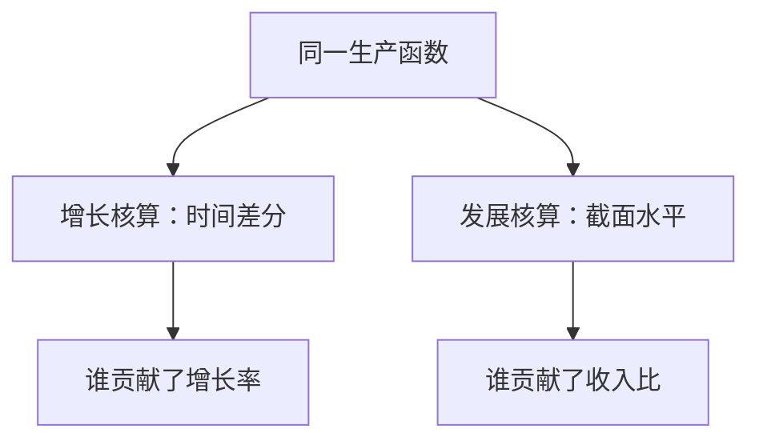

# 增长核算对发展核算

同一套生产函数，对时间差分得到增长率的贡献，对截面取比得到水平差异的贡献；两个问题不要共用同一句「全是 TFP」。

<footer>—— Caselli, Accounting for Cross-Country Income Differences, Handbook of Economic Growth, 2005；对照 Hall and Jones, QJE 1999</footer>

[上一课](/econ/convergence-accounting)已经用 Hall–Jones 一类分解把 $Y/L$ 拆成资本强度、$h$ 与剩余 $A$，并分清绝对/条件收敛。本课的缺口不是再做一遍收敛回归，而是把**增长核算**（一国沿时间）与**发展核算**（各国在某一时点的水平）对起来：公式同源，问题、样本与常见结论不同。货币课从下一课开始；增长主干用这一对照收束。

## 问题

索洛残差课写的是 $\Delta\ln Y=\alpha\Delta\ln K+(1-\alpha)\Delta\ln L+\Delta\ln A$，问增长有多快、各贡献多少。发展核算问的是：美国与某穷国的 $Y/L$ **水平**差，有多少来自 $K$、多少来自 $h$、多少来自 $A$。把东亚「增长很快」的增长核算结论，直接说成「穷国落后是因为不会积累 $K$」，是把时间斜率当成截面水平。Caselli（2005）把发展核算写成系统账户：在观测到的 $K$、$h$ 下，反事实效率能解释多少收入比。缺口是分清这两种会计，而不是再检验 $\beta$ 收敛。

增长核算可以是「这段时间主要靠资本积累」；发展核算仍可以是「国与国之间主要靠 $A$」。两者同时成立，因为比较的对象不同。

## 方法

增长核算：对同一经济的相邻年（或长期平均）做 Solow 1957 的差分。发展核算：对同一年的多国，用

$$
\frac{Y}{L}=A\cdot\Bigl(\frac{K}{Y}\Bigr)^{\alpha/(1-\alpha)}h
$$

一类水平分解（写法随 Caselli、Hall–Jones 而异），比较 $\ln(Y/L)$ 的跨国方差中 $A$ 与要素的份额。资本用 $K/Y$ 而非 $K/L$，是为了减轻内生性：穷国 $K/L$ 低，部分正因为 $A$ 低。Hall–Jones 强调制度进入 $A$；Caselli 强调核算对函数形式与测量的敏感。

收敛回归问的是增长率对初始水平的斜率，既不是增长核算的贡献分解，也不是发展核算的水平方差分解。三句话不要焊成一句「索洛被证实」。

### PPP 不是 CIP

截面比较必须用购买力平价把 $Y$ 与 $K$ 放到可比物量。那是篮子问题，回到价格指数与 [PPP](/econ/ppp-loop)。外汇市场上的抛补利率平价是资产价格，实证在[量化栏](/quant/irp)，不在本课当发展核算。

## 机制

时间上，$K$ 可以快速积累，$A$ 的年变化往往较小，于是高增长时段的增长核算常显示资本贡献大。截面上，$K/Y$ 跨国差有限（收入法份额相近时），$Y/L$ 的巨大差距就落到 $A$ 与 $h$ 上——Hall–Jones、Caselli 的典型叙述。错配课说明 $A$ 的水平差含楔子；内生增长说明 $A$ 的长期变化可以来自研发。核算不识别因果：它只禁止用错会计对象。

若平减、住房与政府产出口径不一致，发展核算的 $A$ 会被价格指数污染。链式物量适合一国的时间序列；跨国水平更依赖 ICP 一类基准年篮子。两种指数回答不同问题，与[链式指数](/econ/chain-index-bias)课同一警告。

错配课已经说明截面 $A$ 含楔子。因此发展核算里「TFP 为主」不必读成「穷国不会发明」，也可以读成「要素没按边际产出对齐」。增长核算里一段时期的高 TFP 增长，同样可以是去扭曲而不是发明。Caselli 的敏感度实验（改 $\alpha$、改 $h$ 的构造）改变的是份额，不取消这两种会计对象的区别。

收敛是第三套句子：条件收敛说参数相同则水平差缩小，不告诉你差的是 $K$ 还是 $A$。把 $\beta$ 收敛回归的斜率当成发展核算的 $A$ 份额，是把增长率对初始水平的相关写成水平分解。

「要素足够解释」还是「TFP 为主」随 $\alpha$、折旧、$h$ 的构造而变。Caselli 的贡献是展示这条敏感度，不是宣布某一个百分比为定律。

## 边界

本课不重估 Hall–Jones 表中的数字，不把殖民与地理的 IV 争论搬进来。增长回归的政策含义仍要等卢卡斯批判。也不要把人均 GDP 差写成交易价差。货币中性下一课建立在已经有 $y^*$ 的世界上：那个 $y^*$ 的水平由本课这类账户说明，短期缺口用 $u$ 与 $y-y^*$。

后课默认：谈「这段时期为何增长」用增长核算；谈「为何各国贫富悬殊」用发展核算；$A$ 在两套账里都是残差。下一课换对象：支付手段与货币层次。增长主干到此收束，不再从索洛运动方程重起。错配与内生技术都进入这个 $A$，核算不替你选按钮。

PPP 篮子用于截面物量，不要用市场汇率把水平差写成价差。

## 小结

- 增长核算分解增长率；发展核算分解水平比；公式同源、问题不同。
- 时间上资本贡献可以很大，截面上剩余 $A$ 仍可主导——并不矛盾。
- 收敛回归是第三句，不是这两种会计的替代。
- PPP 篮子用于截面物量；CIP 不在本栏。
- 出处：Caselli, Handbook 2005；Hall and Jones, QJE 1999；Solow 1957。
