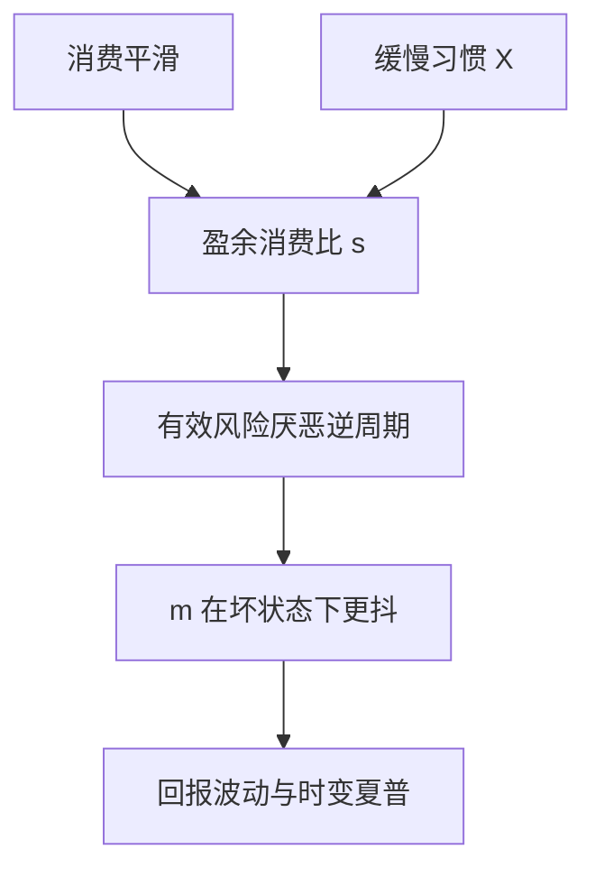

# 习惯形成

边际效用不取决于消费水平，而取决于消费相对缓慢移动的习惯；盈余消费比一低，有效风险厌恶就升，资产价格随坏时光跌。

<footer>—— Campbell and Cochrane, By Force of Habit: A Consumption-Based Explanation of Aggregate Stock Market Behavior, Journal of Political Economy, 1999</footer>

[上一课](/econ/recursive-utility)拆开了 EIS 与 $\gamma$，但总量 $c$ 仍然平滑，有效厌恶仍可以是常数。本课缺口是让厌恶随状态变：Campbell–Cochrane 的外部习惯。不重写 EZ 的递归式，不把习惯做成可交易因子。

## 问题

EZ 允许高 $\gamma$ 配溢价、用 EIS 去顾 $r_f$，但若 surplus 不变，风险价格仍太平，解释不了回报波动与时变夏普。Campbell 与 Cochrane（1999）让效用依赖 $c_t-X_t$，其中 $X_t$ 是外部习惯（邻居或过去社会消费），缓慢随总消费移动。盈余消费比 $s_t=\ln((c_t-X_t)/c_t)$ 在衰退中变小，同一 $\Delta c$ 对边际效用的冲击被放大——有效风险厌恶逆周期。

缺口是：在已经拆开参数之后，还需要一条对**哪一段消费**敏感的技术，才能让 $m$ 在坏状态下更抖。本课取外部习惯，以免与内部习惯的承诺问题缠在一起。

外部习惯：个体把 $X$ 当给定，没有自己操纵习惯的激励。内部习惯：自己的过去 $c$ 进入 $X$，欧拉多出一条习惯的状态变量。CC 用外部，为的是代表主体可处理。

## 方法

CRRA 写在 surplus 上而不是 $c$ 上。习惯用缓慢的过程跟踪消费，并设计成 $s_t$ 不碰到零（敏感度函数保证习惯在 $c$ 下跌时追得够快）。结果：$m$ 对消费创新的弹性随 $s$ 反周期变化；无风险利率可以被习惯的均值回复按住，减轻 Weil 的水平问题；股权溢价与回报波动随 $s$ 升。

这与 EZ 可叠加：习惯改当期边际效用的状态依赖，递归改对续值新闻的态度。本课先单独钉习惯，以免两套自由参数一起开会。

### 不是行为「上瘾」综述

习惯在这里是偏好技术，用来生成逆周期风险价格。不要把 CC 写成消费者心理学实验，也不要把盈余比做成第三个股票因子去排序——本栏不到 [/quant/ff3](/quant/ff3) 里加一列。

## 机制

机制是相对参照。消费水平高但刚从习惯上掉下来时，像很穷；消费低但习惯已经磨下来时，像没那么不可忍受。资产在 $s$ 低时更被厌恶，价格必须已经低到提供高期望回报。历史消费平滑不再直接等于 $m$ 平滑：习惯把平滑的 $c$ 转成波动的 surplus。无风险利率若被习惯的预防性项与均值回复抵消，可以相对稳定——这是 CC 相对纯高 $\gamma$ 的设计目标之一。

长期中性与存在 $m$ 仍成立。失败的仍是「$m\propto c^{-\gamma}$、$\gamma$ 常数」那一特化，不是有效市场分层。

Campbell and Cochrane, *JPE* 1999。敏感度函数是为了让 $r_f$ 不太乱、并让 $s$ 有下界；它是偏好设定的一部分，不是从数据里「发现」的一个因子载荷。

## 边界

不要宣布习惯已经关掉两谜：校准仍用总量消费，测量与样本问题还在。也不要把外部习惯与长期风险互相替代——下一课 [长期风险](/econ/long-run-risk)用的是消费过程的持久成分加 EZ，不是 $c-X$。并列修补，检验换栏。

后课默认：有效风险厌恶可以随盈余消费比逆周期变动；$m$ 对同一 $\Delta c$ 的弹性是状态依赖的。内部习惯的承诺与均衡复杂性不在本课展开。

横截面价值、动量不在此用习惯改写。那些映射若要做，是量化栏用可交易组合去代理状态。

内部习惯让个体自己的过去消费进入 $X$，会多一条承诺：今天多吃抬高明天习惯，欧拉更乱。CC 用外部习惯避开这条，代表主体才好校准。不要把「邻居的消费」读成社会学附录——它是为了关掉承诺。

长期风险下一课给 $\Delta c$ 一条慢的期望增长。差年份往往 $s$ 也低、$x$ 也差，数据上两套 $m$ 会抢同一段历史。理论必须分开写参照与谱。

## 小结

- Campbell–Cochrane：外部习惯使边际效用取决于盈余消费比。
- 有效风险厌恶逆周期，$m$ 在坏状态下更抖，有助于溢价与回报波动。
- 与 Epstein–Zin 是不同旋钮：一个改参照，一个改 EIS 与续值。
- 外部习惯关掉自己操纵 $X$ 的承诺问题；内部习惯不在本课展开。
- 下一课长期风险改消费过程的谱，不改 $c-X$。
- 出处：Campbell and Cochrane, *JPE* 1999。
