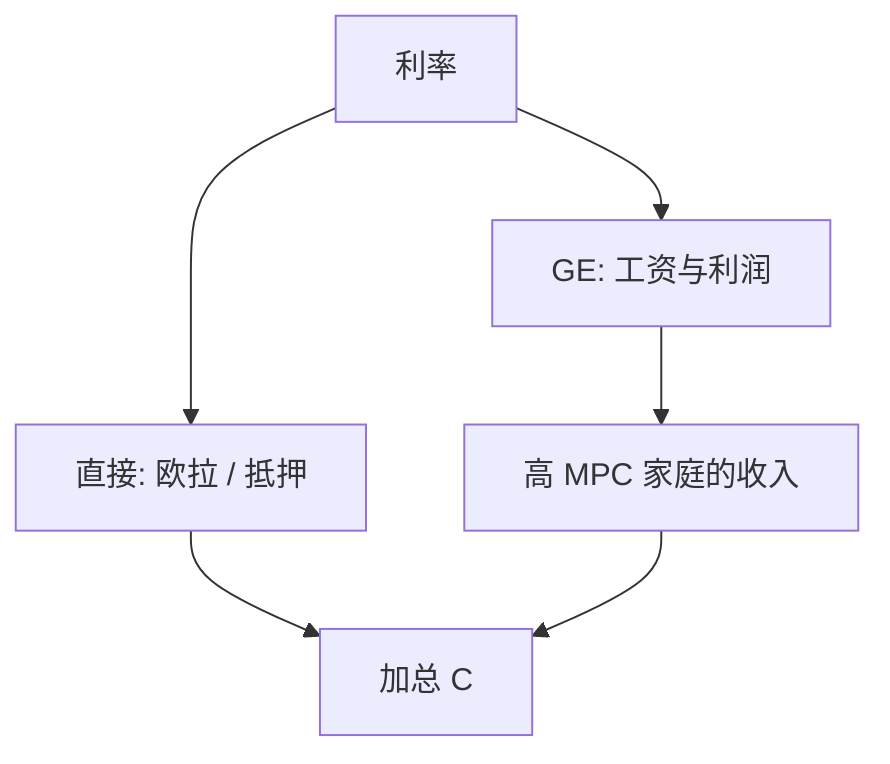

# HANK

异质、不完全市场与名义刚性接在一起时，货币与财政的传导不再只走欧拉的跨期替代，还走收入与流动性。

<footer>—— Kaplan, Moll and Violante, Monetary Policy According to HANK, AER 2018</footer>

[上一课](/econ/wealth-distribution-pareto)把厚尾与资本供给钉在实物不完全市场上。NK 的代表性 RANK 用欧拉把利率接到总需求。本课缺口是 **HANK**：同一套名义刚性，换上异质家庭与流动性资产结构。不重写 Calvo 推导，不重写帕累托机制。

## 问题

RANK：利率升 ⇒ 跨期替代 ⇒ 消费降，收入循环是次要的。Kaplan–Moll–Violante：大量家庭是贫流动性（富于非流动性资本、却缺流动性资产），MPC 高，消费跟的是现金流与工资，不是 $\sigma(i-\pi^e-\rho)$。货币紧缩经一般均衡压劳动收入，再经高 MPC 放大——间接效应可主导直接欧拉效应。缺口是把 Aiyagari 分布与 NK 价格/工资粘性焊成同一均衡，而不是再估一个 SW。

Kaplan, Moll and Violante, *AER* 108(3), 2018, 697–743。Werning 对 RANK/HANK 的解析对照。Auclert 的充分统计（再分配渠道）。Gornemann–Kuester–Nakajima 更早的异质 NK。

## 方法

家庭：至少两种资产（流动性 vs 非流动性）或偶尔绑定的约束，劳动收入来自企业劳动需求。企业：Calvo 或 Rotemberg 定价。政策：泰勒规则。求解：稳态用 Aiyagari 装置；总量冲击用序列空间线性化或 KS 式定律。IRF 分解：直接（利率进欧拉、进抵押）vs 间接（工资、红利、税收、转移）。校准靶同时含微观 MPC 与宏观脉冲。

与 Smets–Wouters：SW 用习惯、规则拇指冲击模仿「消费跟收入」；HANK 把同一现象写成约束与分布。估计仍难，本课不把 HANK 贝叶斯当默认。

## 机制

机制是加总 MPC 与收入循环。谁付利息、谁收红利、谁的工资动，决定再分配：Auclert 的渠道（未预期通胀对名义名义财富、利率对滚动债务）。若利润归富人、工资归高 MPC 劳动者，紧缩的间接效应更强。流动性资产供给（政府债、准备金）改变贫流动性份额，从而改变乘数——财政课下一课再放大这条。

RANK 不是 HANK 的 $\sigma\to\infty$ 极限这么简单：市场结构与谁持有债都要声明。

两资产是 KMV 的关键：一资产 HANK 往往让利率的直接收入效应（储蓄者变富）抵消太多。装置选择会改故事。

## 边界

本课不估计最优 Taylor 系数。不把限价簿当流动性定义。企业异质与投资下一课序末才接。开放经济 HANK 不在此展开。诊断性预期与疏忽是预期单元，可叠加，不是本课。

后课默认：HANK = 不完全市场分布 + 名义刚性；传导以间接收入为主是可校准的结果，不是恒等式。下一课：把 MPC 的截面写成可测对象。

## 小结

- HANK 把异质家庭接到 NK 刚性上。
- 货币传导可被间接收入效应主导。
- 资产流动性结构决定谁是高 MPC。
- 出处：Kaplan, Moll and Violante, *AER* 2018。
