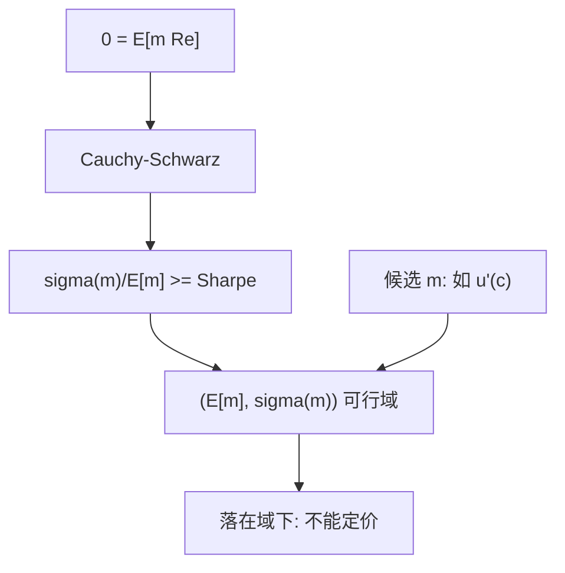

# Hansen–Jagannathan 界

可交易收益的夏普比，给随机折现因子的波动率下了一道不依赖偏好函数形式的界。

<footer>—— Hansen and Jagannathan, Implications of Security Market Data for Models of Dynamic Economies, Journal of Political Economy 1991</footer>

定位：[上一课](/econ/stochastic-discount-factor)。无套利已经给出 $m>0$ 使 $p=\mathrm{E}[m x]$，风险溢价是与 $m$ 的协方差。SDF 课点过名字：可交易夏普比越高，定价核必须越波动——但没有把不等式写出。本课缺口就是这道会计界。不校准消费模型，不估计市场 beta。

## 问题

$0=\mathrm{E}[m R^e]$ 对任意可交易超额收益成立。这是一阶矩约束，尚未说 $m$ 必须「抖」多少。候选很多：几乎常数的 $m$ 对应风险中性，解释不了高夏普；很抖的 $m$ 什么都能定价，又没有拒绝力。Hansen 与 Jagannathan（1991）问：在只使用收益数据、不指定效用的前提下，$m$ 的波动至少要多大。

缺口不是再证明存在性，而是从内积推出可检验的下界。界被违反，则该候选 $m$（例如某组偏好给出的边际替代率）不可能定价这些收益——无论你是否愿意再调一个自由参数去拟合均值。

夏普比 $\mathrm{E}[R^e]/\sigma(R^e)$ 是可交易策略的均值–波动权衡。HJ 界说：定价核的变异系数不能低于该策略能达到的最大夏普。这是 Cauchy–Schwarz，不是估计。

## 方法

由 $0=\mathrm{E}[m R^e]=\mathrm{E}[m]\mathrm{E}[R^e]+\mathrm{Cov}(m,R^e)$ 得 $\mathrm{E}[R^e]=-\mathrm{Cov}(m,R^e)/\mathrm{E}[m]$。Cauchy–Schwarz 给出 $|\mathrm{Cov}(m,R^e)|\le\sigma(m)\sigma(R^e)$，于是

$$
\frac{\sigma(m)}{\mathrm{E}[m]} \ge \frac{|\mathrm{E}[R^e]|}{\sigma(R^e)}.
$$

右边换成可行集合里的最大夏普。$\mathrm{E}[m]$ 由无风险（或零 beta）锚定：$\mathrm{E}[m]=1/R^f$。因此观察到的夏普直接限制 $\sigma(m)$。股票相对债券的历史夏普大约 0.3–0.5 量级，则 $m$ 的年波动不能太小——这是后课股权溢价之谜的会计入口，本课先停在不等式。

更一般的 HJ 界允许把 $m$ 投影到收益空间，画出 $(\mathrm{E}[m],\sigma(m))$ 平面上的可行区域。候选模型必须落在区域上方。区域只用价格与收益，不用消费。

与 [EMH](/econ/emh) 的接法：经 $m$ 调整后无利润，是有效的核语言；HJ 说的是这个 $m$ 不能太平。有效可以成立而候选 $m$ 仍被界拒绝——拒绝的是偏好或因子，不是信息分层。

## 机制

机制是线性定价的几何。所有可交易超额收益张成一个向量空间；$m$ 必须与该空间正交（内积为零）。正交条件能约束的是 $m$ 在该空间上的投影，投影的范数至少等于最大夏普。偏好给出的 $m$ 若几乎不抖，投影太短，正交失败。

不完全市场时 $m$ 不唯一，界约束的是集合里**波动最小**的那个：若连最平滑的可行 $m$ 都不够抖，整个集合失败。这比指定唯一 $m$ 更弱，也因此更硬——躲不进「换一个等价核」。

### 界是会计，不是校准

把 HJ 界当成「估计风险厌恶」是倒过来：界不产出 $\gamma$，它只否决太平滑的核。消费数据进入下一课，才会把 $\sigma(m)$ 翻译成 $\gamma$ 与消费增长波动的乘积。本课禁止用股权溢价的百分数改写不等式。横截面因子是否张成投影，见 [/quant/ff3](/quant/ff3)；这里只保留可行域。

$m$ 必须为正才排除套利。HJ 的波动界可以先不管正性，再加 $m>0$ 的收紧。收紧后下界更高：同样的夏普要求更抖的正核。

## 边界

不要把界的违反写成市场无效：可以是候选 $m$ 错了，价格仍满足某个更抖的核。也不要把最大夏普当成无成本可交易——卖空限制、交易成本会降低可行夏普，从而放松对 $\sigma(m)$ 的要求。本课用无摩擦可交易集当基准。

下一课 [股权溢价之谜](/econ/equity-premium-puzzle) 把消费欧拉放进这道界：观测到的 $\sigma(\Delta c)$ 太小，CRRA 要极大的 $\gamma$ 才能让 $\sigma(m)$ 够格。本课不提前做 Mehra–Prescott 的校准表。

后课默认：$\sigma(m)/\mathrm{E}[m]$ 不低于最大夏普。候选核必须落在 HJ 可行域上。这是对 $m$ 的会计约束，不是 CAPM 检验。

几乎常数的 $m$ 只能定价近零的夏普。股票债券的夏普已经排除风险中性核。

投影最短的 $m$ 若仍不够抖，整个等价类一起失败。不完全市场不是避难所。

## 小结

- 由 $0=\mathrm{E}[m R^e]$ 与 Cauchy–Schwarz：定价核的变异系数 ≥ 最大夏普。
- 可行域只用收益数据，不指定 $u$。
- 违反界是否定该候选 $m$，不是自动否定有效。
- 出处：Hansen and Jagannathan, *JPE* 1991。
