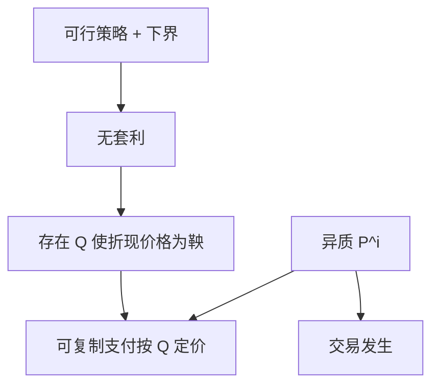

# Harrison–Kreps 鞅定价

可行的跨期交易若不容套利，资产价格在某个等价测度下是鞅；投机者可以意见不同，只要他们的交易仍落在这套价格上。

<footer>—— Harrison and Kreps, Martingales and Arbitrage in Multiperiod Securities Markets, Journal of Economic Theory, 1979</footer>

[上一课](/econ/dynamic-completeness)说明动态张成如何使 EMM 唯一。本课缺口是回到 1979 年原文的问题设定：多期证券、可行消费计划、以及**信念可以不同**时价格仍是鞅。不重做 Girsanov，不把异质信念写成行为泡沫课的再版——那一课已有 Harrison–Kreps 投机；这里要的是鞅定价作为 FTAP 的历史与逻辑核。

## 问题

Harrison 与 Kreps 问：给定事件树与有限证券，怎样的价格过程使（适当定义的）可行策略不产生套利，并使有限生命的投资者能用证券实现消费。答案是：存在等价测度，折现价格为鞅；任何可复制的支付按鞅期望定价。信念异质时，每人有自己的 $\mathbb{P}^i$，但无套利约束的是价格，不是信念——只要存在一个与「被定价的事件」相容的 $\mathbb{Q}$，意见不同的人仍可以交易，价格不必等于任何一个人的 $\mathrm{E}^{i}[m x]$。

缺口是把 FTAP 从「存在 $m$」写回原文的跨期可行集语言，并标明：鞅是对 $\mathbb{Q}$，不是对每个投资者的 $\mathbb{P}^i$。行为课序的投机泡沫用的是同一对作者的另一篇（1978, *QJE*）——短卖约束加异质信念。本课 1979 是套利与鞅；不要并成一篇。

Harrison and Kreps, *JET* 20, 1979。连续时间的 Harrison–Pliska 1981 把同样逻辑放到随机积分。本课以 1979 的离散多期为骨架。

## 方法

定义策略的可行：财富过程有下界（避免加倍策略那种「无限负债换套利」）。在此约束下 NA，分离给出 $\mathbb{Q}$。定价：可复制权益的价格是 $\mathrm{E}^{\mathbb{Q}}[\text{支付}/\text{计价}]$，与任何 $\mathbb{P}^i$ 的主观期望都可以不同——差的部分是风险调整，或是意见，两者在仅有价格数据时分不开。这正是 [EMH](/econ/emh) 联合假说在鞅语言里的样子。

完全时 $\mathbb{Q}$ 唯一，意见差异只能表现在持仓上，不能表现在价格上：价格被复制锁死。不完全时意见可以进入未被复制的方向的「价格」（若那些要求权被开出来），本课仍停在已上市证券。

不要把鞅定价写成「价格不可预测」。在 $\mathbb{P}$ 下价格可以有漂移；不可预测的是 $\mathbb{Q}$ 下的折现价格。Samuelson 1965 的「正确预期」接近 $\mathbb{P}$–鞅，那是风险中性或已经折现好的特例。

## 机制

机制是跨期预算的对偶。每一期的证券交易把财富在状态下搬家；套利是搬家后能免费改善消费。对偶变量在每个节点给出局部状态价格，串起来就是密度过程。异质信念不破坏对偶——破坏的是「$m$ 来自同一个 $u'(c)$」。均衡若要存在，还需要市场出清；FTAP 不管出清，只管给定价格过程是否可套利。Lucas 树下一课才把出清加回来，选出一个特定的 $m$。

加倍策略：若财富无下界，鞅变换仍可能让期望升——那是策略空间太大，不是 FTAP 失败。下界（或可积性）把免费午餐从「技术上的期望把戏」里关掉。

1978 的 *QJE* 投机：短卖约束使乐观者决定价格。1979 的 *JET*：无约束时价格由 $\mathbb{Q}$ 锁。两篇作者重叠，假设与结论不重叠。

## 边界

本课不估计风险中性密度，不从期权表面反演 $q$——那是 Breeden–Litzenberger 的测量，偏量化。下一课把状态价格与 SDF 正式焊成一座桥，便于后文 Lucas 树用 $u'(c)$ 选出 $\mathbb{Q}$。

后课默认：Harrison–Kreps 的鞅是 FTAP 的跨期形式；信念可异质，可复制价格仍由 $\mathbb{Q}$ 给出。财富下界是策略空间的一部分。1978 投机篇不是本课。

## 小结

- 可行策略无套利 ⇔ 存在使折现价格为鞅的 $\mathbb{Q}$。
- 可复制支付按 $\mathbb{Q}$ 定价，不必等于任何主观 $\mathrm{E}^{i}$。
- 鞅在 $\mathbb{Q}$ 下，不是「$\mathbb{P}$ 下不可预测」。
- 出处：Harrison and Kreps, *JET* 1979。
