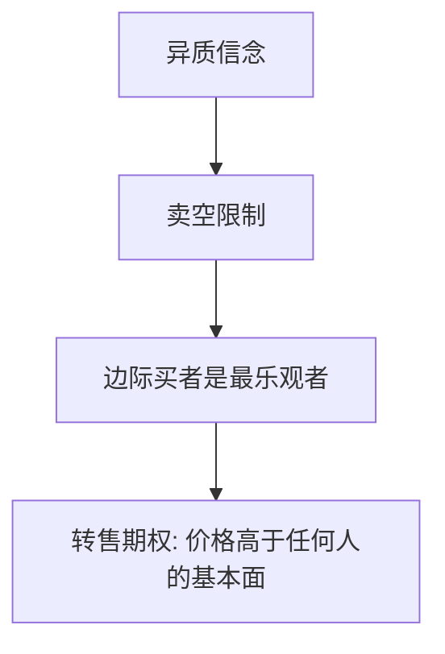

# Harrison–Kreps 异质信念

不能卖空时，价格由最乐观的人决定；他还愿意付一笔溢价，因为可以把资产再卖给明天更乐观的人。

<footer>—— Harrison and Kreps, Speculative Investor Behavior in a Stock Market with Heterogeneous Expectations, QJE 1978</footer>

[上一课](/econ/disposition-effect)的参考点在成本。本课缺口换成信念异质：即使每个人内部时间一致、按期望效用定价，只要信念不同且卖空受限，价格可以高于任何一个人的持有价值。不重写损失厌恶。

## 问题

公共信息下 [EMH](/econ/emh) 常默认共同先验。Harrison 与 Kreps（1978）：投资者对股息过程持不同主观信念，禁止卖空。当前持有者的价值 = 自己吃股息的价值 + **转售期权**（卖给未来更乐观者）。价格可以严格高于所有人的最高基本面估值。投机溢价来自再售，不是来自 $v$ 的拐折。缺口是给泡沫一个不依赖前景理论的理论核。

Miller（1977）已经指出卖空限制下价格反映乐观者。Harrison–Kreps 把动态转售加进去，溢价可以随时间变。

## 方法

离散时间，异质马尔可夫信念，卖空约束。动态规划：持有者每期选择继续持有或卖给当期最乐观的人。均衡价格过程被最乐观的边际买者决定，并含期权项。比较静态：信念越散、越可能轮流当最乐观，转售期权越贵。

本课不把意见分歧写成限价簿上的买卖档。那是协议；这里是谁被允许持有负仓。

## 机制

机制是约束下的期权。悲观者无法把负仓拿满，其信息不能对称地压低价格。乐观者支付的不只是股息，还有「明天也许有人比我更乐观」的彩票。这与 DSSW 不同：不必有人系统性地错，只要持续不同意且不能卖空。与 DHS 过度自信相容：过度精确加大分歧，放大转售期权——Scheinkman–Xiong 下一课把这句话做实。

共同先验加不同信息通常会通过价格学习。Harrison–Kreps 允许对数据生成过程根本不同意，卖空一关，边际定价权交给当期最乐观者。Miller 的静态版没有期权项；动态版让泡沫随「谁明天更乐观」的概率而涨。本课 $p$ 仍是均衡价格，不是买卖档。主干在簿的交接处停，这里补的是持有权约束，不是队列。

## 边界

允许充分卖空，转售期权消失，价格回到某种加权平均信念。共同先验加不同信息会回到理性预期学习，不一定有泡沫。本课不处理内生信息获取。理性泡沫（Tirole）是另一条：共同信念下的爆炸解，更后一课。

后课默认：投机溢价 = 转售期权；换手是期权被行使的痕迹。

卖空限制下边际买者是最乐观者，价格含转售期权，可高于所有人的基本面估值。

不必有人系统错，只要持续不同意。共同先验加学习通常会收敛；此处允许根本不同意。

内生信息获取本课不处理；理性泡沫是共同信念下的另一支。

## 小结

- 卖空限制下，价格由乐观者加转售期权决定，可高于所有基本面估值。
- 不需要前景理论，不需要噪声的随机需求。
- 分歧加约束是泡沫的一条理性投机核。
- Miller 静态版没有期权项。
- 充分卖空关掉溢价。
- 出处：Harrison and Kreps, *QJE* 1978。
