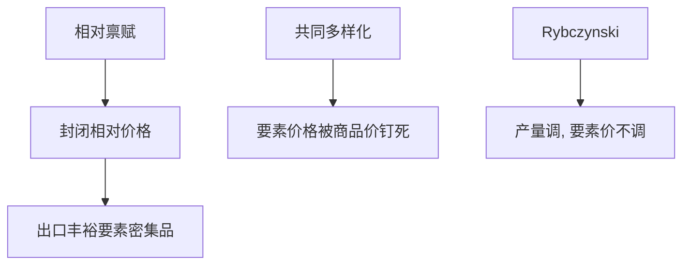

# Heckscher–Ohlin

技术相同、偏好相似时，一国出口密集使用其丰裕要素的产品；贸易是要素服务的间接流动，而不必把工人运出国境。

<footer>—— Heckscher, The Effect of Foreign Trade on the Distribution of Income, 1919；Ohlin, Interregional and International Trade, 1933</footer>

[上一课](/econ/ricardian-comparative-advantage)用劳动生产率差解释分工。本课缺口是：技术若相同，贸易从哪来？Heckscher–Ohlin（HO）用要素禀赋。Stolper–Samuelson 下一课把价格接到要素报酬；本课先钉 $2\times2\times2$ 的出口模式。

## 问题

两国、两商品、两要素（资本与劳动），相同规模报酬不变技术、相同位似偏好。本国资本相对丰裕：$K/L\gt K^*/L^*$。商品 1 资本密集。HO 定理：本国出口 1、进口 2。缺口不是再讲李嘉图的 $a_{Li}$，而是：相对禀赋差 → 封闭时相对要素价格差 → 相对商品价格差 → 贸易方向。要素不能跨境，商品贸易部分替代要素流动。

要素价格均等化（FPE）：自由贸易加要素密集不逆转、两国都生产两种商品，则 $w,r$ 被商品价格钉死，与禀赋无关（在 FPE 集内）。禀赋只定产量，不定要素价格。这是强结论，实证上常破，但逻辑要先有。

## 方法

封闭：丰裕要素相对便宜，密集使用它的产品相对便宜。开放：该产品出口，直到商品价格对齐。Rybczynski：禀赋增加、商品价格不变时，密集使用该要素的产品产量升、另一种降——产量调整代替要素价格调整（在 FPE 内）。这是后课增长与移民的对照系。

Leontief 悖论：美国出口劳动密集——对 HO 的早期打击。读法包括：人力资本不是简单 $L$、技术不同（回到李嘉图）、需求差异、要素密集逆转。本课不仲裁数据，只要求：定理的假设清单要对照着读悖论。

## 机制

机制是相对稀缺。商品流动带着要素服务。完全 FPE 时，贸易已经把要素价格拉齐，再让劳动移民的增益只剩不可贸易品与集聚——后课 Melitz、经济地理。FPE 失败（专业化到锥外、贸易成本、技术差）时，要素价格仍可差，移民与贸易是互补而不是完全替代。

与李嘉图：李嘉图是技术差、一种要素；HO 是技术同、多种要素。现实两者都在。不要用 HO 否定比较优势：HO 是比较优势的一种来源（禀赋），不是替代定义。

Ohlin 强调地区间要素流动与商品流动的替代。Heckscher 更早把收入分配写进贸易。Samuelson 把 $2\times2$ 代数写严。

## 边界

$2\times2\times2$ 不能直接读成「资本丰裕国只出口机器」。多要素、多商品用 HOV（Vanek）写成要素含量：净出口的要素含量等于禀赋减消费的要素含量。Trefler 的「缺失贸易」：要素含量远小于禀赋差，要技术差与贸易成本。下一课 SS：商品价格变动如何切分 $w$ 与 $r$，这是分配政治的理论核。

后课默认：技术相同时，出口丰裕要素的密集型产品；FPE 是共同多样化的强预测，不是数据默认。李嘉图的技术差与 HO 的禀赋差可以并存。不要用封闭要素价格当自由贸易后的工资。

## 小结

- HO：出口密集使用丰裕要素的产品。
- 贸易替代（部分）要素流动；FPE 在锥内钉住 $w,r$。
- Rybczynski：价格不变时产量随禀赋极端调整。
- Leontief / 缺失贸易对照的是假设，不是「定理算错」。
- 出处：Heckscher 1919；Ohlin 1933；Samuelson 的 $2\times2$；Vanek；Trefler。
