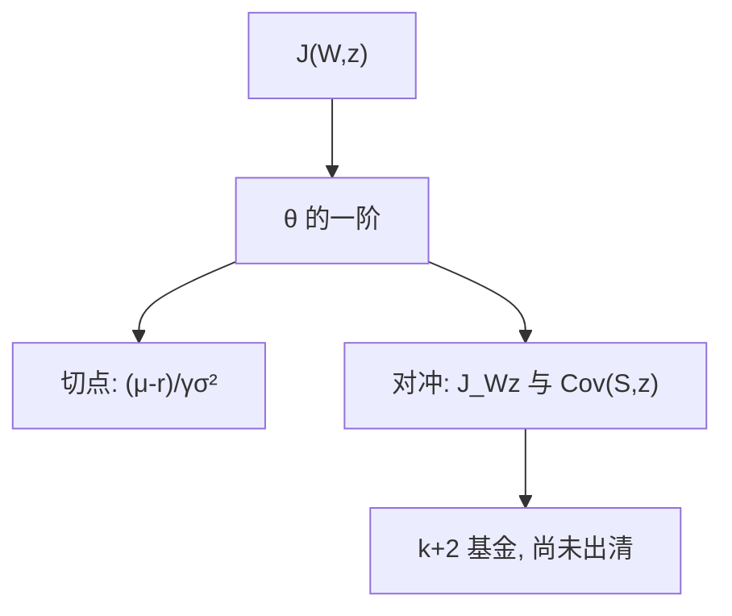

# 对冲需求的来源

$J$ 一旦依赖机会状态 $z$，最优暴露除切点外还要一项：$W$ 与 $z$ 在坏机会里同向还是反向，由 $J_{Wz}$ 的符号决定。

<footer>—— Merton, An Intertemporal Capital Asset Pricing Model, Econometrica, 1973，组合需求一节</footer>

[上一课](/econ/merton-portfolio-theory)在 $J(W)$ 下得到纯切点。本课缺口是让投资机会随机：$r$、$\mu$、$\sigma$ 或价格核随 $z$ 变，$J=J(W,z)$。主干 ICAPM 已经把加总后的多 beta 写过；本课只补**需求从哪一项来**，不出清、不写截面。

## 问题

$z$ 的动力学 $\mathrm{d}z=\ldots$ 与资产扩散相关。伊藤的交叉变差使 HJB 出现 $J_{Wz}$。对 $\theta$ 的一阶变成

$$
\theta^\ast=\frac{\mu-r}{\gamma\sigma^2}+\theta^{\text{hedge}}(J_{Wz},\mathrm{Cov}(\mathrm{d}S,\mathrm{d}z)).
$$

切点项仍是「这瞬间的投机」；对冲项是「$z$ 变差时我希望 $W$ 在哪」。若某资产在机会恶化时上涨，厌恶机会风险的人额外买它，愿意接受更低的即时超额。缺口是把这句话留在需求层，不要立刻跳到「所以有三个因子」。

机会恶化的定义依赖 $J$：利率下降对长期投资者是好是坏，看他是净债权人还是要再投资。符号不是普适的「买债券对冲」口号。

## 方法

状态 $(W,z)$，生成元含 $\mathrm{d}W$、$\mathrm{d}z$、$\mathrm{d}\langle W,z\rangle$。对 $\theta$ 求导，投机项来自 $J_W$ 对超额的暴露，对冲项来自 $J_{Wz}$ 对交叉变差的暴露。CRRA 时相对对冲与财富无关，仍可能随 $z$ 变。多个 $z$ 就多个对冲基金——两基金变成 $k+2$ 基金（Merton）。动态完备：若存在可交易资产能张成每个 $\mathrm{d}z$，对冲可实施；否则个人留在未对冲的 $z$ 风险里，那是不完全。

与消费 CAPM：Breeden 说时间可分下这些对冲被 $c$ 吸收。本课不吸收，故意把 $z$ 留在需求里，好看见来源。两条路在完全市场可相容，主干已对照。

## 机制

机制是跨期保险。$z$ 进入未来的可行集：再投资利率、风险价格、劳动收入机会。今天的组合是唯一能把财富在 $z$ 的状态下搬家的工具（在给定菜单下）。$J_{Wz}>0$ 表示财富与 $z$ 互补（$z$ 高时财富更值钱，或反之，取决于 $z$ 的标号），于是要在 $\mathrm{d}z$ 上持有相应协方差。这与 Glosten–Milgrom 的保险不同：那边保的是不利选择，这边保的是投资机会。都叫对冲，对象不同。

劳动收入若不可交易且与 $z$ 相关，对冲项还要抵消人力资本的暴露——预算里本没有这项资产，需求在可交易菜单上找替代。不完全的典型来源。

随机机会把「长期投资者与短视投资者」分开。短视只看切点；长期多对冲。寿险与养老金的需求理论从这里起步，本课不展开产品。

## 边界

不要列举哪些宏观变量是 $z$。那是实施，滑向量化栏。下一课出清：人人带上对冲需求之后，若机会其实可由市场代表，连续时间 CAPM 仍可能只有一个 beta；一般则回到 ICAPM。本课不出清。

后课默认：对冲需求来自 $J_{Wz}$ 与资产–状态协方差，不是来自特质方差。切点项仍在。基金数目随独立 $z$ 的可交易张成而定。

## 小结

- $J(W,z)$ 使最优 $\theta$ 含切点加对冲。
- 对冲保的是投资机会（及不可交易收入），符号由 $J_{Wz}$ 决定。
- 本课是需求，不是定价方程，更不是因子表。
- 出处：Merton, *Econometrica* 1973（需求节）；对照 *JET* 1971 的常机会。
