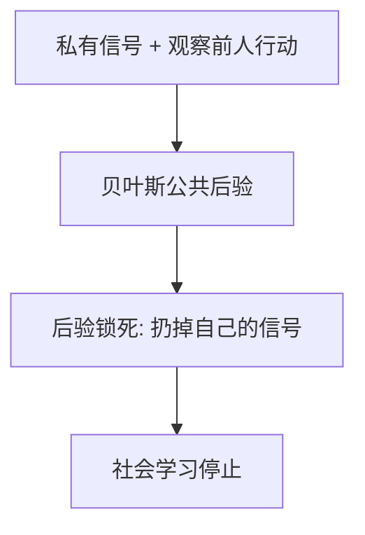

# 羊群与信息级联

一旦前面几个人的行动已经把后验锁死，后面的人理性地扔掉自己的信号——社会学习停止，错误可以永久化。

<footer>—— Banerjee, A Simple Model of Herd Behavior, QJE 1992；Bikhchandani, Hirshleifer and Welch, JPE 1992</footer>

[上一课](/econ/abreu-brunnermeier)是知情者等同步。本课缺口是不知情者向行动学习：序列选择里，公共后验可以压过私有信号，级联开始。不重写攻击阈值。

## 问题

Banerjee（1992）与 Bikhchandani、Hirshleifer、Welch（1992，BHW）：决策者按顺序行动，看到前人选择，收到独立私有信号。最优是贝叶斯更新后选期望更好的项。若前两人已经同向，第三人的信号往往不够翻转公共后验，他模仿——级联。此后行动不再泄露信号，信息加总失败。缺口是给羊群一个**信息外部性**定义，区别于 DSSW 情绪或社会偏好里的模仿。

Scharfstein 与 Stein（1990）的声誉羊群：经理为了不显得比同行笨而模仿，即使有私有信息。那是代理，与 BHW 的纯信息级联并列。

级联对信号质量极敏感：一点点公共信息或打乱顺序就能打破。脆弱是可检验含义，不是缺陷。

## 方法

两状态、二元信号、序列行动。计算公共似然，标出级联开始的历史。对照：若能看到前人的信号而非行动，级联不会发生。金融：IPO 认购、分析师推荐、存款挤兑的信息版本（与 Diamond–Dybvig 的流动性版本分工，不重写银行课）。

## 机制

机制是行动对信号的压缩。行动是粗信号，一旦公共信念越过阈值，后人的行动与自己的信号无关，后人的观察者学不到新东西。价格若即时充分反映所有私有信号，级联难以形成——因此级联模型通常假定离散选择或对价格反应迟钝，与 [EMH](/econ/emh) 半强式紧张。Hong–Stein 的扩散是空间上的分段；级联是时间上的停止学习。两者都是信息加总失败。

与 AB：AB 的玩家已经知道泡沫，等资本；级联的玩家还在猜状态，模仿前人。

行动是对信号的粗压缩：买/不买两个字母，装不下连续后验。公共信念一旦越过阈值，后人的最优是模仿，其行动不再含私有信息，学习停止。若能看到前人信号本身，级联不会发生。价格若连续且充分揭示，级联空间缩小——故模型常配离散选择。Scharfstein–Stein 的声誉羊群是代理：怕显得与众不同，即使没有信息外部性。本课以 BHW 纯信息为主。不写订单流。

## 边界

连续价格、内生顺序、逆向选择会改变级联区域。现场「跟风」混杂声誉、补偿基准与真正的信息外部性。本课不把基金抱团全部写成 BHW。也不写订单流毒化——微观结构课。

后课默认：有限注意力是另一种信息加总失败：不是扔掉信号，是根本没看见公告。

行动是粗信号；公共后验锁死后人扔掉私有信号，社会学习停止。级联脆弱，一点点公共信息就能打破。

AB 是知情者等动手；级联是猜状态的人模仿前人。HS 是空间扩散，这里是时间上停止学习。

## 小结

- 信息级联：理性模仿使私有信号停止进入公共信念。
- 与情绪羊群、声誉羊群分工；脆弱性是含义。
- 对照 AB（知情等待）与 HS（分段扩散）。
- 若能看见前人信号本身，级联不会发生。
- 声誉羊群是代理，与纯信息外部性并列。
- 出处：Banerjee, *QJE* 1992；Bikhchandani, Hirshleifer and Welch, *JPE* 1992。
