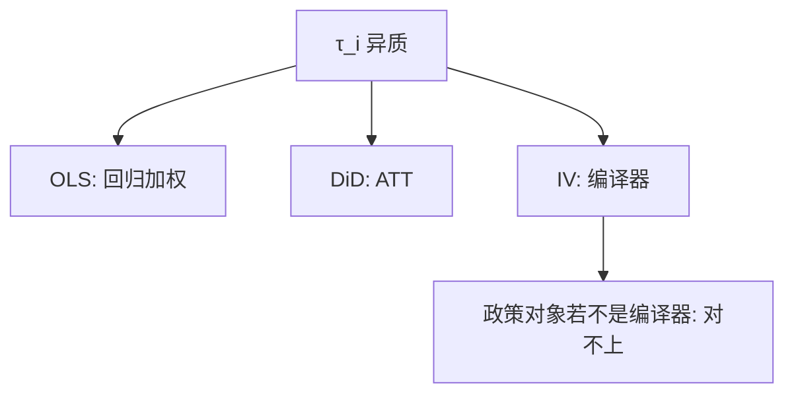

# 异质处理效应

每个人的 $\tau_i$ 可以不同；OLS、IV、DiD 估到的是各自的加权平均。IV 在单调性下对准编译器的 LATE，不是 ATE。

<footer>—— Imbens and Angrist, Identification and Estimation of Local Average Treatment Effects, Econometrica 1994；Heckman and Vytlacil 边际处理效应</footer>

[上一课](/econ/arellano-bond)把动态面板的工具装置写完。本课缺口是：从第一课起就压着没展开的**异质** $\tau_i$。[Bootstrap](/econ/bootstrap-econ)下一课管有限样本精度；稳健聚类更后。本课管参数是谁的平均。识别与回归这一课序在异质处收到「加权必须声明」，机器学习更后再把条件平均拆细。

## 问题

常数 $\beta$ 下 IV、OLS、DiD 说的是同一句话。$\tau_i$ 异质时：OLS 是 $X$ 变异上的加权（Angrist 回归加权）；DiD 是处理组在平行趋势下的 ATT（交错时还要干净对照）；IV 在独立、排除、相关、单调下识别

$$
\mathrm{LATE}=\mathbb{E}[\tau_i\mid\text{complier}],
$$

即工具能推动的那些人。Angrist–Imbens–Rubin 把样本分成永远处理、永不处理、编译器、反抗者；单调性杀掉反抗者。缺口不是再推导 Wald 比，而是：政策若关心的是强制所有人处理（ATE）或已经处理的人（ATT），LATE 可以对不上。义务教育工具推动的是被法律逼入学的边际学生，不是已经会上大学的人。

Heckman–Vytlacil 的 MTE：把 LATE 写成工具从 $u$ 到 $u'$ 的积分。不同工具 = 不同积分段。$J$ 检验拒绝可以是段不同，不一定是排除失败——接住[2SLS](/econ/2sls-overid) 的警告。

## 方法

声明目标参数：ATE、ATT、LATE、条件 $\mathbb{E}[\tau\mid X]$。设计对上参数：随机化 → ATE（或随机化子总体）；资格断点 → 门槛处；IV → 编译器；DiD → ATT。条件平均可用交互、因果树、后课 ML。不要把 LATE 外推成 ATE，除非额外假设（可观测异质全部进入 $X$、或 MTE 平坦）。

弱工具加异质：不仅偏向 OLS，对准的群体也更糊。单调性用领域知识（没有人因为中奖反而少入学），很少能直接检验。

## 机制

机制是加权函数由设计决定，不由研究者的愿望决定。OLS 权重可以在部分区域为负（与 TWFE 同族的投影现象）。IV 权重在编译器密度上为正（单调时）。外部有效是另一句话：加州门槛的 $\tau$ 不等于德州。

与[潜在结果](/econ/potential-outcomes)：ATE 仍是合法参数，只是观测设计常常识别不了它。随机化仍然金标准。结构模型用选择方程把 LATE 接到 ATE——那是下一单元，本课不把选择模型当必须。

「外部有效」失败不等于内部识别失败。LATE 可以对编译器完全对，只是政策要推的是另一群人。两句话分开写。

## 边界

本课不估一组 MTE 曲线。不把异质写成「所以因果无用」。下一课 bootstrap 给有限样本精度；聚类与多重检验更后才会改哪些加权平均「显著」，但不改变参数定义。ML 因果课用样本外与正交化估条件效应，仍要本课的目标参数语言。

后课默认：报告估计量时写清 ATE / ATT / LATE / 局部门槛；异质下禁止把 IV 当 ATE 的同义词。单调性与编译器必须随 IV 一起声明。

## 小结

- 异质时每个估计量是一种加权，不是同一 $\beta$。
- LATE = 编译器平均；单调性排除反抗者。
- 政策对象与编译器可以对不上；这是外部有效，不是内部失效。
- 不同工具对应 MTE 的不同积分段。
- 出处：Imbens and Angrist, *Econometrica* 1994；Heckman and Vytlacil；Angrist and Pischke。
