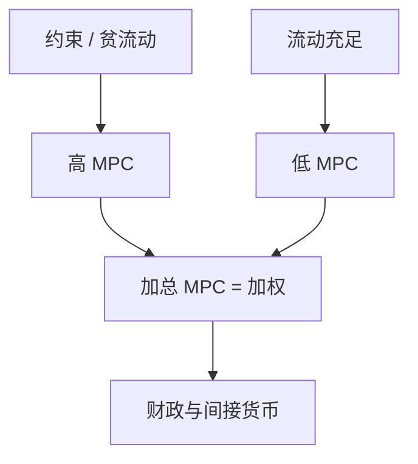

# 边际消费倾向异质

同一美元转移，约束附近几乎吃掉，富人或流动性充足者几乎不吃——加总乘数是 MPC 的加权，不是代表性 $\sigma$。

<footer>—— Kaplan and Violante, A Model of the Consumption Response to Fiscal Stimulus Payments, Econometrica 2014；Parker, Souleles, Johnson and McClelland 的退税实验</footer>

[上一课](/econ/hank)把间接效应的强度交给「谁的 MPC 高」。本课缺口是把 **MPC 截面**写成可估计、可校准的对象。不重推 Calvo，不把财政乘数整课提前写完。

## 问题

RANK 的转移支付若李嘉图，MPC 近零；若一次总付且债券在无限生命代表手里，仍近欧拉。数据：退税、刺激支票的季度 MPC 常在 0.15–0.25 甚至更高（Johnson–Parker–Souleles；Parker 等 2013）。Kaplan–Violante：两资产模型制造「富却无流动性」的手到口，匹配高 MPC 与可观的净资产。缺口是：加总 MPC 不是家庭平均的偏好参数，而是分布与流动性的函数。

Kaplan and Violante, *Econometrica* 82(4), 2014, 1199–1239。Misra–Surico、Fagereng–Holm–Natvik 用挪威行政数据看 MPC 随财富下降。Auclert, *AER* 2019 充分统计。

## 方法

微观：用准实验（退税时间、彩票、分红）估 $\partial c/\partial$ 转移，按流动资产、按揭、收入分箱。宏观校准：令模型的平均 MPC 与分箱 MPC 对上，再谈脉冲。理论：不受约束者 MPC $\approx r$ 量级的小斜率；约束者接近 1（非耐久）。耐久与习惯把动态摊到多期，但仍远高于 RANK。

HANK 的间接效应 $\approx$ 收入变动 $\times$ 加总 MPC。故同一劳动收入 IRF，MPC 校准错则乘数错。

## 机制

机制是欧拉不等式与非流动性。净资产高也可以 MPC 高：住房与退休账户不能当月花。一资产模型用极紧的借贷约束硬造平均 MPC，会把财富分布压得太穷——两资产解开这个权衡。加总时，转移的**指向**（给谁）改变乘数，即使平均 MPC 固定。这是下一课财政 HANK 的入口。

缓冲存量课已有目标财富附近的高 MPC。本课把它接到可测的刺激支付与 HANK 加权，而不是重写谨慎系数。

## 边界

本课不设计最优 UBI。不把信用卡微观结构写成宏观。股票持有者的 MPC 与股权溢价无关的测量，不在此重做资产定价。企业主、创业家庭的 MPC 另口径。

后课默认：说到加总 MPC，必须说加权与流动性，而不是单一 $\sigma$。下一课：同样的加权如何改写财政刺激。

## 小结

- MPC 随流动性与约束强烈异质；平均可由两资产校准。
- 准实验提供分箱靶，不是代表性欧拉的残差。
- 加权 MPC 是 HANK 乘数的充分统计之一。
- 出处：Kaplan and Violante, *Econometrica* 2014；Parker 等退税研究。
