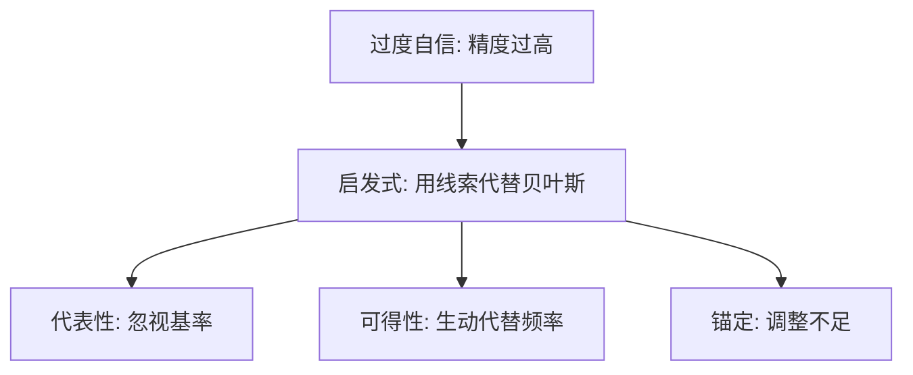

# 启发式与偏差

代表性、可得性、锚定：用便宜的线索代替概率计算，偏差是捷径的影子，不是随机噪声。

<footer>—— Tversky and Kahneman, Judgment under Uncertainty: Heuristics and Biases, Science, 1974</footer>

[上一课](/econ/overconfidence)给出校准失败。本课缺口是机制：人用启发式生成概率，于是系统性地偏。不把过度自信再定义一遍。

## 问题

贝叶斯要求似然与先验。Tversky 与 Kahneman（1974）列出三条捷径。代表性：用「像不像典型」代替基率与样本量，导致基率忽视、合取谬误。可得性：用容易想起的例子代替频率，媒体暴露扭曲灾难概率。锚定与调整：从任意起点调整不足，估计依赖无关锚。这些偏差不是对 [vNM](/econ/expected-utility) 的再拒绝，而是对信念输入的拒绝。

家庭金融：用近期回报代表未来（代表性）制造趋势追逐；用身边炒股故事代表参与收益（可得性）；用买入价当锚（与参考点重叠但起源是判断而非偏好）。

合取谬误：Linda 是银行出纳且女权主义者，被判比「银行出纳」更可能。概率上不可能，代表性上更像故事。

## 方法

实验：基率问题、字母频率、轮盘给出的锚。预测是方向性的：锚高则估计高，生动事件则概率高。本课不估计启发式的神经基础。与概率加权的分工：加权是已知 $p$ 仍扭曲；启发式是 $p$ 本身被错估。

## 机制

机制是属性替换：目标属性难算，用启发属性代替。偏差因此可预测，可被框架放大（生动描述提高可得性）。资产价格若由使用同一启发式的人加总，会有动量与反转——BSV 用代表性与保守性写模型，后单元再接。本课只给微观判断。

与有限理性的接口：启发式可以是对计算成本的最优响应（后课 Simon），也可以是固定的心理程序。1974 年论文取后者：偏差相对规范模型被定义。

基率忽视不是把先验设成无信息：人往往用代表性完全替换贝叶斯分子分母里的基率。锚定的起点可以无关（随机轮盘），调整不足使估计继承锚——这与买入价参考点近亲，但起源是判断数字，不是得失编码。可得性让最近的崩盘故事抬高主观尾部，保险需求上升，不必先动 $w(p)$。BSV 后课会把代表性与保守写成价格动态。

## 边界

Gigerenzer 强调生态理性：在正确环境下启发式可以更准。本栏补层仍用规范贝叶斯当对照，否则「偏差」没有定义。现场经验、统计培训能减弱部分效应，不能据此宣称市场无偏差。本课不把三条写成完备分类。

后课默认：判断偏差来自启发式；有限理性给出「为何不用完整贝叶斯」的计算理由。

属性替换生成可预测偏差：代表性压基率，可得性用生动代替频率，锚定调整不足。

与概率加权分工：启发式错估输入，加权扭曲已知 $p$。

## 小结

- 代表性、可得性、锚定系统性地错估 $p$。
- 与概率加权分工：一个错估输入，一个扭曲已知 $p$。
- 不重推期望效用；信念侧的缺口在此。
- 合取谬误是代表性的经典。
- BSV 后课把代表性与保守放进价格。
- 出处：Tversky and Kahneman, *Science* 1974。
