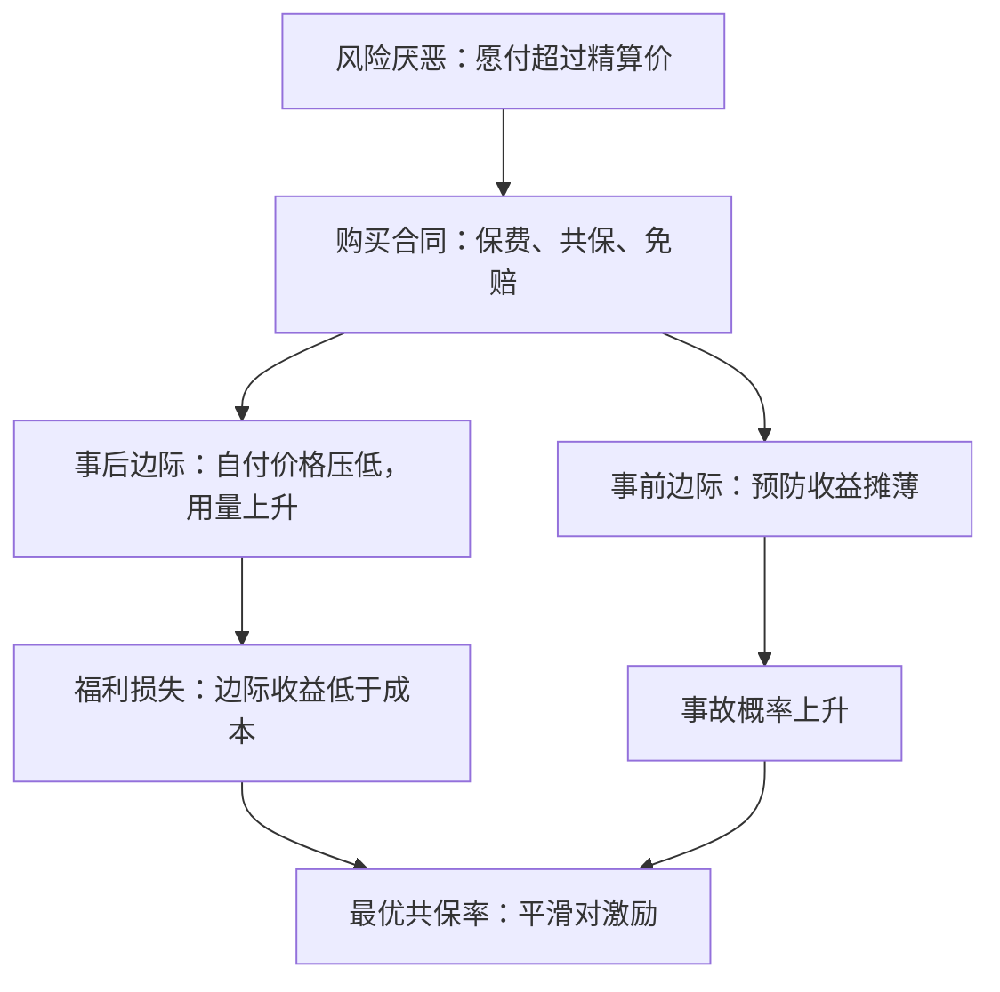

# 保险的需求与道德风险

保险的收益在风险的厌恶一侧，代价在行为的一侧：损失一旦被摊平，患者面对的治疗价格与事故的概率都变了。

<footer>—— 据 Arrow, Uncertainty and the Welfare Economics of Medical Care, AER 1963；Pauly, The Economics of Moral Hazard, AER 1968 整理</footer>

[上一课](/econ/bx-policy-map)把行为公共政策收束：判据先于工具，不对称家长制、自由家长制、有限修复三道门槛递增，判据与证据一个管该不该、一个管配多少。本课是「健康与保险经济学」的第一课，把保险本身当商品来分析：给定风险偏好与保费结构，买多少保障；以及买下保障之后，行为怎么变。后面的风险选择、健康劳动供给与药品定价，都默认你手里有这两件工具：保障的需求曲线，与道德风险的楔子。后课默认已经读完本课。

## 问题

[风险厌恶](/econ/risk-aversion)课给出过基准：公平保费下充分投保，加载越高、自留越多。医疗保险不服从这张图，因为「损失」不是天降的火：医疗支出里有一部分是自己选的治疗量，事故概率里有一部分是自己选的预防努力。保险一旦把患者面对的价格从 $p$ 压到自付 $(1-c)p$，治疗量沿需求曲线上移；一旦把损失的财务后果摊平，预防的私人收益下降，事故概率上移。缺口因此是：这两条行为渠道并不需要「坏人」，只是价格变了——Pauly 把 Arrow 的福利命题收成这一句。分析必须同时写购买边际与行为边际，否则要么高估保险的福利收益，要么把道德风险误读成欺诈。

### 两个边际

事后边际：买了保险之后的用量。事前边际：投保之后更少的预防。文献里道德风险常只指前者；本课两个都记在账上，因为最优合同同时被两者推。

RAND 医疗保险实验把家庭随机分到从免费到 95% 共保的计划：免费组的医疗支出比高共保组高约三成，而平均健康结局的差异很小。使用边际的弹性是真的，其对平均人群的健康收益是小的——这两个数字是本课全部权衡的经验底座。

## 方法

合同写成一个三元组：保费 $\pi$、共保率 $c$、免赔额 $D$。购买边际沿用期望效用：风险厌恶使愿付超过精算价，加载把自留风险推回来。行为边际是两条一阶条件：治疗量 $q$ 选到边际收益等于自付价格 $(1-c)p$，而社会的有效条件是边际收益等于边际成本 $p$，两者的差就是楔子；预防努力选到边际成本等于期望损失 $p(e)L$ 的下降，投保把损失中自己承担的份额摊薄，这项收益随之变小。

免赔额的逻辑由此自明：小额风险的效用溢价是二阶的，加载却按比例收，把小风险保起来是用一阶成本买二阶收益。理性的合同因此把小额支出留给自付、把灾难性损失留给保险——这与观察到的免赔额结构一致。

## 机制

把道德风险画成楔子之后，「最优保障多少」不再是规范口号，而是内部解：自付份额升高，风险平滑变差、楔子变小；自付份额降低，反之为。最优合同停在两种损失的边际相等处。免赔额把小风险的楔子整个拿掉，是同一逻辑在支出分布上的版本。

测量因此也有纪律：把保障的价格（自付份额）变化当工具，用量反应是道德风险，参保反应混着选择——那是下一课的对象。RAND 的贡献是第一次把两者分开：随机分派使选择不进估计，剩下的是干净的用量弹性。

## 边界

本课不写签约前的类型：健康风险高的人更想买慷慨保单，这是逆向选择，下一课用 Rothschild–Stiglitz 的机器处理。也不写动态合同与长期保单关系，不写支付方式把道德风险搬到供给侧的版本——按人头付费是同一楔子贴在医生身上。识别上注意：选择与激励混在一起，只有随机分派或价格工具的外生变化能拆开。

后课默认：合同由 $(\pi,c,D)$ 描述；道德风险是价格楔子，不是道德败坏；测道德风险要动价格，不能只看谁买了什么。

## 小结

- 保险需求由风险厌恶与加载决定；医疗的特殊性在于损失部分可选、概率部分可选。
- 道德风险是事后用量与事前预防两条价格楔子，不是欺诈。
- 最优共保与免赔额是「保险价值对激励损失」的内部解；小风险不值得保。
- RAND 实验给出干净的用量弹性：支出对自付份额敏感，平均健康结局不敏感。
- 出处：Arrow, *AER* 1963；Pauly, *AER* 1968；Manning 等 1987（RAND 医疗保险实验）；Einav–Finkelstein 对道德风险测量的整理。
