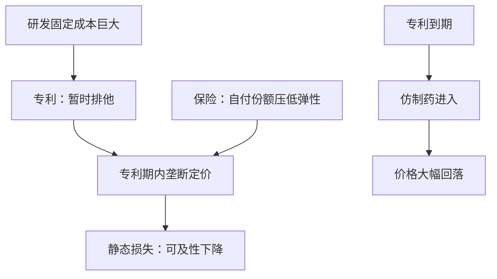
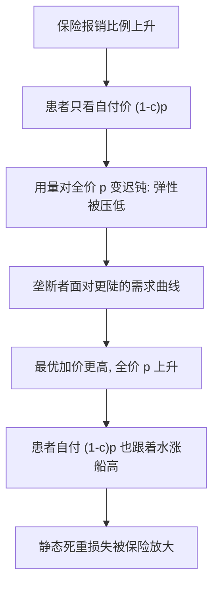

# 药品定价

一粒新药的第一版要烧掉十年研发，第二粒的边际成本只有几美分；定价问题就是让这两种成本共存，而不把任何一侧的激励烧穿。

<footer>—— 据 Arrow, Economic Welfare and the Allocation of Resources for Invention, 1962；Nordhaus, Invention, Growth, and Welfare, 1969 整理</footer>

[上一课](/econ/hi-health-labor)把健康存量接进劳动供给。缺口转向产业与动态：药几乎是最极端的固定成本商品——分子是烧掉的研发，分母是几美分的边际成本，仿制在专利之外随时可行。[福利两定理](/econ/welfare-theorems)的完全市场前提在这里被有意打破：专利就是被制造出来的市场不完全，用来买创新。本课写专利期内的定价怎么定、保险怎么改需求、专利到期后价格怎么落；不写审批监管，也不重写专利竞赛的均衡。

## 问题

两重扭曲叠加，是本课全部内容的骨架。静态侧：垄断定价把价格抬到边际成本之上，可及性下降，死重损失。动态侧：没有排他就没有占有，模仿者零成本进入，研发投入不足——Arrow 的占有性问题，也是[公共物品](/econ/public-goods)课非竞争性的另一面：知识造出来一人用不减另一人可用，收费全靠人为排他。保险把两重扭曲拧在一起：患者只付自付份额，需求弹性被第三方支付压低，定价者面对一条更陡的需求曲线——加价更高，静态损失更大。定价因此不能只看产业，必须连着保单写。

拉姆齐逻辑倒着用：拉姆齐定价让弹性低的市场承担高加价，是被动地按弹性分摊；第三方支付是主动地替定价者把弹性压低。方向相反，效果同形——保单越慷慨，药价越硬。

## 方法

专利期内的定价是一个静态问题：需求来自有保险的患者，自付 $(1-c)p$，用量对自付价格敏感、对全价迟钝；垄断者在合成的需求曲线上找边际收益等于边际成本。专利长度是动态一侧的旋钮：Nordhaus 的权衡——专利期加长，创新的边际激励上升，静态损失的年数也上升，最优长度停在两者边际相等处。价值定价是第三条路：不按成本、不按竞争，按增量健康收益定价，偿付方用每 QALY 阈值决定买不买——把「动态换静态」写成行政数字。

数字实例：一粒仿制药的原料与制造成本常只有几美分，专利期内同分子的原研药可卖数元甚至数百元。定价与分母（边际成本）几乎无关——你付的其实是摊到每一粒上的研发固定成本。

## 机制

专利悬崖是这套逻辑最干净的读数：到期后仿制药进入，价格在几年内跌去大半——说明专利期内的价格由排他权而非成本决定，也说明降价没有摧毁创新，因为创新激励已经付过。悬崖同时是设计参数：延长保护（数据独占、专利丛林）推迟悬崖，是在动态激励上再添一份静态损失。价值定价的机制则反过来：把偿付方的谈判力组织起来，用阈值代替分散的自付；楔子不消失，但从价格搬到了新药不进报销目录。

术语翻译：QALY（质量调整生命年）把「多活几年」与「活得舒不舒服」折成一个数：健康地多活 1 年记 1，带病多活 1 年按生活质量打折记 0.5。偿付方设阈值（如每 QALY 愿付 5 万美元），超过就不进报销目录。

全球市场再加一层：同一分子在不同国家按支付意愿分层定价，参考定价与平行进口把低价国拉向高价国——分层定价与套利的拉锯，是本课楔子在空间上的版本。

## 边界

本课不写临床试验的监管与审批时滞，不写生物类似药的替代细则，也不写竞赛均衡与奖品设计——那是创新与专利竞赛课的对象。三点易错：把药价贵全归给贪婪，会漏掉第三方支付对弹性的压低；把取消专利当普惠，会漏掉模仿者进入对研发的清零；把 QALY 阈值当纯技术参数，会漏掉它是分配判断，不是测量。

常见误区：把专利悬崖读成「暴利被戳破」。悬崖后价格跌去大半，恰恰说明专利期内的价格里含着创新激励的分期偿还；一刀切取消专利，等于把已经卖出去的激励再赖一次账，下一款药就没人垫钱了。

后课默认：药品定价是「固定成本、第三方支付、临时排他」三件事的交点。下一课收束整门课程。

## 小结

- 两重扭曲叠加：静态死重损失与动态研发激励，专利是两者的交换装置。
- 保险压低需求弹性，使专利期内的加价更高；保单与药价要一起读。
- 专利悬崖证明价格由排他决定；价值定价用 QALY 阈值把权衡写成行政数字。
- 分层定价与参考定价是同一楔子的空间版本。
- 出处：Arrow 1962；Nordhaus, *Invention, Growth, and Welfare*, 1969；Ramsey 1927 的定价逻辑；据 Cutler–Zeckhauser 2000 的第三方支付框架整理。
