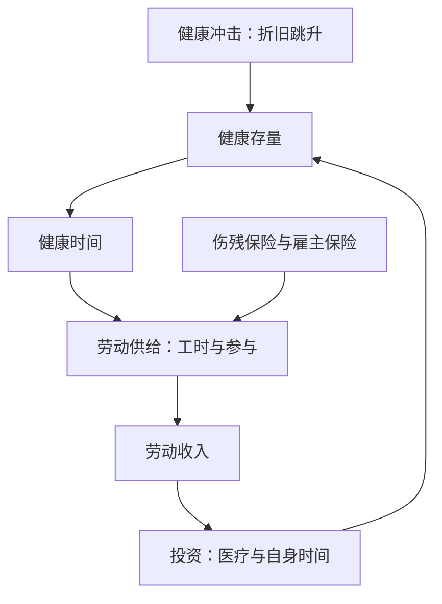

# 健康劳动供给

健康既是消费品也是投资品：人生下来带着一笔健康存量，它按折旧率损耗，也可以用医疗与自己的时间去投资。

<footer>—— Grossman, On the Concept of Health Capital and the Demand for Health, JPE, 1972</footer>

[上一课](/econ/hi-risk-selection)把签约前的类型与保险市场的选择写完。缺口换到人这一边：保单里的「损失状态」其实是健康存量的一次折旧，而这笔存量决定一个人能供给多少劳动。本课把健康当资本写进劳动供给，再看保险怎么改这些决策。它是健康市场单元的第一课，后两课默认读完本课。

## 问题

标准劳动供给把时间当同质的：工资 $w$ 乘工时。Grossman 的修正是先把总时间切一刀：健康时间与生病时间。劳动收入是 $w$ 乘**健康**的工时，健康冲击因此同时做两件事：工资率没变，可卖的工时塌了；医疗支出还往上加。健康于是有双重身份——进入效用（生病的直接负效用），进入预算（健康时间是劳动的原料）。缺口是：健康存量与劳动供给互为因果——健康决定工时，工作条件又反过来折旧健康——把两者当单向关系会系统性估错。

Grossman 的投资条件：健康资本的边际收益（更多健康时间带来的工资与效用）等于利息加折旧成本。年龄上升使折旧加快，同样的投资买到的健康更少——这是「健康随年龄先升后降」的机制版本，不是偏好的变化。

## 方法

把存量写成递推：$H_{t+1}=(1-\delta)H_t+I_t$，投资 $I_t$ 用医疗品 $m_t$ 与自己的时间生产；时间约束里生病时间与工作时间之和固定。健康冲击是折旧率 $\delta$ 的跳升，它有两个下游：工时与参与下降（劳动边际），医疗需求上升（投资边际）。实证的对象是把两个下游分开估：健康冲击对参与、工时与退休年龄的弹性。读数会发现健康的分量比财富大：退休决策里健康冲击的解释力超过财富——French 对健康、财富与工资的分解是这条线的代表。

反过来，工作折旧健康：职业伤害与职业压力改变 $\delta$。识别上这叫联立性，工具变量要用外生的健康冲击（如急性病发作），不能用自报健康的水平。

## 机制

保险从两条线进入这张图。第一条：医疗保险降低投资品 $m_t$ 的价格，健康投资的需求沿第一课的楔子放大——同一部机器，对象换成健康资本。第二条：保险本身成为劳动市场的摩擦。雇主提供的团体保险不可携带，换工作即换保单，健康者不敢动——文献叫 job lock，Gruber–Madrian 用保单延续政策的变化识别出它对流动性的压抑。伤残保险是第三条：它对「健康时间塌了」的人给收入，替代率高则退出的门槛降低——与[失业保险与道德风险](/econ/ui-moral-hazard)同一权衡，只是冲击更大、筛选更难。

## 边界

本课不写药品定价（下一课），不进宏观的人力资本核算与卫生支出的总量决定。健康测量有坑：自报健康随参照系移动，行政数据更硬但仍不含轻度状态；把自报健康的回归直接读成弹性，量级不可信。健康不平等的形成也不展开——那要把本课的存量动态与收入分配接起来，是另一门课的规模。

后课默认：健康是折旧的资本存量，保险既补贴它的投资品、又是劳动配置的摩擦。下一课转产业侧，问新药怎么定价。

## 小结

- 健康存量决定健康时间，健康时间是劳动的原料：健康与劳动供给互为因果。
- Grossman：健康是消费品兼投资品，投资条件是边际收益对利息加折旧。
- 保险的三条线：补贴医疗投资、制造 job lock、降低伤残退出的门槛。
- 识别用外生健康冲击，不信自报健康的水平。
- 出处：Grossman, *JPE* 1972；Gruber–Madrian, *ILR Review* 1994；French, *AER* 2005。
