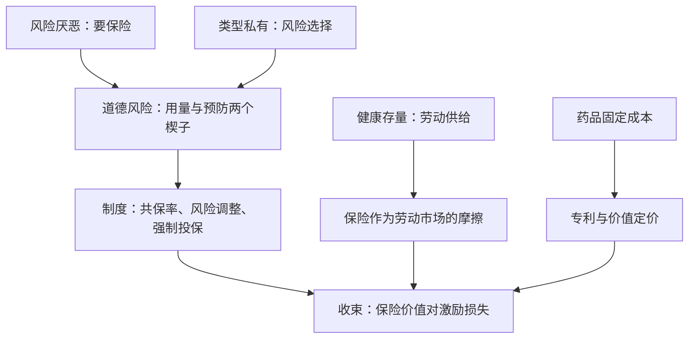

# 健康与保险收束

健康经济学不是一门关于特殊商品的学问；它是把不确定性、信息不对称与第三方支付叠在普通商品上之后，问市场制度还剩下什么。

<footer>—— 据 Arrow, AER 1963；Rothschild and Stiglitz, QJE 1976；Cutler and Zeckhauser 2000 整理</footer>

[上一课](/econ/hi-drug-pricing)把固定成本、专利与第三方支付的交点写完。本课程到此收束：把四课的工具并成一张图，指出每种制度在「保险价值对激励损失」这把尺上的位置，并说清这门课没有覆盖什么。

## 问题

健康市场为什么值得整门课，而不是[风险厌恶](/econ/risk-aversion)与[道德风险](/econ/moral-hazard)两课的加总？因为三层结构叠加之后，产生了单独不存在的问题。第一层，风险厌恶要求保险——这部分是通用的。第二层，保险改变行为：用量与预防两个边际同时动，这是第一课的楔子。第三层，类型私有：谁最想要慷慨的保单，本身就是信息，这是第二课的机器。两层一起，保单条款不再是风险偏好的镜像，而同时是激励装置与筛选装置；再往产业与家庭两侧延伸，就有了药品的动态定价与健康存量的劳动供给。缺口从来不是「市场失灵」四个字，而是失灵在哪一层、制度补哪一维。

把四课排成一张对照表：免赔额与共保率对道德风险；强制投保、社区评级与风险调整对风险选择；专利长度与 QALY 阈值对动态激励；可携带性与伤残保险对劳动配置。每种制度都只作用于各自的可观测维度。

## 方法

收束用同一把尺读四个对象。保险价值一侧：风险平滑、健康投资的补贴、创新的动态激励。激励损失一侧：用量楔子、预防塌陷、选择与死亡螺旋、垄断加价与可及性下降。每课的最优点都是内部解：共保率停在平滑与楔子的边际相等处，风险调整的分数停在可观测维度的边界上，专利长度停在动态激励与静态损失的边际相等处，价值定价的阈值本身就是这把尺的行政化。这门课的方法因此不是一张失灵清单，而是一个重复出现的权衡结构——把它认出来，比记住每课的结论更可迁移。

## 机制

叠加是本课程真正的机制题。选择与道德风险互相放大：慷慨计划吸引高风险者与高使用者，费率涨得比任一单独效应快，这是第二课。保险补贴健康投资，健康存量又决定劳动收入，保单由此进了劳动市场，这是第三课。第三方支付压低弹性，专利加价更硬，药价反过来推高保单——闭环在这里合拢：保险、选择与定价不是三个市场，是一个市场的三个面，这是第四课。[福利两定理](/econ/welfare-theorems)的前提在每一层都被打破，所以制度不是对市场的干预，而是对失效前提的替换：强制投保替换参与约束，风险调整替换缺失的或有市场，专利替换知识市场的收费装置，公共保险替换不可保的大风险。

## 边界

没写的不等于不存在：医院竞争与质量规制、医生支付方式（按项目付费把道德风险搬到供给侧，按人头付费是同一楔子贴在医生身上）、卫生支出占总收入比重的长期增长、公共卫生的外部性——传染病预防是[公共物品](/econ/public-goods)课的对象，本课程只在收束处点名。年金与长期护理属于跨期与家庭金融。这些留白有共同点：都要把本课程的权衡结构搬进新的商品空间，而不是新的经济学。

本课程到此收束。带走三件事：楔子、筛选、与「保险价值对激励损失」的内部解。

## 小结

- 健康市场的特殊性是三层叠加：风险厌恶要保险，保险改行为，投保决策泄露类型。
- 每种制度对应一层失灵的一个可观测维度；选择只会换维度，不会消失。
- 药品定价与健康劳动供给是同一权衡在产业侧与家庭侧的延伸。
- 闭环：保单、选择与药价互相定价，是一个市场的三个面。
- 出处：Arrow, *AER* 1963；Pauly, *AER* 1968；Rothschild–Stiglitz, *QJE* 1976；Cutler–Zeckhauser 2000；Grossman, *JPE* 1972。
