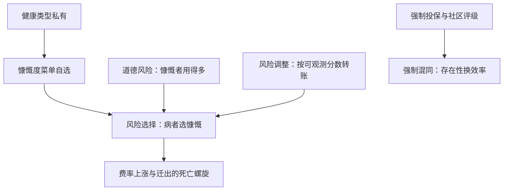
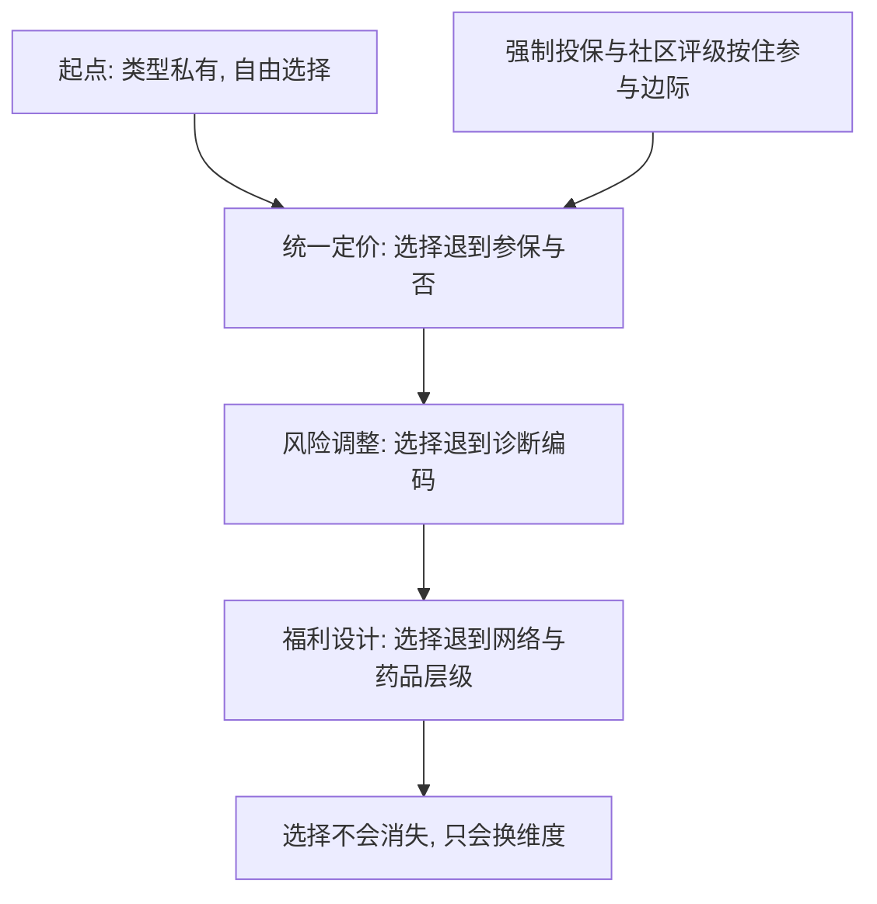

# 风险选择与 Rothschild–Stiglitz 的深化

保险公司卖的不是一份保单，是一个风险池；池子的构成比费率表更决定盈亏，于是每一条保单条款都同时是筛选工具。

<footer>—— 据 Cutler and Zeckhauser, The Anatomy of Health Insurance, Handbook of Health Economics, 2000 整理</footer>

[上一课](/econ/hi-demand-moralhazard)把合同给定之后的行为写清：保障压低自付价格，用量与预防两个边际同时动。缺口在签约之前——类型是私有的，高风险者更想要慷慨的保单。[Rothschild–Stiglitz 崩溃](/econ/rs-unraveling)已经证明：竞争筛选下混同必被撇脂，分离在低风险足够多时也会被挖走。本课把那台机器开进健康保险的真实制度——计划菜单、雇主团购、风险调整与强制投保——看它在哪里照样运转、哪里被制度改写，不重写 1976 年的定理。

## 问题

真实市场不提供「全保或部分保」两档，而提供一张慷慨度菜单：免赔高低、网络宽窄、专科药自付。三个真实装置使 RS 的压力比教科书更紧。其一，补贴固定：雇主的贡献额不随计划而变，慷慨计划的额外保费全由选择它的人承担——分离被政策做实了。其二，风险与道德风险同向：慷慨计划吸引的既是高风险者，也是上一课楔子下的高使用者，费率因此涨得比纯类型效应更快。其三，退出自由：健康者随时可以搬到便宜计划，死亡螺旋的每一环都不缺燃料。

### 死亡螺旋

Cutler–Reber 的哈佛案例是标准教具：固定补贴下，慷慨计划费率上涨，健康者迁出，留下的池子更差，费率再涨，几年之内计划关停。这不是均衡不存在，而是存在的那条均衡路径通向收缩。

数字实例：设池中健康者年支出 1000 元、病者 10000 元、各占一半，平均保费 5500 元。健康者一盘算：自己的期望损失才 1000，花 5500 不划算，搬到便宜计划——留下的池子人均支出升到 10000，保费翻近一倍，下一批健康者跑得更快。

## 方法

三个装置，各自对应 RS 的某种回应。风险调整：按年龄、性别、诊断的分数把保费在保险公司之间转移，把交叉补贴写成行政规则——Wilson 预期与 Miyazaki 想用合同内交叉补贴救存在性，制度用强制转账实现了它。强制投保加社区评级：不许定价于类型、不许不参保，低风险被留在池里，撇脂被禁止——用存在性换效率，是 RS 边界的原话。福利设计筛选：保险公司反过来用条款选择人群，窄网络劝退重症、专科药高自付劝退病者——这是供给侧的撇脂偏离，RS 的机器照转，只是方向反过来。

## 机制

把三个装置并排，共同点是：它们都只能对**可观测维度**操作。风险调整的分数解释不了支出的大头，剩下的不可观测部分照旧在选择；强制投保补的是参与边际，补不了强度边际；福利设计则专挑可观测维度打。所以每一代改革都把选择从上一维度推进下一维度：统一定价把选择推进参保与否，风险调整把选择推进诊断编码，福利设计把选择推进网络与药品层级。选择不会消失，只会换维度——这是本课最该带走的判断。

术语翻译：风险调整=保险公司之间的转移支付。按年龄、性别、诊断给每名参保人打分，分数高的让保险公司从统筹基金里多领钱——让保险公司不再因为怕接到病人而撇脂。

测量上，[柠檬](/econ/akerlof-lemons)的切断逻辑可以直接读数：覆盖弹性里混着选择与道德风险，区分它们靠只动其中一件工具的外生变化，与上一课识别道德风险的纪律相同。

风险调整模型的分数能解释的支出方差只是小头；解释不了的部分，正是保险公司最有激励去筛的人群。条款设计（窄网络、药品层级）因此常被读成「用福利设计做的定价」。

## 边界

本课不重写均衡不存在的参数区域，那是[崩溃课](/econ/rs-unraveling)的内容；垄断筛选的菜单与信息租金是[筛选课](/econ/screening-rent)的委托人版本，也不在此重算。动态选择（年轻时签终身合同）与多维类型（风险与健康行为同时私有）都没有展开。注意别把死亡螺旋读成必然：它是固定补贴与自由退出下的一条路径，风险调整与强制投保都在改它的参数。

常见误区：以为「统一定价、人人同价」就消灭了选择。同价只是把选择从价格维度赶进别的维度——诊断、网络、药品层级；看不见的选择不等于没有选择。

后课默认：类型私有加自由进入时，市场结构是制度设计的对象，不是给定的背景。下一课把镜头从保单转回人，看健康存量怎么进劳动供给。

## 小结

- 慷慨度菜单使选择与道德风险同向叠加，费率螺旋比纯类型模型更快。
- 风险调整、强制投保、社区评级是 RS 后继补丁的制度版本，都只作用于可观测维度。
- 选择不会消失，只会换维度：从价格退到诊断、网络与药品层级。
- 福利设计是供给侧撇脂：条款即定价。
- 出处：Rothschild–Stiglitz, *QJE* 1976；Cutler–Reber, *QJE* 1998；Cutler–Zeckhauser 2000；Einav–Finkelstein 对选择与道德风险测量的整理。
