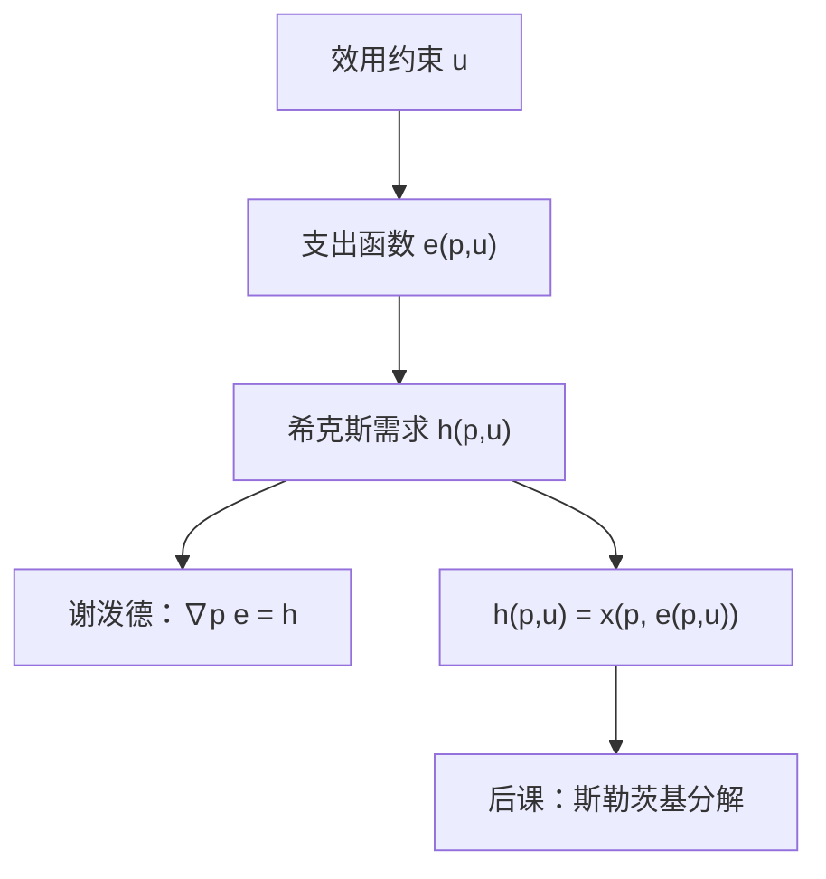

# 希克斯需求

补偿需求问的是：价格变了，要保持原来的满足，最优消费怎样沿无差异集滑动。

<footer>—— 据 Hicks, Value and Capital, 1939；Mas-Colell, Whinston and Green, Microeconomic Theory 第 3 章整理</footer>

上一课[Roy 恒等式](/econ/roy-identity)从 $v$ 的导数恢复了马歇尔需求 $x(p,w)$。本课不重写包络，也不再推导 $x_i=-(\partial v/\partial p_i)/(\partial v/\partial w)$。缺口是：补偿需求 $h(p,u)$ 还没作为独立对象出场。斯勒茨基要把价格效应拆成「钉住效用的滑动」与「财富变动」，没有 $h$，拆不开。

## 问题

$x(p,w)$ 钉住的是名义财富。涨价时相对价格与真实购买力一起变，自价格弹性符号不定。要单独看替代，必须换约束：效用给定、账单最小。缺口不是再从 $v$ 读一次 $x$，而是定义

$$
h(p,u)=\arg\min_x\bigl\{p\cdot x:u(x)\ge u\bigr\},
$$

支出函数 $e(p,u)=p\cdot h(p,u)$ 是它的值。Hicks 的补偿需求就是这个 $h$。局部非饱和下 $u\bigl(h(p,u)\bigr)=u$，且与马歇尔焊在一起：$h(p,u)=x\bigl(p,e(p,u)\bigr)$，$x(p,w)=h\bigl(p,v(p,w)\bigr)$。

### 补偿的是效用，不是原消费束

希克斯钉住无差异集。斯勒茨基补偿钉住「原束刚好仍买得起」。可微点上二者一阶相同；经验上常用后者，因为原束可观测。本课对象是 $h(p,u)$，因为它是 $e$ 的导数，形状干净。

$h$ 只依赖无差异集，不依赖 $u$ 的刻度。$e$ 的「效用单位」随单调变换改，$h$ 作为商品束不变。

## 方法

谢泼德引理：$\nabla_p e(p,u)=h(p,u)$。仍是包络：最小支出对价格的直接项就是那一束。$e$ 对 $p$ 一次齐次且凹，故 $h$ 零次齐次于 $p$，且替代矩阵 $D_p h=D^2_{pp}e$ 对称、负半定。自价格补偿效应非正：补偿过的需求不向上倾斜。这是马歇尔需求没有的保护。

求解支出最小，一阶条件在内点是 $\nabla u=\lambda p$，与马歇尔同一切点，只是乘数解释成「效用约束的影子价格」。角点同样走 Kuhn–Tucker。本课不把上一课的 Roy 再写一遍；两条引理对偶：一边从 $v$ 读 $x$，一边从 $e$ 读 $h$。

恒等式对 $p$ 微分，交叉项里会冒出 $\partial x/\partial w$，那是下一课。本课停在 $h$ 出场、以及它的凹性含义。

## 机制

$h$ 沿无差异集滑动。相对价格变，真实收入按 $e$ 补回，消费者不换到另一条无差异曲线。凸偏好使滑动方向指向相对变便宜的商品，故 $S=D_p h$ 负半定。马歇尔需求没有这层：收入效应可以翻号，吉芬合法——但那是 $x$ 的现象，不是 $h$ 的。

福利用 $e$ 积分，被积函数正是 $h$。路径无关靠 $S$ 对称，下一课才写成定理。本课只需：补偿变化是两条价格下最小账单之差，账单的价格导数是希克斯需求。

拟线性使非计价物的 $h$ 与 $x$ 重合。一般偏好二者分开：同一价格，一个钉 $u$，一个钉 $w$。

## 边界

$h$ 要求给定 $u$ 可及。效用高于 $v(p,\infty)$ 或消费集达不到的层，最小值不存在。角点上谢泼德改成超梯度：$e$ 仍凹，$h$ 是对应。

也不要把希克斯需求读成市场上能买到的数量。它是思维实验里的补偿束；观测到的购买是马歇尔的。显示偏好从 $x$ 走，不从 $h$ 走。量化栏的订单流更不是补偿需求。

后课默认：可以自由使用 $h(p,u)$ 与谢泼德引理。把 $\partial x/\partial p$ 拆成 $D_p h$ 与收入项，是[斯勒茨基方程](/econ/slutsky-equation)的缺口。

## 小结

- 希克斯需求是效用约束下的最小支出解，钉住无差异集。
- 谢泼德引理从 $e$ 读出 $h$；替代矩阵对称、负半定。
- 补偿需求自价格不向上倾斜；马歇尔可以。
- 与 $x$ 的恒等式是斯勒茨基分解的原料。
- 出处：Hicks, *Value and Capital*；Mas-Colell, Whinston and Green 第 3 章。
