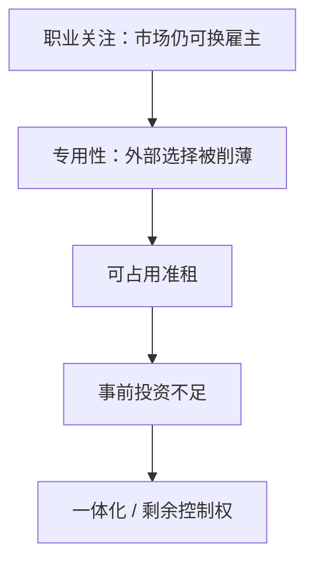

# 套牢与专用性

一旦投资沉没在特定关系里，可占用的准租就出现；对方会在事后讨价还价中抽走一块，事前投资因此不足。

<footer>—— Klein, Crawford and Alchian, Vertical Integration, Appropriable Rents, and the Competitive Contracting Process, Journal of Law and Economics, 1978；Grossman and Hart, The Costs and Benefits of Ownership, Journal of Political Economy, 1986</footer>

[上一课](/econ/career-concerns)的纪律来自**市场**对能力的定价，关系可以换雇主。缺口是投资一旦沉没，外面的市场变薄：模具、管道、地点、人力资本只对这一个对手值钱。准租等于「继续合作的剩余减去各自的外部选择」，谁能占用这块，谁就在事后谈判里有手。本课钉套牢与所有权反应，不把学习方程再写一遍，也不把「写不尽的条款」展开成下一课的合同理论。

## 问题

事前一方（或双方）选专用性投资 $i$，成本 $c(i)$，事后剩余 $R(i)$ 大于双方外部选择之和。投资不可逆、不能无成本地搬到下一家。若事后按纳什谈判均分合作剩余，投资者只拿到 $R$ 增量的一半，一阶条件扭曲：$c'(i)=\tfrac12 R'(i)$，投资不足。Klein–Crawford–Alchian 把这块差称为可占用准租：竞争事前存在，事后被专用性锁死。

纵向一体化是一种反应：把对方买进来，准租变成内部会计，不再靠市场价抽取。代价是一体化之后的管理成本与另一套激励（多任务、职业关注仍在企业内部）。

### 不是普通的双边垄断加价

双边垄断可以发生在投资之前：要挟的是「若不答应就不开始」。套牢发生在投资**之后**：要挟的是「不继续合作，你的模具作废」。时序是定义的一部分。职业关注里市场仍厚，换雇主的外部选择还在；套牢里外部选择被专用性故意削薄。

Grossman–Hart 把「买进来」写成剩余控制权：合同未规定之事由资产所有者决定。一体化不是简单把两个利润函数加总，而是改变事后谈判的威胁点——谁拥有关键资产，谁的外部选择更高，谁在均分前已经多拿。

## 方法

对象：两人、一次投资、事后可观察但未必可对第三方验证的剩余、无第三方定价。先写分离时的半半分成与投资不足。再写所有权：把资产配置给投资者，提高其谈判份额（或外部选择），比较两种所有权下的事前 $i$。GH 的教具：两边都投资时，所有权只能保护一边，另一边仍被套；最优所有权给投资更重要、更专用的一方。

两边都投时，所有权只能抬一边的份额：把资产给 A，B 的外部选择变差，B 的 $i$ 更不足。最优所有权比较的是两边投资的边际社会价值，不是「谁更大」。

价格竞争、长期合同、抵押与声誉是并列工具。本课主钉准租与所有权，声誉已在上一课；长期条款写不尽是下一课。经典教具是专用模具或管道：事前有许多买者，模具一开就只适配一家；对方抬输入品价格，占用的正是模具相对残值的差额。纵向一体化把抬价变成内部转移，占用渠道关掉，但总部要重新解决多任务与职业关注。

## 机制

专用性把竞争从「许多买者」变成「这一个买者」。准租的大小是 $R$ 减外部选择；谈判力决定切法。理性投资者预见被切，缩减 $i$，于是 $R$ 本身变小——无效率在事前，不在事后（事后谈判在完全信息下仍可有效分剩余）。一体化改变的是谁坐在谈判桌上、威胁点是什么，不是取消剩余要被分这一事实。

KCA 强调占用的手段：特许费、投入品加价、突然中断。GH 把手段收成控制权语言，便于比较「A 拥有」对「B 拥有」。两者同一套时序：投资 → 准租 → 谈判 → 预见 → 投资不足。

### 市场纪律补不了专用性

职业关注依赖「还有下一家雇主」。模具只适配这一条产线时，下一家不存在，名声卖不掉准租。两种摩擦不要并成一句「激励不足」：一个是学习，一个是锁死。

Williamson 的机会主义与资产专用性是同一家族；KCA 把准租写进占用，GH 把占用写进所有权。课堂上用准租一把尺子，避免三篇文献各讲一个故事。

## 边界

投资可验证并写入单价，套牢可被合同消掉——下一课问为什么常常写不成。多方、网络专用性、政府征收，准租的占用者不只是交易对手。也不要把套牢写成限价簿流动性消耗。

抵押、预付与「交换人质」能抬高占用成本，部分替代一体化。声誉（上一课）在重复交易、外部选择仍厚时有效；模具一旦开好，下一家不存在，名声卖不掉准租。工具要按外部选择是否还在来选，不能一律「靠市场纪律」。

后课默认：专用性制造可占用准租，分离时投资不足；所有权通过剩余控制权改谈判份额。下一课不完全合同：为何不能把 $i$ 和 $R$ 直接写进可执行条款。

## 小结

- 职业关注靠外部市场；套牢发生在市场被专用性锁死后。
- 可占用准租来自沉没投资，事后均分导致事前不足。
- 一体化 / GH 所有权改变威胁点，不是取消要分剩余。
- 无效率在事前投资，不在完全信息的事后谈判。
- 出处：Klein, Crawford and Alchian, *JLE*, 1978；Grossman and Hart, *JPE*, 1986。
