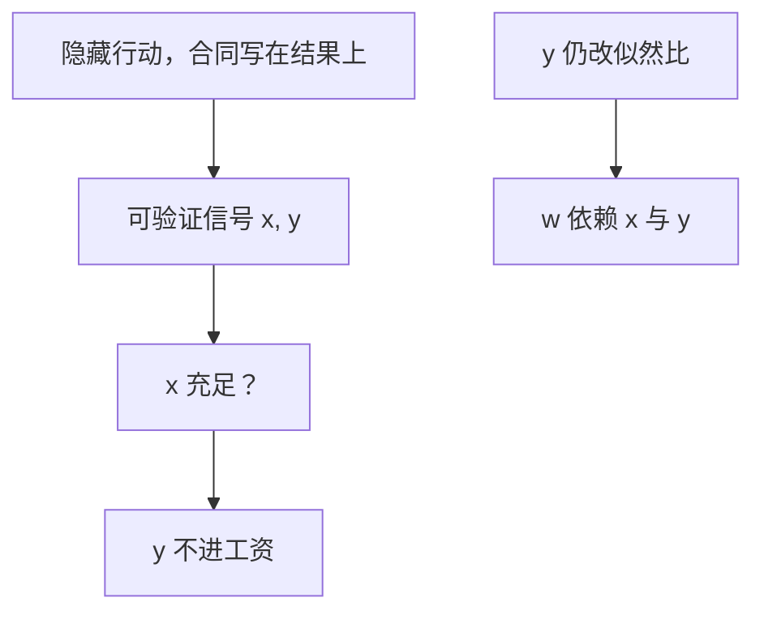

# 霍姆斯特罗姆充足统计

对行动而言，合同只应依赖其充足统计量；再写入无关噪声，只增加无谓风险，不能改进激励。

<footer>—— Holmström, Moral Hazard and Observability, Bell Journal of Economics, 1979</footer>

[上一课](/econ/moral-hazard)说明合同只能写在可验证结果上，激励等于把风险塞给代理人。缺口是：可验证变量往往有一串——产出、同行产出、天气、股价。哪些该进 $w(\cdot)$？本课钉充足统计 / 信息量原则，不把 IC–IR 规划写全，也不把有限责任写成下一课。

## 问题

行动 $a$ 不可写入合同。观察到的是 $x$，或许还有 $y$。似然 $f(x,y\mid a)$。若 $x$ 已是 $a$ 的充足统计，即 $f(x,y\mid a)=g(y\mid x)\,h(x\mid a)$，则 $y$ 在给定 $x$ 后不含关于 $a$ 的信息。最优合同可以写成 $w(x)$，不必再随 $y$ 变。写入 $y$ 只会在同一激励下加噪声，厌恶风险的代理人要求补偿，委托人更亏。

反过来：若 $y$ 在给定 $x$ 后仍改变 $a$ 的似然比，则 $y$ 有信息量，最优 $w$ 应依赖 $(x,y)$。这就是信息量原则（informativeness principle）。相对绩效是其推论：若 $y$ 是别人的产出，共同冲击使 $(x,y)$ 比单看 $x$ 更能滤掉运气，合同应写成对 $x-y$ 或名次的奖惩。

### 充足的是对行动，不是对产出

会计上的「利润」不必是对 $a$ 的充足统计；股价若含有利润没有的关于努力的似然比，就应进合同。反过来，利润里若掺进代理人不可控的会计噪声，应尽量滤掉。原则问的是似然比 $f_a/f$，不是变量的名字。

Holmström 1979 的工资公式里，似然比 $f_a/f$ 进入点态条件。若两个结果有相同似然比，应付相同工资——这正是「合同是似然比的函数」。单调似然比让工资对 $x$ 单调，但是附加假设，不是充足统计本身。

风险中性且无财富约束时，把剩余卖给代理人，充足统计变得无足轻重：他承受全部风险，滤不滤噪声只影响他的方差，委托人已抽干。
厌恶风险时过滤才值钱。
信号若不可验证，原则帮不上：法庭执行不了 $y$。

## 方法

对象：单代理人、隐藏行动、可验证信号向量。先对 $(x,y)$ 写似然比分解；再看最优规划的点态条件是否随 $y$ 变。相对绩效：设 $x_i=a_i+\eta+\varepsilon_i$，则 $\bar x$ 含 $\eta$，合同应依赖 $x_i-\bar x$。团队生产里共同产出不可分，那是 1982 年另文，本课只借「共同冲击可滤」。

## 机制

激励来自似然比，风险来自 $w$ 的方差。最优是：在实施既定 $a$ 的前提下最小化风险成本。充足统计把实施所需的似然比已经给齐，多出来的随机性没有实施价值，纯属成本。故最优把 $w$ 写成似然比的函数，等价于写成充足统计的函数。相对绩效不是「公平」或「锦标赛文化」，是把 $\eta$ 从似然比里消掉。

与柠檬、信号不同：这里没有隐藏类型的切断或教育年限；信号是关于行动的，写进合同而不是写进工资等于产出的竞争报价。后课委托–代理会把 $\mu(f_a/f)$ 写进 FOC；本课只先限制自变量：不在无关维度上花钱买风险。相对绩效的限度是：共同冲击才该滤；若别人的产出主要含个体噪声，写成名次会把别人的行动噪声塞给自己，违反充足统计。团队里共同产出不可分到个人，那是 Holmström 1982，本课不把团队道德风险展开。

相对绩效不是公平口号：它只在 $y$ 含共同冲击时改进似然比。
合谋会把这条过滤的好处吃掉，那是边界，不是原则失效。

## 边界

信号若同时是投资决策的输入（会计稳健、短视），信息量原则仍说「有信息就该用」，但多任务会反对强激励——那是 Holmström–Milgrom 1991，不是本课。合谋：相对绩效让代理人互相陷害或串通，滤噪声的好处被策略抵消。有限责任下，过滤的公式还在，但工资下界会强迫把惩罚换成租金，下一课。

后课默认：合同的自变量应是行动的充足统计；再加无关噪声严格变差。委托–代理规划在这个自变量上做。

### 似然比相同则工资相同

两个结果 $x,x'$ 若 $f_a/f$ 相同，实施同一行动不需要区别它们。强行区别等于在无信息维度上打赌。这比「高产出高工资」更精确：运气堆出来的高产出，似然比未必高。

可观察不等于可验证，上节已钉。本课补一句：可验证也不等于有信息。法庭能执行的天气指数，若与 $a$ 独立，仍不该进 $w$。

## 小结

- 合同只应依赖对行动的充足统计；无关信号只加风险。
- 若额外信号改似然比，就必须用——信息量原则。
- 相对绩效是滤共同冲击，不是公平观念。
- 下一课：有限责任让「罚不到」破坏这套风险分担。
- 出处：Holmström, *Bell* 1979。
