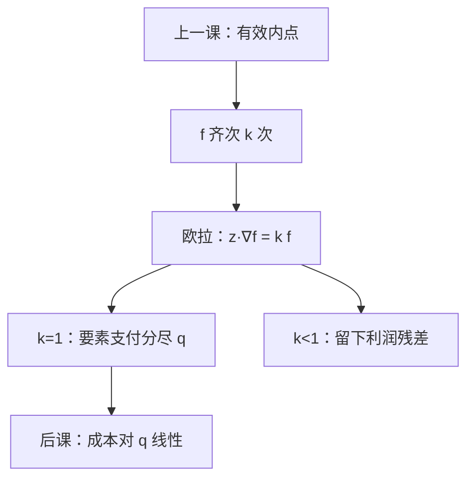

# 齐次生产与欧拉定理

    
一次齐次的技术上，产出恰好等于边际产出乘要素的加总——竞争支付把产品分尽，不剩一笔「纯利润」。

    <footer>—— 据 Varian, Microeconomic Analysis；Euler 齐次函数定理整理</footer>

[上一课](/econ/free-disposal-inada)用自由处置与 Inada 把分析钉在有效内点。本课不重写边际在原点炸掉，也不把 $Y$ 的闭与可歇业再列一遍。缺口是：[技术课](/econ/production-technology)边注里提过一次齐次与欧拉分尽，后课成本、竞争零利润要把它从边注升级成定理：何时要素的边际贡献把 $q$ 加尽，何时留下残差。

## 问题

$f$ 齐次 $k$ 次指 $f(\lambda z)=\lambda^k f(z)$ 对一切 $\lambda>0$。$k=1$ 即 CRS 在单产出语言里的写法。可微时欧拉定理给出

$$
\sum_j z_j\frac{\partial f}{\partial z_j}(z)=k\,f(z).
$$

缺口是读 $k=1$：若要素按边际产出付酬 $w_j=p\,\mathrm{MP}_j$（价格接受，后课才正式做），则 $\sum w_j z_j=p q$，会计上的增加值被要素分尽。$k<1$（DRS）则 $\sum w_j z_j
1$ 则支付超过产值，竞争支付站不住——与技术课 IRS 炸开供给是同一道墙。

位似（homothetic）更弱：等产量是彼此的径向放大，$f=F(h(z))$，$h$ 一次齐次，$F$ 递增。成本份额沿射线不变，但欧拉分尽仍要求底层 $h$ 一次齐次且竞争按 $h$ 的边际付酬。不要把位似直接叫 CRS。

### 分尽是几何，不是分配正义

欧拉等式是齐次函数的恒等式，不论证「劳动应得多少」。它只说：若技术是一次齐次且按边际产品付酬，账加得上。规模弹性不是 $k$ 时，残差必须有承担者（利润、固定要素）。上一课的 Inada 保证内点，使偏导数存在；本课不管轴上的极限，只管射线。

欧拉分尽与 $0\in Y$、自由处置一起，才让 CRS 下竞争利润只能是零：放大可行计划不改变单位产值，正利润会被复制到无穷。

## 方法

先检验齐次：沿射线 $z\mapsto\lambda z$ 看产出是否按 $\lambda^k$ 走。Cobb–Douglas 指数和为 $k$；CES 常写成一次齐次。再写欧拉，不必把欧拉定理从微积分再证一遍——本课用它。成本最小化下一课会看到：一次齐次则 $c(w,q)=q\,c(w,1)$，平均成本不随 $q$ 变。那是本课几何的对偶面，本课只钉原空间。

位似技术的 TRS 沿射线不变，替代弹性可以单独规定。齐次次数管规模，位似管等产量形状，两刀正交——与技术课「规模报酬与替代正交」对齐，本课给出函数语言。

本课仍不把 $w$、$p$ 当选择。分尽等式里出现的 $w=p\,\mathrm{MP}$ 是对照，不是本课的厂商问题。也不把残差写成限价簿上的做市利润。

## 机制

为什么一次齐次会分尽：把所有投入同时放大一丁点，产出按同一比例涨；这笔涨正好等于各边际产出乘原投入的和。竞争把边际产出标成要素价格，加总就等于产值。$k\ne 1$ 时，按比例放大的产出增量与「沿各轴分别算边际再加总」差一个因子，残差出现。

位似的机制是等产量自相似：要素价格比钉住 TRS 之后，最优投入比例与 $q$ 无关，扩张路径是射线。这为下一课条件需求的齐次性做铺垫，但条件需求本身还没有价格。

不要把生产函数的齐次与[位似偏好](/econ/quasilinear-homothetic)焊死成「厂商也有位似效用」。$f$ 是可行性；支出份额不变是几何推论，不是排序。

## 边界

局部齐次（只在某锥上）时，欧拉只在该锥上成立。不可微时改用欧拉的支撑形式，分尽变成「存在一组支撑价格使等式成立」。整数投入破坏任意 $\lambda$。

联合生产没有单一 $f$，要回到 $Y$ 的锥：CRS 即 $Y$ 是锥，竞争利润在无固定成本时为零或无穷。本课单产出写法是特例。也不把欧拉分尽写成宏观核算恒等式的证明——核算是定义，这里是技术前提。

后课默认：一次齐次则欧拉分尽产出；成本将随 $q$ 线性齐变。位似只保证扩张路径为射线。

## 小结

- 齐次 $k$ 次加可微，欧拉把 $\sum z_j\mathrm{MP}_j$ 钉成 $k f$。
- $k=1$ 时竞争边际支付分尽产值；$k\ne 1$ 必有残差。
- 位似管等产量自相似，不等于 CRS。
- 下一课贴上要素价格，做成本最小化。
- 出处：Varian, *Microeconomic Analysis*；齐次函数的欧拉定理；对照 Mas-Colell, Whinston and Green 第 5 章。
