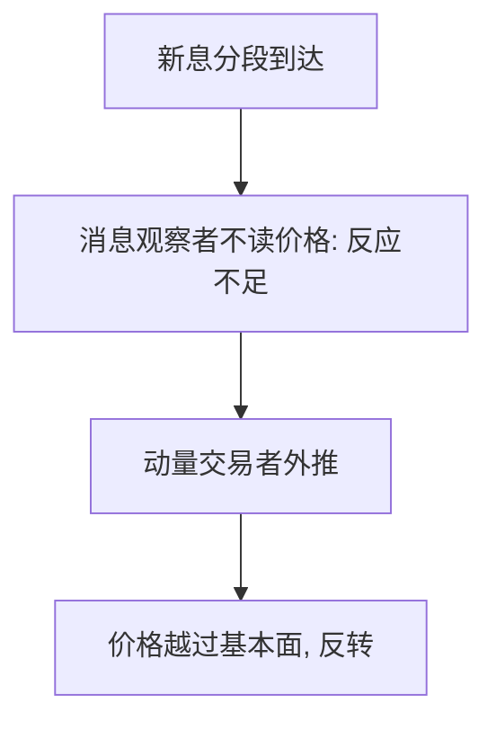

# Hong–Stein 信息扩散

新息先在一部分人那里，再慢慢传到另一部分人；观察价格的动量交易者把扩散变成先不足、后过度。

<footer>—— Hong and Stein, A Unified Theory of Underreaction, Momentum Trading, and Overreaction in Asset Markets, Journal of Finance, 1999</footer>

[上一课](/econ/dhs-overconfidence)靠私人信号精度。本课缺口是传播：即使每个人都贝叶斯，信息若在人群中分段到达，价格也会先反应不足；简单动量规则再把不足推成过度。不重写自我归因。

## 问题

Hong 与 Stein（1999）设两类有限理性：消息观察者只看自己那一段基本面新息，不从价格提取别人的信息；动量交易者只看过去价格，用简单正反馈外推。新息在消息观察者之间逐渐扩散，价格初期反应不足，动量为正。动量交易者吃这个正的序列相关，把价格推过基本面，长期反转。缺口是第三条统一不足–动量–过度的路：有限注意力式的分割，而不是 BSV 体制或 DHS 精度。

Hong、Lim 与 Stein 后来用分析师覆盖检验：覆盖少的股票动量更强，符合「扩散慢」。那是经验，本课只要机制。

## 方法

基本面新息分块，每块只被一群消息观察者看见。价格对未见块反应为零。动量交易者用滞后收益回归决定需求，寿命有限（又回到 DSSW 式的短视）。均衡路径：扩散期动量，过度期反转。比较静态：扩散越慢，动量窗口越长。

## 机制

机制是信息加总失败加正反馈。消息观察者的有限理性是：不从 $p$ 反推别人的信号——这比「算错似然」更粗，接近[有限理性](/econ/bounded-rationality-satisficing)的程序限制。动量交易者不看基本面，只看价格的时间序列启发式。两类单独都不会走完不足–过度的全路径，合在一起会。套利者若又短视又资本有限，挡不住中间那段动量。

与 [EMH](/econ/emh)：半强式假定公开信息立刻进价格。「公开但尚未传到所有人」是对信息集的社会学放松，不是对 Fama 分层的改写。

消息观察者的程序限制是：不从 $p$ 反演别人的块。若他们会读价格，扩散瞬间完成。动量交易者的程序是时间序列启发式，不看 $d$。有限寿命再次出现：他们吃中间的正相关，来不及为长期负相关负责——DSSW 式短视。分析师覆盖少则扩散慢，动量更强，是后文经验，本课只要这条比较静态。不写订单在簿上从一档传到另一档。

## 边界

若消息观察者能从价格充分提取，扩散瞬间完成，模型塌掉。动量交易者若会学习自己造成过度，正反馈减弱。本课不把所有动量写成 HS。也不写订单流在簿上的传播——那是微观结构。

后课默认：信念模型三件套（BSV/DHS/HS）之后，改评价函数的前景理论也可以定价，不必再错估 $p$。

新息分段到达，消息观察者不读价格，动量交易者只读价格：两类合在一起才走完不足–过度。

「公开但尚未传到所有人」放松的是信息集的到达，不是 Fama 分层本身。

动量交易者若学会自己造成过度，正反馈会减弱；本课不把所有动量写成 HS。

## 小结

- 信息分段扩散造成反应不足；动量交易者把它推成过度。
- 有限理性是程序：不读价格，或只读价格。
- 与 BSV/DHS 并列，不互相吞并。
- 扩散越慢，动量窗口越长。
- 若能从价格充分提取，模型塌掉。
- 出处：Hong and Stein, *JF* 1999。
