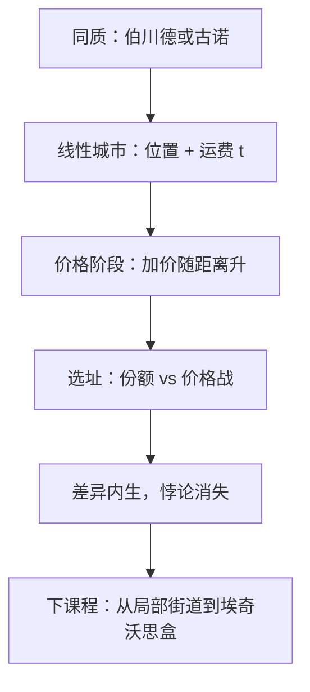

# 产品差异与霍特林

买者沿一条线分布，卖者选址再定价；运费把本来同质的产品拆开，价格不再一刀切到边际成本。

<footer>—— 据 Hotelling, Stability in Competition, The Economic Journal, 1929 整理</footer>

上一课[斯塔克尔伯格与领导者](/econ/stackelberg)仍在同质产品上比较先动与同时。本课不重讲反应曲线的切点。缺口是：[伯川德](/econ/bertrand-capacity)的赢者通吃来自完全替代。只要产品在空间或特征上略有不同，低价不能抢走全部需求，加价可以在价格竞争里存活。市场结构课序的主干在此收束：差异本身是策略，然后把局部市场交给一般均衡课的盒子。

## 问题

单位区间 $[0,1]$ 上消费者均匀分布，到商店的线性运费为 $t$。两家先选位置 $x_1,x_2$，再选价格。无差异消费者把市场切开，剩余需求有斜率，伯川德悖论消失。缺口不是再写一次勒纳公式，而是：**位置如何改变价格阶段的弹性，以及均衡位置会不会挤在一起。**

价格阶段：给定位置，距离越近，交叉弹性越高，均衡加价越低。位置阶段：靠近对手能抢份额，但会加剧随后的价格战。Hotelling 原文在线性运费下得到最小差异——两家挤向中点。运费改成二次后，d'Aspremont、Gabszewicz 与 Thisse 证明价格均衡存在，且均衡是最大差异：两家走到端点。本课把「差异是缓和价格竞争的工具」钉死，不把 1929 的中点当成一般定理。

### 差异不是垄断，也不是另一条需求曲线外生给定

每家仍面对向下的剩余需求，勒纳仍可读，但弹性由 $t$ 与距离内生。把差异写成「每家都是小垄断者」而不写位置博弈，会漏掉靠近与远离的权衡。也不要把 $t$ 写成偏好课的 $u$：运费是购物的物质成本，不是伯努利函数。

线性运费下，位置太近时价格均衡可以不存在（底切循环）。二次运费修补存在性。引用霍特林时要声明运费形式，否则「最小差异」与「最大差异」会对着打。

## 方法

两阶段、逆向归纳：先解给定 $(x_1,x_2)$ 的价格均衡，把利润写成位置的函数，再选址。对称均衡便于算。$t$ 上升：价格阶段加价上升，位置阶段更敢靠近——运费像天然的产能约束，挡住赢者通吃。$t\to 0$ 回到伯川德。圆上、多维特征、多家厂商，几何更烦，机制不变：横差异缓和价格。

本课不引入广告、质量（纵差异）的同时选择。质量改变需求截距，位置改变替代程度；后者才是对伯川德刀刃的直接补丁。先动选址可以叠斯塔克尔伯格，但教具上两家同时选址已够把课序收住。

线性城市也可以读成偏好谱：甜度、政治光谱、颜色。运输是「不合心意」的效用损失，不一定是公里数。$t\to 0$ 或两店重合，交叉弹性无穷，回到同质伯川德。本课横向两店已够收束市场结构课序。

街道是局部市场。两种商品、两个人的总量配置，下一课程用埃奇沃思盒来画；不要把 $[0,1]$ 上的份额写成一般均衡的可行配置。

## 机制

切开市场的机制是运费：离商店更近的人，对对方提价不那么敏感，剩余需求倾斜。选址向中靠的机制是「偷份额」；向外走的机制是「软化随后的 $p$」。哪一边赢，取决于运费曲率与价格均衡是否存在。无论端点还是中点，只要 $t>0$，价格就不会落到共同的 MC——这才是对上一课悖论的回答。

与数量领导的关系：位置是另一种承诺，改变的是需求形状而不是产能。沉没的店址一旦落下，价格阶段在既定差异上打，类似产能先沉没。市场结构课序从接受价格、到垄断、到同时量、到同时价、到先动、到选址，全部是在改「谁把什么钉死」。

$[0,1]$ 只是特征的教具。颜色、接口、交货时点都可以当位置读；运费 $t$ 则读成「换一家的不适」。机制不依赖真的有一条街。

Hotelling 1929 与 Hotelling 1932 的供给引理不是同一篇。线性城市用 1929；利润函数用 1932。后课一般均衡从街道收回到总量盒子，不再加一家商店。

## 边界

搜寻、转换成本、网络效应也能制造有效差异，不必真的有一条街。纵向差异（质量）与本课的横向差异不要混成一个 $t$。规制最低差异、分区，会把选址约束写进规划，本课不写。

产品市场到此结束。下一课换坐标系：不再是厂商对消费者的局部定价，而是两人两种商品的可行配置与帕累托集。街道上的「位置」不是埃奇沃思盒里的禀赋点——前者是特征空间，后者是商品总量守恒。限价簿仍不在本栏出现。

后课默认：横差异用位置与运费进入剩余需求；伯川德悖论在 $t>0$ 时解除。

## 小结

- 运费把同质产品拆开，价格竞争可以留下加价。
- 选址权衡份额与随后的价格战；最小差异不是一般结论。
- 市场结构主干止于局部街道；下一课进入交换的盒子。
- 不要把霍特林价格写成限价簿价差。
- 出处：Hotelling, *Economic Journal*, 1929；d'Aspremont, Gabszewicz and Thisse, *JET*, 1979；Mas-Colell, Whinston and Green 第 12 章。
