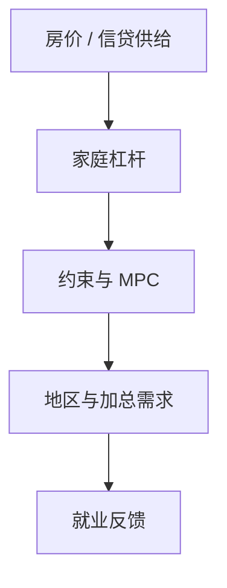

# 家庭债务与周期

杠杆把房价与收入冲击放大成消费崩溃：高债务地区在去杠杆时 MPC 更高，加总看起来像需求冲击。

<footer>—— Mian and Sufi, House of Debt；Mian, Rao and Sufi, Household Balance Sheets, Consumption, and the Great Recession, QJE 2013</footer>

[上一课](/econ/ui-moral-hazard)的保险对象是失业流。大衰退里更刺眼的是**资产负债表**。本课缺口是家庭杠杆如何把资产价格变成加总需求。不重写 Baily 公式，不把 Kiyotaki–Moore 的企业抵押提前当主模型。

## 问题

Mian–Sufi：2000 年代按揭扩张、房价下跌后，高杠杆邮编的消费与就业掉得更狠。名义债、住房抵押、去杠杆时的高 MPC，使财富冲击不像代表性欧拉里的小财富效应。缺口是把 HANK 的约束从「偶发借贷下限」升级成**周期性的债务积压**，并与识别课的加总 IRF 对话：看起来像偏好冲击的，可能是债务分布。

Mian, Rao and Sufi, *QJE* 2013。Mian and Sufi, *QJE* 2009 等。Eggertsson–Krugman 的借款人–储蓄人是后课名义模型；本课先钉经验机制与资产负债表。

## 方法

截面：用杠杆与房价暴露的地区变异识别消费弹性。宏观模型：异质住房、按揭约束、名义债。冲击：房价、利率、信贷供给。IRF 状态依存：债务/收入高时同一利率脉冲更大——可用 LP 的状态依存，识别仍要外来。与住房作为资产：本栏不估计住房 CAPM。

银行中介如何放贷，留给 Gertler–Kiyotaki。本课家庭侧：即使银行无损，家庭去杠杆也能制造衰退。

## 机制

机制是名义刚性债遇到资产价格下跌：净值蒸发，约束绑住，MPC 升，需求降，劳动收入再降。若债是浮动利率，货币政策的直接现金流通道变强（Auclert）。若债是固定利率长期按揭，通道弱一些，但再融资与房价仍在。分配：债权人的正财富效应通常 MPC 更低，加总净效应为负。

与 $r>g$：长期财富份额 vs 周期性杠杆，不是同一课。危机十年里顶层份额与中产住房净值可以反向动。

Justiniano, Primiceri and Tambalotti 把信贷供给与住房写入 DSGE。Guerrieri and Lorenzoni 的信贷紧缩异质模型。本课保持宏观，不写贷款级证券化结构的全部细节——影子银行后课。

## 边界

本课不写宏观审慎 LTV 的最优公式（后课）。不把个人破产法写完。企业债务积压是公司金融与后课企业异质。限价簿上的抵押品定价不是这里的房价指数。

后课默认：家庭杠杆使需求冲击的截面可预测；加总 IRF 可能是债务分布的投影。本单元最后一课：企业侧异质投资。

## 小结

- 家庭债务把资产价格冲击变成高 MPC 的消费崩溃。
- 债权人与债务人的 MPC 不对称，加总为负。
- 与 UI 的保险对象不同：这是存量杠杆。
- 出处：Mian, Rao and Sufi, *QJE* 2013；Mian and Sufi, *House of Debt*。
