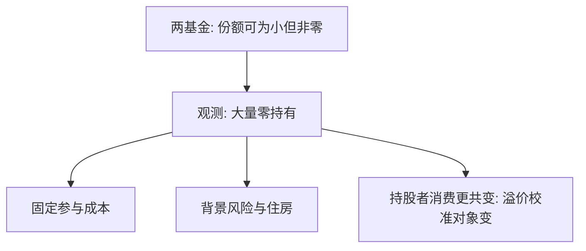

# 家庭组合与参与之谜

有限参与不是「有人没听说过股票」的注脚：它改写谁的消费进入定价核，也改写股权溢价该向谁校准。

<footer>—— Mankiw and Zeldes, The Consumption of Stockholders and Nonstockholders, JFE 1991；Haliassos and Bertaut, EJ 1995</footer>

[上一课](/econ/housing-asset-consumption)把净值绑在房子上。本课缺口是金融风险资产：标准两基金分离预测，只要风险厌恶有限、股权有正溢价，人人持有市场组合的某一杠杆。数据里大量家庭股票持有为零。不重写 [CAPM](/econ/capm-theory) 的均衡推导，只问参与的零角点。

## 问题

Merton 连续时间、两基金分离：风险资产份额由夏普与风险厌恶决定，可以为小，但恰好为零需要无限厌恶或零溢价。Haliassos 与 Bertaut（1995）把零持有写成谜。Mankiw 与 Zeldes（1991）比较持股者与非持股者的消费：持股者消费与股市更共变，$\sigma(m)$ 的微观候选更抖——这是对[股权溢价之谜](/econ/equity-premium-puzzle)的参与侧翻译，不重推 HJ 界。Vissing-Jørgensen（2002）强调固定参与成本：小财富下成本吃掉溢价，零持有可以是理性角点。

缺口是在住房挤出之后，再加一层参与决策，而不是重讲期望效用公理。

Guiso、Haliassos 与 Jappelli 的跨国比较：参与随财富、教育、信任变化。信任与素养是下一课，本课先钉成本和背景风险。

## 方法

在缓冲存量加住房的资产负债表上，加一只股权。固定成本（信息、开户、时间）使价值函数在「参与 / 不参与」上离散比较。背景风险（劳动收入、房价）若与股市正相关，挤出股票；若不可保且独立，也可能挤出（谨慎）。卖空限制把负份额关掉，零成为角点。

本课不估计成本美元数。交易协议仍不是对象。

## 机制

机制是角点加异质。未参与者的欧拉对股权不成等式，他们的消费不必进市场的 $m$。代表性主体用总量 $c$ 生成核，把未参与者的平滑消费也算进去，溢价被夸大成「谜」。参与之谜因此既是家庭金融问题，也是资产定价加总问题。住房与劳动收入是背景风险的主要来源；现时偏差和损失厌恶可以再抬高不参与——行为单元再写。

与 [EMH](/econ/emh) 不冲突：有效是相对信息集的价格陈述；参与是谁愿意持有。未参与不蕴含价格可预测。

两基金分离来自主干的均值方差或 ICAPM 逻辑，本课不重导。零持有是角点：要么成本吃掉溢价，要么背景风险把有效厌恶抬到参与阈值以上。Mankiw–Zeldes 的含义对溢价之谜是加总的：正确的 $c$ 也许是持股者的 $c$。补层停在家庭侧；量化栏的 CAPM 实证仍用市场组合，不在此改测量。

## 边界

「谜」取决于成本与背景风险能否定量吃掉零持有。年轻、穷、无风险资产也很少的家庭，零持有并不奇怪。真正刺耳的是中高财富、已有缓冲仍不参与。本课把刺耳的区域标出来，定量交给经验文献，不在此校准。

后课默认：参与是离散选择；默认选项与素养会移动这个角点，而不必先改变 $\gamma$。

两基金分离几乎禁止零持有；固定成本与背景风险把零写成角点。

持股者消费更共变，溢价之谜的 $c$ 可能找错了人。未参与不蕴含价格可预测。

## 小结

- 两基金分离几乎禁止零持有；数据里零是常态。
- 固定成本、住房与劳动收入背景风险给出理性角点。
- 持股者消费更共变，溢价之谜的 $c$ 可能找错了人。
- 刺耳的是中高财富仍不参与，不是穷人的零持有。
- 默认与素养下一课移动这个角点。
- 出处：Mankiw and Zeldes, *JFE* 1991；Haliassos and Bertaut, *EJ* 1995；Vissing-Jørgensen, 2002。
