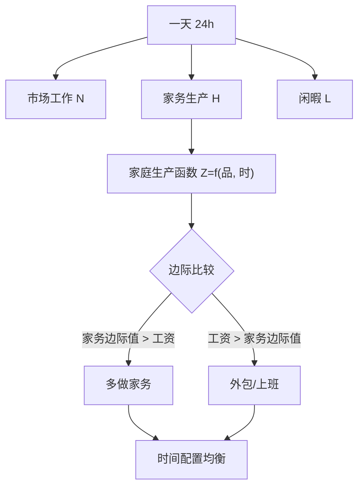
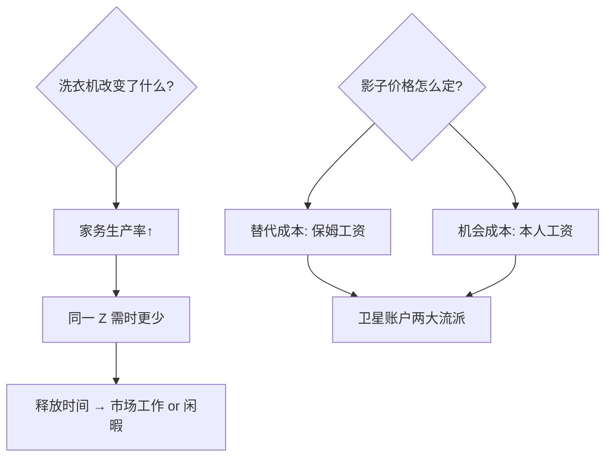

# household-production

GDP 看不见的半边天：做饭、带娃、照护老人——家庭不是消费黑箱，是一座没进账本的工厂。

<footer>—— 据 Becker「A Theory of the Allocation of Time」(1965)；Gronau 家庭生产模型 (1977)</footer>

[可行能力方法](/econ/capability-approach)把福祉的镜头从收入拉宽，本课把镜头对准 GDP 的测量盲区：家庭内部的生产活动。缺口是**时间配置模型**——在市场工作、家务生产与闲暇之间，人怎么分配一天 24 小时。它是女性劳动参与、育儿成本与 GDP 卫星账户的共同地基。

## 问题

自己做饭与外卖做饭，GDP 一个不计一个计；妻子退出职场回家带娃，GDP「下降」。国民账户把家庭当纯消费单位，掩盖了规模可观的非市场生产——OECD 卫星账户估计其价值达 GDP 的 30–50%。要回答：家庭生产怎么进模型，它的机会成本怎么定价，技术进步（洗衣机、外卖）怎么改写时间配置。

术语翻译：家庭生产函数 $Z=f(x_M, x_T)$——市场品 $x_M$（食材）与家庭时间 $x_T$（做饭）合成为家庭品 $Z$（一顿饭）；全收入（full income）= 货币收入 + 全部时间的影子价格。

数字实例：煮一餐饭食材 30 元 + 45 分钟。时薪 100 元的人的机会成本 75 元，总成本 105 元；时薪 30 元的人 22.5 元，总成本 52.5 元——同一顿饭，市场价格相同，「真实价格」差一倍，替代行为（叫外卖与否）随之分岔。

## 方法

Gronau 模型把时间分三块：市场工作 $N$、家务 $H$、闲暇 $L$。边际条件：时间从家务转向市场工作直到「家务边际产品 × 家庭品影子价格 = 市场工资」。推论直接：市场工资上升 ⇒ 家务时间下降（外包部分家务）；家庭生产率提升（洗衣机）⇒ 既解放时间又降低 $Z$ 的影子价格。GDP 卫星账户的方法论之争全在第三步：产出法（按替代成本估价服务量）还是投入法（按机会成本估价工时）。

直觉类比：家是「一揽子小微工厂」，车间主任是时间。工资涨了，主任把劳动密集车间（做饭、保洁）外包，只保留技术密集车间（育儿陪伴）；洗衣机像一次车间自动化——不是把车间关闭，而是让同一小时产出翻倍。

## 机制

模型解释三大实证谜题。**性别工资差与家务分工**：即使控制市场工资，女性家务时间仍系统性偏高——社会规范的影子价格进入家庭生产函数，市场工资平等化未必自动带来家务平等（「第二班」）。**劳动供给的背面**：已婚女性劳动参与率上升与家电普及、育儿市场化同步——技术替代弹性决定外包速度。**福利测量**：的机会成本随生命阶段变动，只看市场收入的贫困线会误判多孩家庭。机制核心一句话：时间是家庭唯一的硬约束，一切家庭决策都是它在三个出口间的套利。

常见误区：把家务时间乘以平均工资当家庭生产价值——高估（多数家务不需本家时薪水平技能）；反向误区是「家务无价值所以不核算」——OECD 卫星账户证明它占 30–50% GDP，忽略它会系统性误判税收、育儿与养老政策的分配后果。

## 边界

模型的边界：家庭内部谈判被简化——集体家庭模型（Chiappori）把夫妻决策从单一效用拆成讨价还价，解释了「同家庭不同品味」；照护的不可外包性（情感劳动）限制替代逻辑；测量上时间利用调查是唯一数据源，且「陪玩的快乐」算闲暇还是生产存在本质含糊。政策接口：育儿成本核算、照护假定价、退休后家庭生产低估导致的养老误判。与[生育的经济学](/econ/fertility-econ)衔接：孩子是家庭生产函数里时间最密集的「产品」，质量-数量替代全在这一框架内展开。

直觉类比：GDP 是只记门店流水、无视后厨的账本；家庭生产核算就是给后厨装摄像头——不改变菜的味道，但让「谁在掌勺、掌了多久」第一次进入成本表。

## 小结

- 家庭是生产单位：市场品 × 时间 → 家庭品；时间是硬约束。
- 边际条件「家务边际值 = 市场工资」驱动外包与劳动供给。
- 卫星账户产出法/投入法之争照进政策：照护、育儿、养老都受其定价影响。
- 出处：Becker 1965；Gronau 1977；Chiappori 集体模型 1992；OECD Household Production Satellite Accounts。
