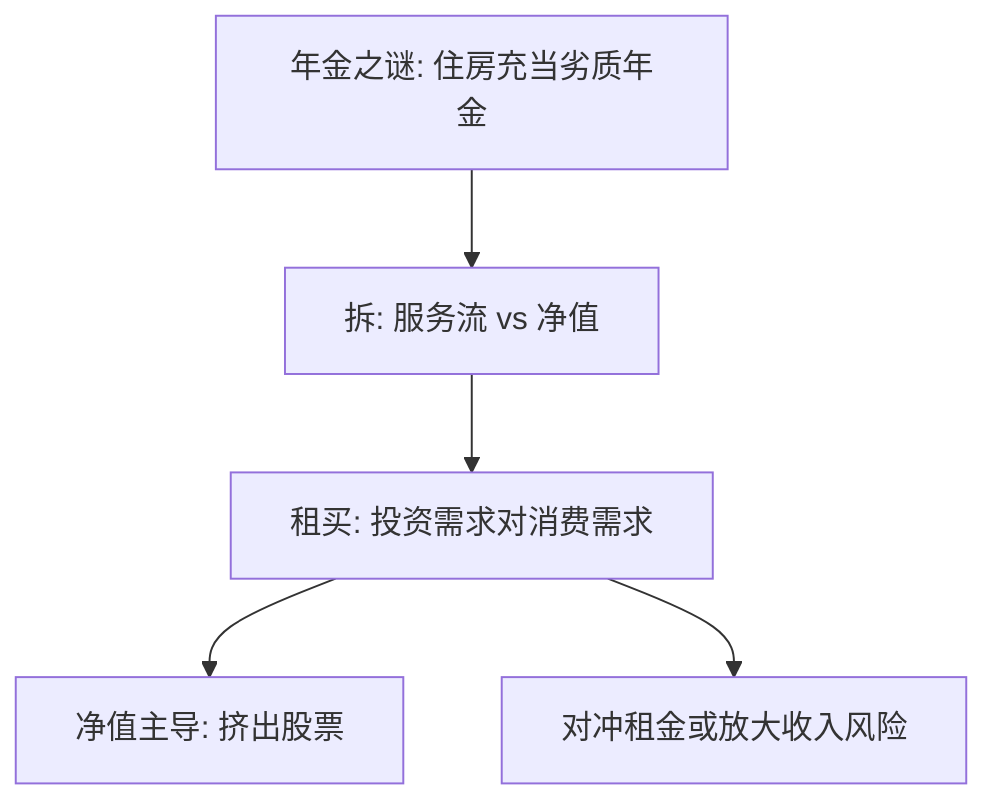

# 住房：资产与消费

同一套房子同时是消费品和资产负债表上最大的一项资产；把租金服务与资产需求拆开，组合问题才变得可写。

<footer>—— Henderson and Ioannides, A Model of Housing Tenure Choice, AER 1983；对照 Flavin and Yamashita, 2002；Campbell and Cocco, 2003, 2007</footer>

[上一课](/econ/annuity-puzzle)把住房点成劣质年金。本课缺口是正式拆开：住房服务进入期内效用，房屋净值进入跨期预算，租买选择把两者焊在同一决策里。不重写 Yaari 公式。

## 问题

标准 LCH/PIH 的 $c$ 是可分消费品。住房不是：住在里面才有服务流，卖掉才有残值，交易成本高，杠杆（按揭）把利率与违约写进家庭欧拉。Henderson 与 Ioannides（1983）把租买写成投资需求与消费需求是否相等：投资需求大于消费需求则持有投资性住房，反之则租。Flavin 与 Yamashita（2002）强调：年轻房主的组合被住房净值主导，股票份额被挤出——这是下一课参与之谜的实物侧。Campbell 与 Cocco（2003, 2007）把按揭类型与房价风险、劳动收入风险放在一起：房价与收入若正相关，住房是坏对冲。

缺口是给家庭金融加上不可分、高成本的住房，而不是重写一般均衡商品空间。

Sinai 与 Souleles：租客暴露在租金风险里，自住对冲「住在这城里」的成本。住房作为对冲的符号取决于人是否计划长期住下去。

## 方法

效用 $u(c,h)$，$h$ 为住房服务；自住时 $h$ 与房屋存量绑在一起，租住时 $h$ 在租赁市场买。资产方程含按揭余额、房价随机、交易与搬家成本。租买是离散选择；一旦自住，组合在住房上过度暴露，其他风险资产的最优份额下降。本课不估计房价过程，不把城市经济学写进来。

价格 $p$ 仍是资产价格，不是盘口中间价。本补层不进入限价簿。

## 机制

机制是捆绑。消费需求决定要多少平方；投资需求决定要持有多少房屋作为资产。两者只在无摩擦时能用租赁拆开。摩擦使许多家庭被迫同时满足两个需求，于是出现「过度住房、过少股票」。按揭把无风险利率换成浮动或固定的名义合同，通胀与再融资进入家庭金融，仍不是微观结构课。

与遗赠：住房不可分且交易成本高，强化终点留下房产而非金融年金。与承诺：首付与提前还贷罚则可当金蛋。本课只标明接口。

期内效用仍是[偏好](/econ/preference-choice)上的 $u(c,h)$，不重写完备传递。跨期预算多了房价随机与按揭合同，欧拉对金融资产仍成立，对住房可能因不可分与成本变成离散选择。Campbell–Cocco 强调：浮动利率把通胀与短期利率写进还款，固定利率把再融资期权写进合同——都是家庭金融，不是期限结构主干的再推导。

## 边界

商业地产、REIT、住房抵押贷款证券化是另一组市场，量化栏与机构金融会碰，本课家庭侧停在自住与按揭。也不把 2008 年危机写成住房课的正文——那是宏观金融附录，不是租买理论。

后课默认：家庭组合在住房占净值很高的现实约束下展开；参与之谜不能假装有一个无住房的 Merton 问题。

租买把住房服务需求与资产需求焊在同一决策；摩擦下无法用租赁完全拆开。

净值主导挤出股票，是参与之谜的实物侧，不是另写一套 CAPM。

## 小结

- 住房同时是 $h$ 与资产，租买把两个需求焊在一起。
- 净值主导挤出股票；房价–收入相关决定对冲还是放大。
- 不重写年金公式，不写簿；只补家庭资产负债表的最大一项。
- 房价与劳动收入相关决定对冲还是放大。
- 首付可当承诺，房产可当劣质年金。
- 出处：Henderson and Ioannides, *AER* 1983；Flavin and Yamashita 2002；Campbell and Cocco, 2003, 2007。
