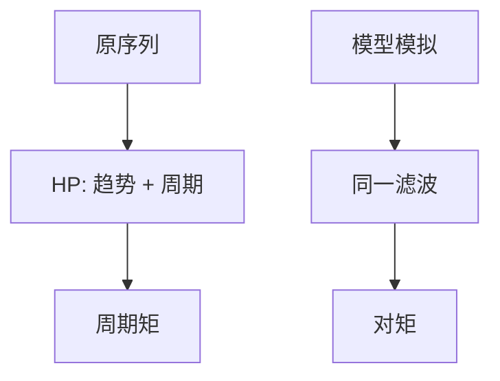

# HP 滤波与周期分离

把序列拆成光滑趋势与周期，才能谈「波动的标准差」；λ 的选择是定义，不是从数据估出来的自然常数。

<footer>—— Hodrick and Prescott, Postwar U.S. Business Cycles: An Empirical Investigation, JMCB 1997；对照 Ravn–Uhlig 对 λ 的讨论；Hamilton 2018 的批评</footer>

[上一课](/econ/dsge-bayesian-estimation)的似然吃的是模型自己的趋势假设。校准传统吃的是滤波后的周期矩。本课缺口是**切开**：HP 滤波做什么、与模型去趋势如何错位。不重写 Kalman，不把滤波当因果识别。

## 问题

Hodrick–Prescott：$\min_{\{\tau_t\}}\sum (y_t-\tau_t)^2+\lambda\sum(\Delta^2\tau_t)^2$。$\lambda=1600$ 对季度是惯例。周期 $c_t=y_t-\tau_t$ 的标准差、相关、谱，成为 RBC/NK 校准的靶。缺口是：趋势是平滑器的输出，不是理论中的随机趋势或确定性时间趋势。Hamilton（2018）指出 HP 会在两端产生虚假动态、把预测误差的结构强加给周期。本课要把「周期事实」的测量声明为滤波依赖。

Hodrick and Prescott, *JMCB* 29(1), 1997（工作论文更早）。Ravn and Uhlig, *ReStat* 2002 讨论频率与 λ。Baxter–King 带通是另一刀。

## 方法

对对数产出、消费、投资、工时分别 HP，再算相对产出的波动与同期相关。线性 DSGE 的理论矩应对**同一滤波算子**施加于模型模拟，而不是拿模型的 $\mathrm{Var}(\hat y_t)$ 直接对 HP 后的数据。若模型含单位根或漂移，HP 与一阶差分、线性趋势会给出不同靶。估计课若用增长平稳或差分平稳，与校准课的 HP 矩不要混报成同一检验。

带通（Baxter–King）、一阶差分、Hamilton 回归，是不同的周期定义。事实表必须标注刀法。

## 机制

机制是惩罚二阶差分：λ 大则趋势更直、周期更像原序列的偏离。商业周期的「4–32 季度」故事与 λ=1600 大致对齐，但不是定理。滤波是双边的（用未来 $y$），实时政策监控要用单边版本，端点问题更重。把 HP 周期当结构冲击的实现，是把平滑器当识别——后课 SVAR 才谈冲击。

增长理论里的趋势是 TFP 与资本；HP 趋势不必等于 Solow 残差的累积。混为一谈会让「周期劳动份额」变成滤波伪迹。

Kydland–Prescott 的矩表默认 HP。Smets–Wouters 估计常对数据做去趋势或用增长观测，两套传统的「拟合」不可直接比大小。

## 边界

本课不列各国事实表（下一课）。不把 λ 写成最优政策参数。也不进入频谱计量的全部工具。资产价格的「周期」更不宜默认 HP：估值比率有持久成分，那是另一课程已写的回报可预测，本栏不重做。

后课默认：周期矩必须声明滤波；模型矩用同一算子。下一课：在 HP（或标明的刀）下，商业周期事实是哪些共动。

## 小结

- HP 用平滑惩罚定义趋势；λ 是惯例。
- 模型与数据必须过同一滤波才能对矩。
- 滤波不是冲击识别；端点与虚假动态是已知代价。
- 出处：Hodrick and Prescott, *JMCB* 1997；Hamilton, *ReStat* 2018。
