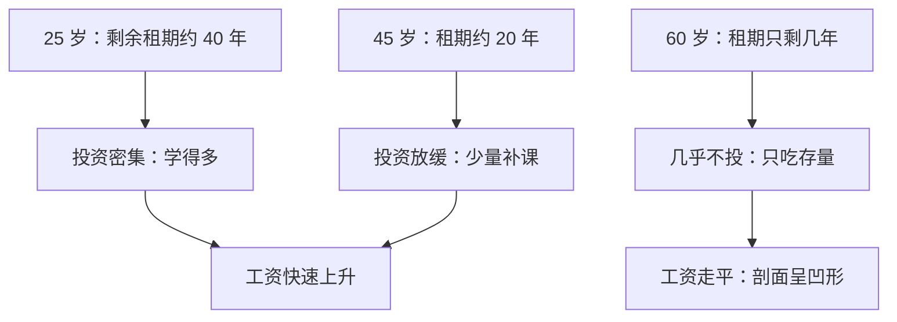
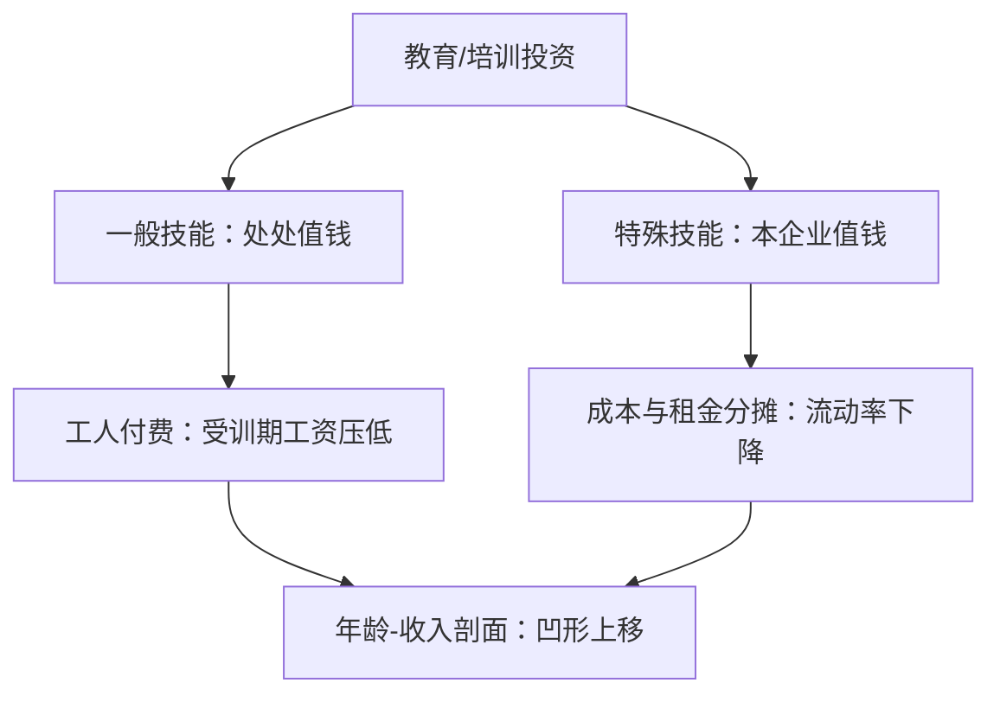

# 人力资本：一般与特殊训练

训练若带来一般技能，市场会把学费记在受训期的工资单上；若是特殊技能，雇主必须分摊——否则留不住人。

<footer>—— 据 Becker, Human Capital, 1964；Ben-Porath, The Production of Human Capital and the Life Cycle of Earnings, JPE, 1967 整理</footer>

[上一课](/econ/compensating-differentials)把工资差的属性维度钉完：风险、脏活、偏远由享乐工资函数定价。但工资剖面最粗的形态还没解释：为什么工资随年龄先陡后平、教育年限高的人整个剖面往上抬？缺口是把「能力」当成可投资的存量——人力资本。本课讲 Becker 的一般与特殊训练之分、成本谁付、年龄-收入剖面怎么读。教育到底是真技能还是标签，本单元后面的信号课再对照。

## 问题

上一课的属性是岗位给定的特征；本课的变量长在人身上。投资教育或培训，当期少赚（学费、受训期低工资），未来多赚。缺口有三个：投资谁定、成本谁付、剖面为什么凹。不分投资类型，「企业送员工去培训」会被当成反竞争模型的反例，其实它是模型自己的推论——分界在技能带走之后还值不值钱。

### 一般与特殊的分界

一般技能换个雇主同样值钱；特殊技能只在本企业提高边际产出，带走归零。这条分界决定付费结构，是 Becker 1964 的核心命题。

## 方法

竞争市场基准下推付费结构。一般训练：若企业垫付学费，训练完成后市场工资追平工人（已抬高的一般）生产率，工人可以跳槽，垫付收不回。所以一般训练由工人付费：受训期工资被压到低于当期边际产出，差额即学费。特殊训练：技能带走归零，跳槽对双方都是损失，租金必须分享——培训期工资高于工人的外部选择（否则他不学），训练后工资低于其含特殊技能的边际产出、高于外部工资；成本与收益分摊，流动率随之下降。专用投资的这套治理，在[套牢与专用性](/econ/hold-up-gh)的口径里已经搭过台。

数字实例：一般培训期，工人当期边际产出 5000 元，市场工资也值 5000 元，但企业只发 3500 元——扣下的 1500 元就是这期培训的「学费」。结业后他跳槽也能拿到 5000 元以上，所以垫付的只能是自己的低工资，企业一分不能多掏。

直觉类比：特殊技能像只在这一家餐厅有用的秘方。老板不敢让你白学（怕你端着秘方走），你也不敢自己全垫（怕学成后被压价），于是学费一起摊：受训期你拿中间水平的工资，结业后拿介于外部工资与含秘方产出之间的钱——走人亏、留下赚，双方都被拴住。

年龄-收入剖面：Ben-Porath 1967 把人力资本写成存量上的生产——投资先回报自身（复合增长），且剩余工作年限越长、投资的租期越长，于是年轻时投资密、随年龄递减；产出随存量上升、投资随年龄下降，剖面先陡后平，凹形。教育年限把整个剖面上移：Mincer 1974 的对数工资回归

$$
\ln w = \alpha + \rho\, s + \beta_1 x + \beta_2 x^2 + \cdots
$$

把教育年限 $s$ 与经验 $x$ 的回报分开，$\rho$ 的估计多落在每年 6%–12%（Heckman 等 2006 的综述与再检验）。

术语翻译：Mincer 方程就是把工资差拆成三块——教育年限 $s$（每多读一年涨约 $\rho$）、经验 $x$（早期涨得快）、经验的平方 $x^2$（后期放缓）。它默认是相关而非因果：能力偏误要靠工具变量另外压。

## 机制

凹形不是偶然：投资前密后疏是租期效应——同样的技能，二十五岁学有四十年收租，五十五岁学只剩十年。一般与特殊的分界同时预测流动率：只受一般训练者到处值钱、流动率高；受特殊训练者外部工资低、流动率低，数据里培训与长任期相伴随。付费结构可检验：企业出钱的培训偏特殊技能（专有流程、内部系统），一般技能多由工人自费或由学校承担——分工在数据里对得上。

「企业愿意免费提供通用培训」在竞争基准里是亏本买卖：垫付收不回。Acemoglu–Pischke 1999 指出工资压缩（买方垄断、制度、信息摩擦）会让企业也付一般训练——不是 Becker 错了，是竞争假设松了之后付费结构跟着变。

## 边界

本课把教育全当生产率投资用；教育与工资正相关这个事实本身分不开技能与标签——文凭可能只是筛选装置，那个口径留给本单元后面的信号课。还有能力偏误：能力强的人教育多、工资也高，把能力误记在教育头上会高估 $\rho$；用义务教育法、离最近大学的距离当工具变量往下降（Card 1999 的口径）。信贷约束决定谁能投资：教育的分布不只是偏好问题，也是融资问题。

## 小结

- 一般训练工人付费（受训期低工资），特殊训练成本与租金双方分摊；分界是流动率。
- 年龄-收入剖面的凹形来自租期效应：投资随年龄递减（Ben-Porath 1967）。
- 教育年限的对数工资回报多估在每年 6%–12%，能力偏误用工具变量压。
- 教育是技能还是标签，本课未拆——留给信号课对照。
- 出处：Becker, Human Capital, 1964；Ben-Porath, JPE 1967；Mincer 1974；Acemoglu and Pischke 1999。
