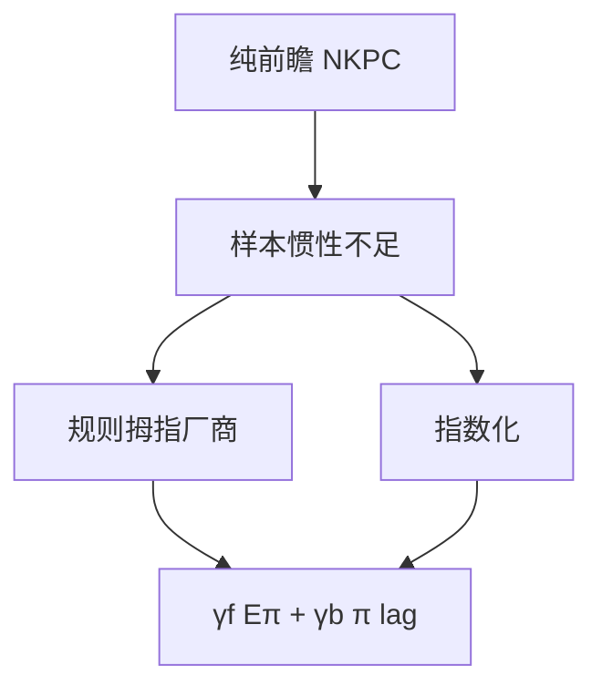

# 混合 NKPC

纯前瞻的菲利普斯在数据里惯性不够；加一项滞后通胀之后拟合变好——那是规则拇指或指数化，不是把适应性预期请回结构。

<footer>—— Galí and Gertler, Inflation Dynamics: A Structural Econometric Analysis, JME 1999</footer>

[上一课](/econ/nk-phillips)从重置价格得到 $\pi_t=\beta\mathbb{E}_t\pi_{t+1}+\kappa\tilde{y}_t$，并声明混合项是经验修补。本课的缺口是把修补写成结构：一部分厂商后视或按过去通胀指数化，于是

$$
\pi_t=\gamma_f\mathbb{E}_t\pi_{t+1}+\gamma_b\pi_{t-1}+\lambda\widetilde{mc}_t.
$$

Galí–Gertler（1999）用边际成本而不是 $u$ 去估这条式子。动态 IS 下一课才配需求侧；本课只改供给惯性。

## 问题

纯 NKPC 的 $\beta\mathbb{E}\pi_{t+1}$ 给出的通胀惯性往往小于样本自相关。把滞后 $\pi$ 直接塞进回归，容易退回 Friedman–Phelps 的适应性。缺口是：在仍由优化定价出发的前提下，谁贡献 $\gamma_b$。Galí–Gertler：一部分厂商按经验规则（过去的重置价格）定价，其余仍前瞻 Calvo。指数化（未改价合同自动跟 $\pi_{t-1}$）是另一来源，Woodford 与 Christiano–Eichenbaum–Evans 常用。本课并列二者，不把 $\gamma_b$ 写成「公众不会理性」。

$\gamma_f+\gamma_b$ 常被约束近 1。$\gamma_b$ 大不是「未来不重要」，而是当前通胀有一部分被过去锁住。规则一变，$\gamma$ 仍可能变——卢卡斯批判没有取消。

## 方法

前瞻份额 $1-\omega$ 仍解 Calvo 重置价格；规则拇指份额 $\omega$ 把 $x_t$ 写成过去重置价加通胀。加总后得到混合 NKPC，$\gamma_f$、$\gamma_b$ 是 $\omega$、$\theta$、$\beta$ 的函数。用劳动收入份额一类代理 $\widetilde{mc}$，避免直接把 $u$ 当成本。估计上，$\gamma_f$ 往往仍显著——不是纯后视。

Taylor 叠期也能留下滞后项，来自未到期合同，不必引入非优化厂商。本课把 Galí–Gertler 当经验结构的代表，承认日历合同是平行来源。

### 不要把混合项读成 IS 的 $C(Y)$

需求侧仍是欧拉。供给侧多一个 $\pi_{t-1}$，改变的是通胀对缺口的动态，不是把消费函数请回。混合 NKPC 使「承诺用未来低通胀换今天」的路径更贵：惯性越强，反通胀越痛——时间不一致课会用到，本课只改方程形状。

## 机制

成本冲击或缺口到来，前瞻厂商立刻把 $\mathbb{E}\pi$ 写入；后视厂商把昨天的 $\pi$ 再抄一截。于是通胀爬升与回落都拖尾。政策若只盯当期 $\tilde{y}$，会低估锁进 $\pi_{t-1}$ 的那截。纯 NKPC 下神圣巧合更干净；混合项使即使没有 markup 冲击，关掉当期缺口也不立刻关掉通胀——惯性本身制造权衡的外观。真正的成本推动仍是 $u_t$；不要把 $\gamma_b$ 叫做供给冲击。

边际成本代理比 $u$ 更接近理论：劳动份额含生产率与工资。工资粘性进入 $\widetilde{mc}$ 的动态，于是混合 NKPC 的 $\lambda$ 与 EHL 缠在一起。本课不重估 Galí–Gertler 表。

反通胀：纯前瞻下，可信的未来紧路径可以立刻压当前 $\pi$。$\gamma_b$ 大时，昨天的通胀还要「走完」，牺牲比上升。这不是否定预期管理，而是说惯性把承诺的收益与成本都改写了。权变若每期重新优化，混合项下的稳定偏误可以更粘——时间不一致课会用到形状，本课只改 Phillips。

混合 NKPC 是线性宏观的修补，不是价格理论终局。状态依赖菜单成本在高通胀时会改有效 $\gamma$，系数不是深结构。

## 边界

本课不把滞后项升格为第三种定价公理。量化栏没有宏观 Phillips。动态 IS 下一课给出需求；三方程要等利率规则。CIP 不进入这条国内通胀方程。

用滞后通胀当工具变量去估 NKPC，识别弱且易受政策规则污染。Galí–Gertler 强调用边际成本，是为了靠近结构，不是已经解决卢卡斯批判。$\gamma_b$ 随样本与规则变，正是预期的。把某一年代的 $\gamma_b$ 写成深结构，会在规则切换后读错惯性。

后课默认：经验 NKPC 允许 $\gamma_b>0$，来自指数化或规则拇指；预期项仍在。下一课把欧拉收成与它对偶的动态 IS。

## 小结

- 纯 NKPC 前瞻；样本惯性要求滞后项。
- Galí–Gertler：规则拇指份额给出 $\gamma_b$，其余仍优化前瞻。
- 指数化与 Taylor 叠期是平行来源。
- 混合不是适应性预期复辟，也不是把 $C(Y)$ 请回。
- 出处：Galí and Gertler, *JME* 1999。
