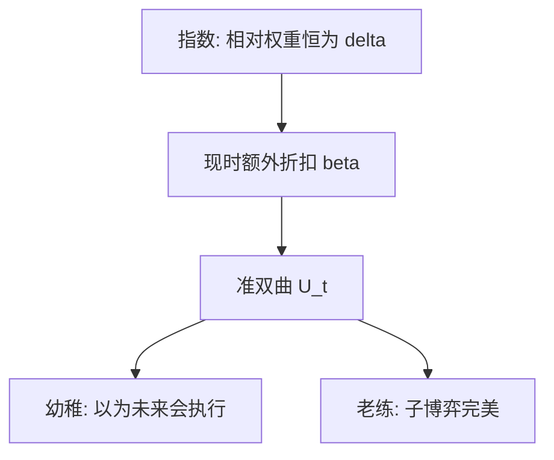

# 双曲贴现与现时偏差

从现在看，「明天相对后天」几乎一样重要；真到了明天，「今天相对明天」突然陡了——相对权重随等待的起点而变。

<footer>—— Laibson, Golden Eggs and Hyperbolic Discounting, Quarterly Journal of Economics, 1997；对照 Phelps and Pollak, RES 1968</footer>

[上一课](/econ/exponential-discounting)把几何 $\beta^t$ 钉成时间一致。本课缺口是：实验室与田间常见的是**现时偏差**——对立刻兑现的延迟特别不耐烦，对同样长度的远期延迟却接近指数。不重写贴现效用的可分骨架，只换权重。

## 问题

指数贴现下，任意相邻两期的相对权重都是同一个 $\beta$。Ainslie 的动物与人类延迟实验、以及后来的选择实验，显示短期贴现率高于长期。Phelps 与 Pollak（1968）用世代间的准双曲；Laibson（1997）把它写成个人自我序列：

$$
U_t=u(c_t)+\beta\sum_{k=1}^{\infty}\delta^k u(c_{t+k}),
$$

$\delta$ 是长期因子，$\beta\le 1$ 是「现在」相对「以后所有期」的额外折扣。$\beta\lt 1$ 时，从 $t$ 看 $t+1$ 对 $t+2$ 的相对权重是 $\delta$，从 $t+1$ 看变成 $\beta\delta$——计划在边界上翻脸。缺口是把上一课的一致性拆掉，而不是重讲[偏好](/econ/preference-choice)或 [vNM](/econ/expected-utility)。

真双曲常用 $1/(1+k\Delta)$。准双曲 $\beta$–$\delta$ 是离散近似，便于动态规划。本课以准双曲为主，机制相同：现时额外折扣。

## 方法

自我是一串决策者，每期只有当期 $c_t$ 在自己手里。幼稚型相信未来的自己仍按 $t$ 的计划执行；老练型解子博弈完美均衡，知道下一期会再贴一次 $\beta$。O'Donoghue 与 Rabin（1999）把两者分开：幼稚推迟成本前置的任务、抢先做收益前置的任务；老练部分纠正，但现时偏差仍在。本课不估计 $\beta$，只标明策略型。

资产仍是完全债券或非流动性「金蛋」（Laibson）：非流动资产充当承诺，因为下一期的自己无法立刻吃掉本金。承诺装置的制度细节下一课再写。

## 机制

机制是相对权重依赖「延迟从哪一天起算」。不是人算错了欧拉，是每期的 $U_t$ 换了一套尺。消费路径因此有两种偏离：过度消费（相对长期自我），以及对流动性的需求——流动资产会被现时自我吃掉。这与[欧拉方程](/econ/consumption-euler)的宏观用法不冲突：宏观主干仍用指数 $\beta$ 写前瞻 IS；补层指出，若家庭是准双曲，欧拉在「长期自我」与「现时自我」之间没有单一主体。

也不进入限价簿。现时偏差改的是家庭目标，不是报价协议。主干在交接处交给量化栏的是均衡 $p$；补层在这里改的是 $U_t$ 的权重，两者不相吞。

与[两期](/econ/two-period-micro)的切点对照：指数下切点沿时间滑动仍被承认；准双曲下 $t$ 的切点在 $t+1$ 被另一条无差异曲线取代。宏观[欧拉](/econ/consumption-euler)若继续用单一 $\beta$，写的是长期自我或代表主体，不是现时自我的一阶条件。本课把这个错位标出来，后课用承诺去焊。

## 边界

双曲不是对所有跨期选择的否证。指数贴现在长期利率、增长模型里仍是默认。本课不把政府通胀偏差（Kydland–Prescott）与个人现时偏差写成同一个方程：前者是政策对私人预期，后者是自我对自我。股权溢价、习惯形成已经在主干用别的 $m$；这里不重校准谜。

后课默认：说到现时偏差，指 $\beta$–$\delta$ 或真双曲；说到承诺，默认读者知道老练自我愿意付出代价关掉未来的选择。

## 小结

- 指数贴现的相对权重不随起点变；现时偏差让「现在」额外打折。
- Laibson 准双曲把自我写成博弈；幼稚与老练策略不同。
- 不重推 vNM，不重写簿；只换跨期权重。
- 出处：Phelps and Pollak, *RES* 1968；Laibson, *QJE* 1997；O'Donoghue and Rabin, *AER* 1999。
