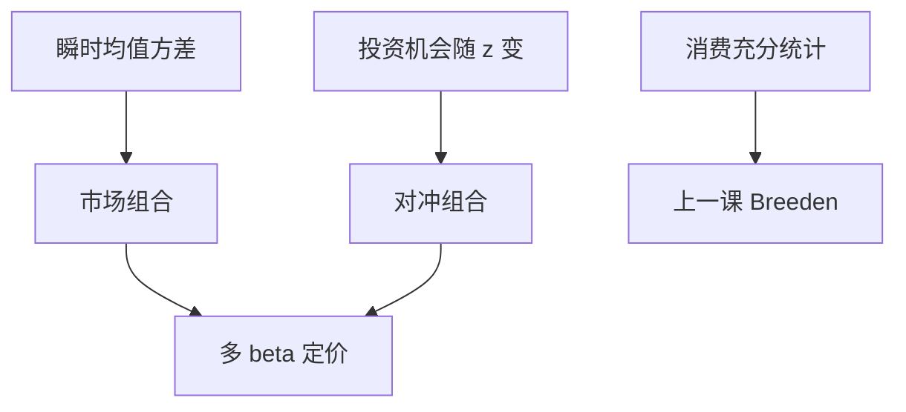

# Merton ICAPM

投资机会随状态变时，均值–方差不够：投资者还要持有对冲组合，为的是在机会变差的时候补上财富；期望超额于是进入多组 beta。

<footer>—— Merton, An Intertemporal Capital Asset Pricing Model, Econometrica, 1973</footer>

[上一课](/econ/ccapm)把消费欧拉写成消费 beta：Breeden 说状态变量已被消费吸收。本课缺口是 Merton 的跨期 CAPM（ICAPM）：在连续时间、投资机会随机时，把那些状态重新列成对冲需求，而不是立刻用 $c$ 充分统计。不重做 Mehra–Prescott 校准，不把状态变量做成 Fama–French 表。

## 问题

单期均值–方差给出市场切点，下一课 [CAPM 作为均衡](/econ/capm-theory)会把它写成市场 beta。多期里，机会集（利率、夏普、可投资的 $\mu,\sigma$）随状态 $z$ 变。今天的最优不只是「这期的均值方差」，还要考虑财富在 $z$ 变差时是否还够明天投资。Merton（1973）导出：除市场组合外，每个状态变量对应一个对冲组合；期望超额是市场 beta 加对冲 beta 的线性组合。

缺口是与 CCAPM 的对照，而不是再推一遍消费欧拉。Breeden：瞬时效用时间可分时，对冲需求被消费路径吸收，只剩消费 beta。Merton：不先加总到 $c$，把 $z$ 留在定价方程里。两句话在完全市场、时间可分下可以相容；数据上 $c$ 很噪，于是 ICAPM 常被当成「用可交易状态代理去代替 $\Delta c$」的许可证——那一步已经滑向量化栏，本课只停在均衡陈述。

对冲需求：为了在投资机会恶化时财富上升（或下降得少）而持有的组合。它不是「对冲某只股票的特质风险」，而是对共同状态 $z$ 的保险。

## 方法

连续时间，投资者最大化递归的期望效用（Merton 原文是时间可分），状态 $z$ 驱动机会集。最优财富动态把需求拆成：类似单期的切点需求，加上与 $z$ 的协方差对冲。出清：市场组合清切点需求，专门的基金清对冲需求。个股期望超额

$$
\mathrm{E}[R_i^e]=\beta_{i,m}\lambda_m+\sum_k\beta_{i,z_k}\lambda_{z_k}.
$$

状态的风险价格 $\lambda_{z}$ 可正可负，取决于该状态变差时边际效用升还是降。

APT 后课用的是近似因子结构；ICAPM 用的是跨期优化。不要把两者写成同一句「所以要有多个因子」。

### 不是截面工程

哪些 $z$ 可观测、用哪几个可交易组合去代理、Fama–MacBeth 斜率显不显著，全部换 [/quant/capm](/quant/capm) 与其后的因子课。本课禁止用 SMB/HML「实施」1973 年的 $z$。Merton 没有颁发规模与价值的执照。

## 机制

机制是跨期保险。机会变差等于未来再投资更难；厌恶这一点的人，愿意付出期望收益，去持有在该状态下表现好的资产。于是这些资产价格被抬高、无条件溢价下降（或相反，若它们在坏 $z$ 时更差）。单期 CAPM 把所有坏状态压缩成「市场下跌」；ICAPM 说市场下跌不是唯一相关的坏。

CCAPM 的机制仍是 $u'(c)$。若 $c$ 把所有 $z$ 的信息吃进去，多 beta 与消费 beta 是同一映射的两个坐标。总量消费平滑使消费坐标在回归里弱，市场加几个宏观 $z$ 看起来更强——那是测量与代理，不是 1973 否证了 1979。

Merton, *Econometrica* 41(5), 1973。连续时间是为了把瞬时均值方差与对冲干净地拆开。离散时间也可写近似，精神相同。

## 边界

不要把 ICAPM 写成 EMH，也不要写成「所以 CAPM 已死」。下一课的市场 CAPM 是把对冲关掉（机会确定或可被市场充分代表）之后的均衡特化。实证拒绝市场 beta，可以是需要 $z$，也可以是 $m$ 根本不是均值方差加总。习惯、长期风险、灾难改的是 $m$ 的形状，可以生成看起来像对冲的溢价，不必真有一个 Merton 基金。

后课默认：投资机会随机时，定价进入状态对冲 beta；消费 CAPM 声称这些 beta 被 $c$ 吸收。可交易因子实施换栏，本栏不排序。

限价簿、期限结构微观结构不在此出现。状态 $z$ 若是短期利率，后课仿射模型会给它动态，仍不是盘口。

单期 CAPM 是机会确定、或市场已充分代表所有对冲时的特例。ICAPM 多出来的项在数据上常被可交易组合代理；代理是否等于 $z$，是联合假说，与 EMH 的信息分层不是同一句话。

不要用「所以需要三个因子」把 1973 年接到 Fama–French。下一课 [CAPM 作为均衡陈述](/econ/capm-theory) 先把切点加总写死，实证仍换 [/quant/capm](/quant/capm)。

## 小结

- Merton ICAPM：机会集随状态变时，除市场外还需对冲组合，期望超额是多组 beta。
- Breeden 的消费 beta 是时间可分下把状态吸收进 $c$；两模型坐标不同，完全市场下可相容。
- 用规模价值等可交易因子去「实施」$z$，是量化栏，不是 1973 年的定理。
- 出处：Merton, *Econometrica* 1973；对照 Breeden 1979；下一课 Sharpe–Lintner。
