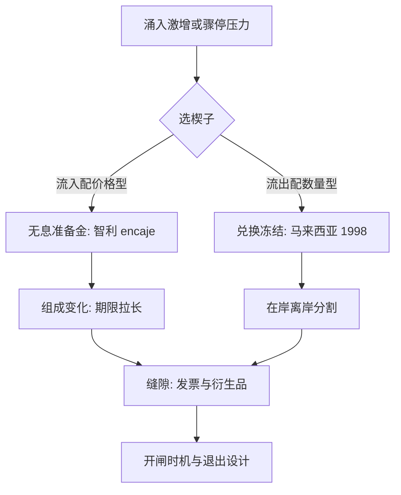
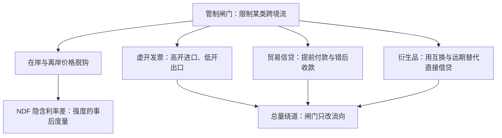

# 资本管制

管制管的是数量，管到的是缝隙：资本像水，闸门抬的是水位、改的是流向——评估管制要看组成与裂缝，不看条文宣布了什么。

<footer>—— 据 De Gregorio, Edwards and Valdés 2000；Magud, Reinhart and Rogoff 2011；IMF Institutional View 2012 整理</footer>

[上一课](/econ/if-fx-intervention)把干预收在价格侧：降波动可达、守水平撞基本面。本课补数量侧：当问题不是瞬时波动而是持续流量——涌入期怕热钱堆债务、骤停期怕挤兑外汇——闸门从价格转到数量本身。主干[资本管制](/econ/capital-controls)已经给了三角位置与「组成比总量更听使唤」的结论；本课的缺口是**工程细节**：设计空间怎么排、缝隙从哪漏、效力怎么测、开闸与关闸的时机怎么定。后课默认已经读完本课。

## 问题

问题有三个，分开才答得清。**楔在哪**：流入还是流出、价格还是数量、按居民身份还是按工具——设计空间是三维的，选错维度等于白管。**漏在哪**：管制是法规，资本是合同与发票，缝隙永远存在且随学习扩大。**怎么证明有效**：总量最不听使唤——Magud–Reinhart–Rogoff 的综述把这一条写成了总结论——于是证明责任移到组成与政策空间上，测什么、怎么测，是方法论不是立场。

## 方法

设计空间先排维。第一维方向：流入管制（智利 encaje、巴西 IOF 税）对付涌入期的债务堆积，流出管制（马来西亚 1998 年的兑换冻结与钉住）对付骤停期的挤兑；方向不同，政治含义相反——管流入是防患，管流出是拦逃。第二维形式：价格型（无息准备金、托宾式税）把套利算术留给市场；数量型（额度、审批）直接切断，代价是寻租与错配。第三维对象：FDI、股权、银行信贷、债券分开对待，短期外债的成本抬得最狠——那是骤停时最先断的部分。评估随之定型：不问总量，问组成（期限结构是否拉长）、问在岸离岸分割的深度、问买回的货币空间。智利 encaje 是标准样本：1991 年开征、1992 年提到 30%、锁定期一年，事后研究（De Gregorio–Edwards–Valdés 2000 一线）发现期限被拉长、总量没被压住——这不是失败，是这条渠道的全部。

智利 encaje 对除 FDI 外的流入收无息准备金，1992 年起比率 30%、存央行一年；1998 年亚洲危机后资本匮乏，随之废止。它抬高的是短期债务的价格——组成渠道是真实的，总量渠道不是。

数字实例：借 1 年期 100 万美元，encaje 要求 30% 无息存央行一年，机会成本按年利率 8% 算是 2.4 万美元——等于把这笔借款的年成本抬高 2.4 个百分点。锁定期固定一年，若把期限拉到 5 年，同样的成本摊到每年只剩约 0.5 个百分点：楔子天然「劝长避短」。

## 机制

机制是楔子与缝隙的赛跑。楔子分割市场：管制生效的直接后果是在岸与离岸价格脱钩，NDF 隐含利率偏离在岸利率（[量化栏的利率平价](/quant/irp)的尾段），脱钩幅度是管制强度的事后度量——比法条诚实。缝隙从贸易与合同里漏：高开低开的发票、贸易信贷的提前与错后、跨国公司的内部转移、衍生品的替代头寸；马来西亚 1998 年能在一年内守得住，靠的是离岸林吉特市场被一并关掉，代价是市场多年不敢回来。组成渠道是真实的收益：抬高短期美元债的成本，流入被推向 FDI 与长债，骤停时的断裂面就小——这与[全球金融周期](/econ/global-financial-cycle)的两难相接：浮动不绝缘，所以连不钉汇率的国家也需要 CFM，IMF 2012 年的机构观点把这一点写进了官方工具箱，与[宏观审慎](/econ/macroprudential)配套使用。不这么做会错在哪：把宣布的条文当实际的楔子；把总量不变读成管制无效；把管制当永久绝缘板——它是买时间的工具，时间花在哪决定成败。

术语翻译：「在岸/离岸脱钩」就是同一笔钱在境内外的价格分了家。在岸一年期利率 6%，离岸 NDF 隐含的利率却是 10%——中间 4 个百分点的裂缝，是资本为绕开管制愿意付的「买路钱」，也是外界估计管制强度最诚实的尺子。

## 边界

管制不修基本面：财政赤字、银行坏账、汇率高估照旧，它只是把暴露的时点往后推。分配面上，关系户先走，管制的真实承担者常与立法意图相反。信号成本在流出侧最重：关闸是「资本不再回头」的公告，马来西亚之后多年资本流入的溢价里都有这一笔。多边约束真实存在：贸易与投资协定限定可用的楔子；中国式的渐进管理——宏观审慎系数与定价机制——是另一条制度路径，成效与代价仍在记录。最后，效力随学习衰减：同一道闸门，第二次启用时缝隙已经修好；读任何管制研究，先看它测的是启用后第几年。

常见误区：初学者容易拿「资本流入总量没变」证明管制没用。智利 encaje 的经验恰恰相反：总量没压住、期限却拉长了——短期热钱换成 FDI 与长债，骤停时的断裂面小了一截。评估要看它改了什么，不是只看它没压住什么。

## 小结

- 设计空间三维：方向（流入/流出）、形式（价格/数量）、对象（按工具与期限），错维白管。
- 评估看组成与分割，不看总量：智利 encaje 拉长期限、压不住总量，这正是渠道的形状。
- 楔子制造在岸离岸脱钩，NDF 基差是管制强度的事后度量。
- 缝隙从发票、贸易信贷与衍生品漏，效力随学习衰减；马来西亚样本的代价是市场信任。
- 管制买时间不修基本面；两难之下它与宏观审慎配套。
- 出处：De Gregorio–Edwards–Valdés, *JDE* 2000；Magud–Reinhart–Rogoff 2011；Ostry 等 IMF 2010/2012；Tobin 1978。
