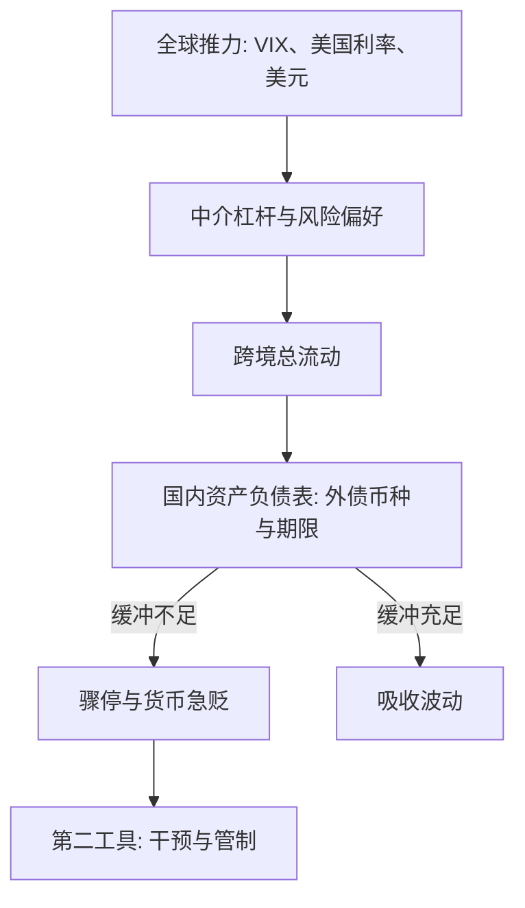

# 资本流动的驱动

资本流动不是储蓄缺口的快递，是风险偏好与资产负债表的共振：推力决定总量何时涨落，拉力决定谁先被冲垮。

<footer>—— 据 Calvo 1998；Forbes and Warnock, JIE 2012；Rey 2013 整理</footer>

[上一课](/econ/if-crossborder-dollar-cycle)把离岸美元信贷的进退写在银行账本上：美元汇率经估值渠道驱动全球杠杆。本课把银行、债券、股票与 FDI 放进同一张图，问总量：资本流动究竟被谁驱动——全球推力还是国内拉力，以及为什么同一阵风吹过，有的国家没事、有的国家断流。主干[突然停止](/econ/sudden-stop)给了断流的形态，[全球金融周期](/econ/global-financial-cycle)给了全球因子；本课的缺口是把「谁在驱动」写成可估计的分解，把脆弱性写成拉力侧的清单。后课默认已经读完本课。

## 问题

直觉版本把资本流动写成储蓄与投资：穷国缺资本，富国多储蓄，钱往回报高处流。事实三层都不配合。其一，总额与净额完全不成比例：金融决策在总额上做，跨境总流动是经常账户差额的数倍到十倍量级——只看净额，丢掉绝大部分信息。其二，资本并不往低资本处流：[卢卡斯悖论](/econ/lucas-paradox)在，[费尔德斯坦–堀冈](/econ/feldstein-horioka)的储蓄投资相关也说明资本流动性远低于教科书。其三，流动极端地成批出现：涌入与骤停以「波」的形式横扫多个国家，共动远超各自基本面能解释的范围。缺口是把这三件事接进一个驱动分解。

危机前主要经济体的跨境总流动可达 GDP 的两成上下，而经常账户差额只有两三个百分点：用净额读全球金融，九成以上的信息被丢掉。

## 方法

分解分四步。第一步把对象定成**总额**：银行信贷、债券、股票分别计，FDI 单列——它们对推力的敏感度不同。第二步分类极端事件：Forbes–Warnock 把资本流动的极端段落切成涌入、骤停、外逃、回撤四类，全球因子对骤停与外逃的解释力最强，本国产出新闻最弱。第三步摆变量：推力侧是 VIX、美国利率路径、美元与全球中介杠杆（上一课的机器）；拉力侧是制度、储备、外债的币种与期限、外部余额与增长。第四步做识别：全球因子是公共冲击，时间序列识别不了推拉，截面识别靠**暴露差异**——同样一阵风，美元债务多、储备薄的倒得快；推拉交互项才是要估的系数。

## 机制

机制是上一课估值渠道的放大版。推力松时，中介杠杆抬升，总额涌入，借款人的净值、抵押品与本币汇率一起走强——拉力侧的脆弱被繁荣盖住。推力紧时，边际借款人失联，Calvo 1998 的骤停开始：不是渐进减速而是状态切换，流量断裂经[原罪](/econ/original-sin)式的币种错配放大成汇率贬值、净值塌缩与产出收缩的第二轮。两难随之而来：Rey 2013 的结论是资本开放下浮动汇率不能买回货币自主，政策需要第二工具——本课程最后两课的外汇干预与资本管制就是那两个名字。不这么做会错在哪：把骤停全归咎国内治理（推力是公共的，事后问责选错了被告）；把总额流动当实物流动配置（它主要是资产负债表易手）；用经常账户判脆弱性（脆弱性在外债的币种与期限里）。

## 边界

推拉不是二选一：交互项才是结构，单独挑边都会把样本拟合成故事。不是所有流动都走价格敏感渠道：FDI 粘、汇款稳，骤停主要发生在可撤回的组合与银行渠道；纯国内的政治冲击也能触发断流，全球因子解释不完。测量有盲区：衍生品与贸易信贷低估流量，离岸发行把债记给谁常说不清。读完本课应当能做的判断是：先问一阵风有多硬（推力），再问船上压舱石有多少（拉力），两问分开，政策才对得上号。

## 小结

- 资本流动要读总额：总流动数倍于经常账户，净额丢掉九成信息。
- 极端流动成批出现：骤停与外逃由全球推力主导，本国产出新闻解释力弱。
- 拉力是脆弱性清单：外债币种与期限、储备、制度决定同一阵风下谁倒。
- 骤停是状态切换，经币种错配放大；浮动不绝缘，需要干预与管制两个第二工具。
- 出处：Calvo, *Journal of Applied Economics* 1998；Forbes–Warnock, *JIE* 2012；Rey 2013；Obstfeld 2012。
