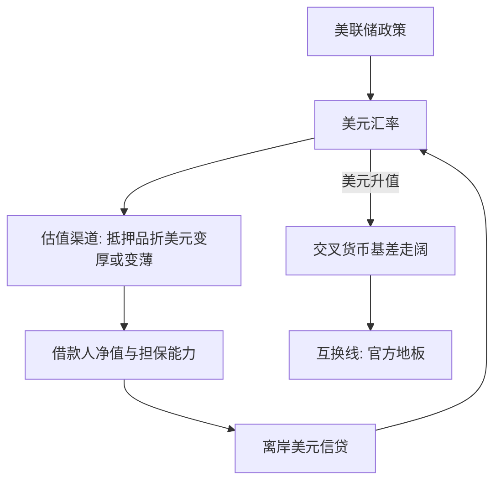

# 跨境银行与美元周期

美元潮汐不在贸易账户里，而在全球银行的资产负债表里：美元走弱，海外借款人的抵押品升值，美元信贷扩张；美元走强，同一台机器反向收缩。

<footer>—— 据 Bruno and Shin, JME 2015 与 REStud 2015；Shin, IMF Economic Review 2012 整理</footer>

[上一课](/econ/if-fx-risk-premia)把外汇风险溢价收在中介容量上：VIX 与美元紧缩使保费集体上浮。本课把镜头从价格转向数量：全球银行的美元信贷本身如何随美联储与美元进退。主干[全球金融周期](/econ/global-financial-cycle)钉了共动，[国际银行与跨境中介](/econ/bm-international-banking)写了银行的公司结构与监管错位；本课的缺口是**美元这个币种的特殊性**——离岸美元信贷怎么组织、美元汇率为何与全球杠杆反向、这条链在压力时靠什么托底。后课默认已经读完本课。

## 问题

美联储收紧，世界跟着紧，经典解释给两条通道：贸易（汇率贬值改竞争力）与利率（本币被动加息）。对美元信贷来说，两条都不主要：借款人欠的是美元，借钱的银行不在这两国之间，贸易根本不在链上。缺口是估值渠道：**美元自己的汇率**是全球美元借款人资产负债表的价格。美元贬值时，本币收入与抵押品折成美元变厚，净值上升，借美元的能力上升——美元信贷反而扩张，这与美国本土借款人「美元升值压制信用」的直觉完全相反。

### 机器的构造

两级结构。核心是全球银行与美国的货币中心，把美元经批发市场（大额存单、回购、FX 掉期）输给外围：非美银行的美元账本、以及直接借美元的海外企业。量的口径在 BIS：美国之外非银部门的美元债务存量，2020 年代初已逾 12 万亿美元。外围银行借短贷长、借美元贷本币，币种与期限双重错配；它们的杠杆目标（Adrian–Shin 的证据）决定信贷量，而不是某地的储蓄缺口。

BIS 口径下，美国之外非银部门的美元债务存量 2020 年代初已过 12 万亿美元；这还不含通过 FX 掉期形成的表外美元敞口——掉期把美元债务移出资产负债表，是美元周期里最难看清的一层。

## 方法

把「美元周期」写成可测对象。第一步，定存量与流量：BIS 银行统计给跨境债权，按币种与借款人部门拆开——只看总量会把美元信贷与全部跨境业务混在一起。第二步，识别估值渠道：美元宽口径汇率与离岸美元信贷增速的负相关，配美联储议息窗口的事件研究；银行层面用美元暴露的差异做截面，暴露深的缩得更多，才算渠道而不是共趋势。第三步，盯价格信号：交叉货币基差是美元压力的价格，走阔先于数量收缩，见[量化栏的利率平价](/quant/irp)。顺序不能乱：没有币种拆分，「美元周期」只是一个形容词。

## 机制

机制是一个正反馈加一个保险丝。正反馈：美元贬值 $\rightarrow$ 借款人净值上升 $\rightarrow$ 美元信贷扩张 $\rightarrow$ 全球风险偏好更松、美元更弱——Bruno–Shin 记录的全球银行杠杆与美元的反向关系就是这条回路的均衡痕迹。反向时机器倒转：美联储收紧，美元升值，外围净值缩水，批发美元市场先断，基差走阔把压力标出价格，信贷收缩再反过来推高美元。2008 年的剧本正是批发侧的挤兑——Gorton 与 Metrick 记录了回购市场上抵押品折扣的集体上调：周期反向运转时，压力以批发挤兑而非存款挤兑的形式出现。保险丝在官方侧：美联储对少数央行的[美元互换线](/econ/dollar-swap-lines)把离岸美元的地板价格补上——它是事后装置，资格不均，平时不出场。不这么做会错在哪：把美元周期读成贸易失衡（链上没有贸易）；把互换线当成日常工具（它是压力时的地板，不是常备水管）；只看银行账本（表外掉期与债券融资把敞口藏起来）。

## 边界

机器只覆盖银行与类银行渠道：2010 年代美元债券融资占比上升，同一条估值渠道搬进基金与公司债，量的分布变了，机制没变。互换线只盖有资格的司法辖区，无资格者的地板是自身储备——这把话题递给后课的外汇干预。识别也有边界：估值渠道是条件关系，不是每次美联储会议都触发；本币大国的美元敞口相对小，传导弱。

## 小结

- 离岸美元信贷是两级银行结构上的批发美元生意，BIS 口径存量逾 12 万亿美元。
- 估值渠道：美元汇率是全球美元借款人资产负债表的价格，美元弱则信贷扩、美元强则信贷缩。
- 交叉货币基差是这条链的价格信号，互换线是压力时的官方地板。
- 表外 FX 掉期是统计盲区，只看银行账本会低估敞口。
- 出处：Bruno–Shin, *JME* 2015 与 *REStud* 2015；Shin, *IMF Economic Review* 2012；Adrian–Shin 2010；Gorton–Metrick, *JFE* 2012；BIS 银行统计。
