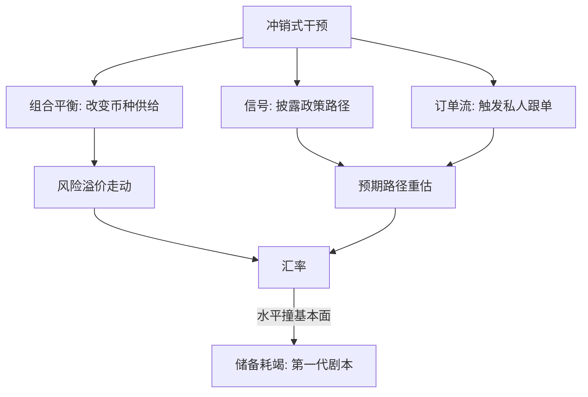

# 外汇干预

冲销式干预不直接给汇率定价，它是在私人中介缺位时替市场吸收流量；有效与否，取决于能否改变私人部门的币种敞口或预期路径。

<footer>—— 据 Dominguez and Frankel 1993；Sarno and Taylor, JEL 2001；Friedman 1953 整理</footer>

[上一课](/econ/if-capital-flow-drivers)把驱动收在推拉交互上：全球推力经资产负债表打出骤停与涌入。本课转政策侧，先问价格工具。主干[外汇干预与储备](/econ/fx-intervention-reserves)已经钉了怕浮动、冲销会计与储备需求；本课的缺口是干预**怎么起作用**：三条渠道各在什么条件下承重、协调干预能成什么事后退成什么、以及守水平与降波动这两种目标为什么命运不同。后课默认已经读完本课。

## 问题

在完全替代加理性预期的世界里，冲销式干预是空操作：央行用本币换外币再冲销回笼，私人部门的币种敞口不变，UIP 定价，汇率纹丝不动。可记录里央行们在干预：日本财务省、瑞士国民银行、各新兴市场央行，规模以千亿计。矛盾不在「央行非理性」，而在教科书前提——[第一课](/econ/if-fx-risk-premia)刚量过：风险溢价真实存在且随中介容量大幅波动，完全替代不成立。溢价在，干预才有杠杆；缺口是把这个杠杆写成可操作的渠道清单。

## 方法

渠道分三条，各自承重条件不同。**组合平衡**：外汇资产与本币资产不完全替代，干预改变私人部门被迫持有的币种构成，动的正是第一课量过的溢价——渠道强时，小规模也能挪价；弱时，万亿储备只是池水。**信号**：干预披露央行对未来政策路径的信息，外汇市场的交易员为抢先建仓而动价；承重条件是信用——说话不算数的央行，干预一次烧一次信号资本。**订单流**：央行订单触发私人跟单，Evans–Lyons 的订单流证据说明价格对订单流的反应远超公开信息含量；小单与反复逆风的小单最吃这条渠道。测度是老问题：多数央行滞后且部分披露干预数据，识别靠高频事件窗口与央行沟通文本的比对。

2022 年 9–10 月，日本财务省二十四年来首次买入口元，两轮合计动用逾 9 万亿日元；贬值势头此后才在美联储预期转向时放缓——方向性目标比波动率目标难守得多。

## 机制

机制收在目标的分野。**降波动**通常可达：逆风干预在急涨急跌时吸收流量，压低实现与隐含波动，这不需要改变均衡水平，只需中介功能在压力时缺位——第一课与上一课刚说明中介容量何时紧。**守水平**则撞基本面：储备是有限资源，对手是全球私人资产负债表；当汇率水平与政策基本面矛盾，第一代货币危机模型（Krugman 1979，见[货币危机模型](/econ/currency-crisis-models)）给出剧本——投机者算得清储备耗尽的时刻，干预只是给时钟上弦；Obstfeld 与 Rogoff 1995 说得更直白：资本流动足够快时，钉住水平本身就是幻景。协调干预介于两者之间：1985 年广场协议时美元已高位，五国协同干预加政策转向，美元对日元两年内从 240 上下落到 130 上下；而无协调的小额干预常常只是噪声。退出是机制的镜子：瑞士国民银行 2011 年承诺 1.20 的瑞郎下限，敞口随欧元贬值压力累积，2015 年 1 月弃守，瑞郎盘中对欧元升值一度超过三成——水平承诺的代价是敞口无界。

## 边界

干预不替代宏观调整：它买时间或压波动，基本面矛盾只在财政与政策路径里解。发达国家汇率由利率预期主导，干预边际小——2022 年日本两轮逾 9 万亿日元也只算延缓。冲销有准财政成本：利差倒挂时，储备的收益低于冲销负债的利息，守汇率的账单按日计息。资格问题上一课已经见过：互换线是发达经济体的地板，无资格者用储备自我保险，这把储备需求接回主干课。最后一条边界是分工：干预管价格、花资产负债表；当涌入是持续流量而非瞬时波动，数量侧的工具——资本管制——是下一课。

## 小结

- 完全替代下冲销干预是空操作；溢价存在（第一课）是它有杠杆的前提。
- 三渠道：组合平衡动溢价、信号动预期、订单流动微观价格，承重条件各不相同。
- 降波动是可达目标；守水平撞基本面时是第一代危机剧本。
- 协调干预在 1985 年成事；瑞士 2015 年弃守说明水平承诺的敞口无界。
- 干预买时间不修基本面；持续流量问题交给数量侧工具。
- 出处：Friedman 1953；Dominguez–Frankel 1993；Sarno–Taylor, *JEL* 2001；Krugman, *JMCB* 1979；Obstfeld–Rogoff, *JEP* 1995；Evans–Lyons, *JPE* 2002。
