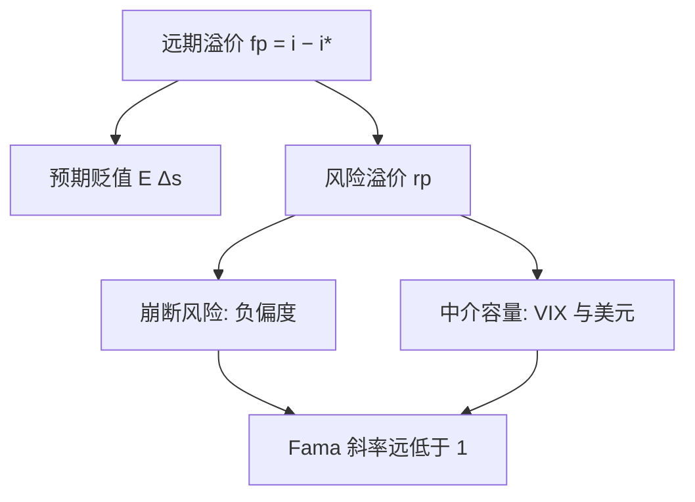
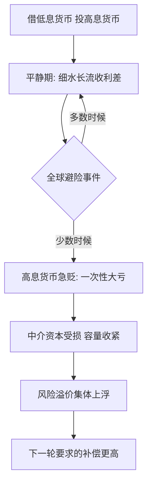

# 汇率风险的溢价

无抛补平价把利率差读成预期贬值；把它拆开，剩下那半是风险的价格，而这个价格由中介资产负债表的松紧来定——溢价不是噪声，是全球金融体系收的保费。

<footer>—— 据 Fama, JME 1984；Lustig, Roussanov and Verdelhan, RFS 2011；Gabaix and Maggiori, QJE 2015 整理</footer>

[上一课](/econ/gd-map)把增长与发展的深化收在激励与制度上：微观楔子与宏观渠道在激励结构汇合，制度是否可改变是留下的问题。增长的故事走到国界处换主角——资本跨国流动、汇率定价、美元周期；本课程「国际金融深化」从价格侧开工。既成的起点是中心货币：[美元主导与国际货币](/econ/dollar-dominance)给出了计价、跨境银行负债与官方地板的三层捆绑，浮动汇率取消不了 Rey 意义上的全球金融周期；主干[远期溢价之谜](/econ/forward-premium-puzzle)则给出事实——Fama 回归的斜率常为负、高息货币平均升值。本课的缺口是负斜率的**来源**：预期错在哪、溢价怎么被定价、为什么它随全球周期同涨同落。本课程之后依次写跨境银行与美元周期、资本流动的驱动，再过外汇干预与资本管制两课政策，最后收束。后课默认已经读完本课。

## 问题

记本币与外币的利率差为 $fp_t = i_t - i_t^*$，UIP 说 $E_t \Delta s_{t+1} = fp_t$。把远期溢价拆成两块：

$$fp_t = E_t \Delta s_{t+1} + rp_t,$$

其中 $rp_t$ 是风险溢价。若 UIP 成立且预期理性，$\Delta s_{t+1}$ 对 $fp_t$ 回归的斜率应是 1；实证斜率远低于 1 且常为负，要求

$$\mathrm{Cov}(rp_t, fp_t) \lt -\mathrm{Var}(fp_t):$$

溢价的摆幅必须**超过**远期溢价自身。缺口因此不是「UIP 又失败了」——预期误差填不满这个坑——而是：$rp_t$ 由什么定价，它为什么在高息货币上长期为负，又在什么时刻突然转正。

### 溢价的定价

证据分三层。横截面上，按远期溢价排序的货币组合能被两个因子定价：美元因子与斜率因子（Lustig–Roussanov–Verdelhan 2011）——套息收益不是逐对货币的特例，是一个共同的斜率风险在收费。时间序列上，套息策略收益高度负偏：赚钱细水长流，亏钱集中在崩断（Brunnermeier–Nagel–Pedersen 2009），高息货币恰在全球避险时急贬。结构上，汇率由中介资产负债表的容量决定（Gabaix–Maggiori 2015）：中介吸收币种错配，容量紧时风险价格上升。

Fama 自己对 1980 年代主要货币的估计斜率低到 −3 上下，此后 G10 月度回归的常见读数落在 −1 与 −3 之间。斜率为负意味着 $\mathrm{Cov}(rp,fp)$ 的负值超过 $\mathrm{Var}(fp)$——预期误差解释不了这么大的摆幅；Froot 与 Frankel（1989）用调查预期把预期与溢价分开后，主导的一侧仍是溢价。

「套息交易」（carry trade）直译过来就是「赚息差」：借利率低的货币（比如日元），换成利率高的货币（比如澳元）去投资，汇率不动就白赚利差。它是本章的主角——高息货币平均升值、套息还倒赚，正说明风险溢价在给「借低投高」的敞口让渡保费。

## 方法

测法分四步。第一步写清分解：$\beta = 1 + \mathrm{Cov}(rp,fp)/\mathrm{Var}(fp)$，先算协方差再谈解释——不分解就直接把负斜率读成「市场无效」，是把风险的价格当成白捡的钱。第二步分开预期与溢价：调查预期或事后实现均值单独量 $E_t\Delta s_{t+1}$，剩下归 $rp$。第三步做结构检验：组合排序看因子载荷，事件窗口看中介变量（VIX、交易商杠杆）与溢价是否同动。第四步接回全球周期：美元升值与中介缩表正是溢价走阔的同一件事，这条线本课程后面反复出现。

## 机制

机制是把外汇当成一张保险单。套息交易等于卖出美元融资压力的保险：平时收权利金（利率差），美元荒时一次性赔付；负偏度不是异常，是保单的形状。中介机制解释溢价为什么在**所有**货币对上同时动：中介资本是全局稀缺品，VIX 上升、美元升值时，同一份资本要背所有币种错配，保费集体上浮。这正好接上[全球金融周期](/econ/global-financial-cycle)：中心风险偏好经中介容量，把外围的汇率风险溢价焊在一起。三个常见错误随之排除：把崩断月的亏损当「可忽略的小概率」（它就是策略的保险成本）；把溢价走阔当必须救助的「失灵」（它是风险的价格，救不救是分配问题不是测度问题）；把 CIP 基差与风险溢价混写——基差是中介约束的会计价格，见[量化栏的利率平价](/quant/irp)，不承担预期假说。

数字实例：日元利率 0.5%、澳元利率 5%，借 100 万日元换成澳元存一年，汇率不动就赚 4.5% 利差；可只要日元那年升值超过 4.5%，利差就全部赔光——2008 年 10 月套息平仓让日元单月对澳元升值近三成，等于多年权利金一次赔穿。

## 边界

本课不宣称负斜率已被完全解释：预期误差、比索问题与溢价的纠缠仍在，样本与频率都敏感（Engel 2016 表明溢价解释不完样本期）。也不把溢价写成可套取的工程量：策略收益对交易成本、容量与崩断风险高度敏感，量化栏的[外汇套息与动量](/quant/fx-carry-mom)管那半边。溢价是风险的影子价格，不直接给出政策方向；把它接到数量侧——美元信贷如何随中介周期进退——是下一课的事。

「比索问题」是名称很怪的经典陷阱：1970 年代墨西哥比索盯住美元，多数时间汇率纹丝不动，回归看起来很稳，其实市场一直在为罕见的大贬值定价。初学者容易把「样本里没出事」当成「预期错了」，实际上可能只是那件小概率大事还没轮到——负 Fama 斜率的一部分纠缠正来源于此。

## 小结

- 远期溢价 $=$ 预期贬值 $+$ 风险溢价；负 Fama 斜率要求 $\mathrm{Cov}(rp,fp) \lt -\mathrm{Var}(fp)$。
- 溢价由共同因子定价：美元因子与斜率因子；崩断的负偏度是保单的形状。
- 结构机制是中介容量：VIX 与美元紧缩使保费集体上浮，接上全球金融周期。
- CIP 基差与 UIP 溢价是两件事，不要混写。
- 出处：Fama, *JME* 1984；Froot–Frankel, *QJE* 1989；Lustig–Roussanov–Verdelhan, *RFS* 2011；Brunnermeier–Nagel–Pedersen, *NBER Macro Annual* 2009；Gabaix–Maggiori, *QJE* 2015。
