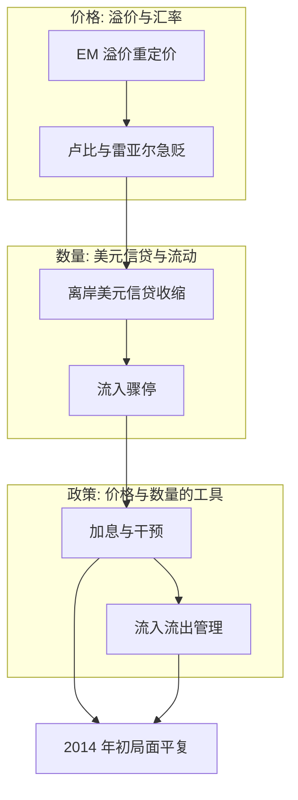
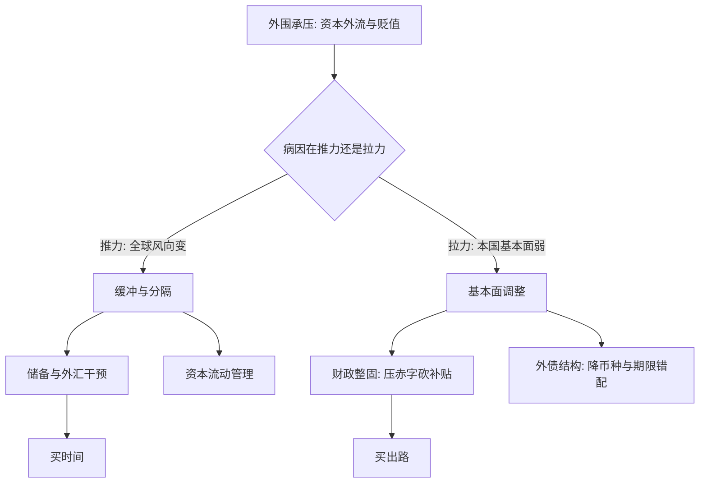

# 国际金融深化收束

退潮时才知道谁在裸泳，而潮汐由中心的货币政策定：识别谁脆弱、价格怎么动、政策拿什么接，是同一门功课的三道考题。

<footer>—— 据 Rey 2013；Shin 的全球美元信贷；印度储备银行 2013 年干预记录 整理</footer>

[上一课](/econ/if-capital-controls)把管制收在楔子与缝隙的赛跑上：管组成不总量，效力随学习衰减。本课收束全课程：把 2013 年的缩减恐慌放进工具箱走一遍——价格、数量、驱动、政策四层各露一次脸——再按读序重排六课。本课程到此收束。

## 问题

收束靠案例。2013 年 5 月 22 日，伯南克在证词里把「缩减购债」摆上桌：全球推力骤然转向，脆弱五国（印度、印尼、巴西、土耳其、南非）在夏秋两季货币急贬——印度卢比对美元从 55 附近贬到 68 上下。用本课程的四层读它。**价格**：全球中介风险偏好重定价，新兴市场汇率的风险溢价集体走阔，正是[第一课](/econ/if-fx-risk-premia)的保费机制——不是每国基本面都变了，是保险费变了。**数量**：离岸美元信贷收缩，第二课的估值渠道反转，美元升值与去杠杆互为因果。**驱动**：推力是公共的，拉力决定谁中枪——经常账户赤字大、通胀高、外债重、储备薄的先倒，第三课的脆弱性清单逐项应验。**政策**：印度加息并开出居民外币存款的优惠互换窗口，三个月吸回约 340 亿美元；巴西反过来撤掉流入税鼓励资金进来——干预与管制的组合拳，方向因流入还是流出而反。

「缩减恐慌」的「缩减」只是美联储放缓买债的速度——不加息，只是把水龙头从最大拧到中开；「恐慌」是外围对水龙头不再放大的集体反应。这提醒读者：外围的危机不需要中心真的紧缩，「停止变得更松」就够了。卢比从 55 贬到 68，进口石油按本币计贵了约两成四，输入型通胀与资金外流互相点火。

印度储备银行 2013 年 11 月的 FCNR(B) 优惠互换窗口，把居民的外币存款变成官方弹药，约 340 亿美元入账——在「干预」与「动员国民储蓄」的边界上做了个发明。

## 方法

按读序重排全课程：

- [汇率风险的溢价](/econ/if-fx-risk-premia)：远期溢价 $=$ 预期贬值 $+$ 溢价；溢价由美元因子与斜率因子定价，中介容量决定保费。
- [跨境银行与美元周期](/econ/if-crossborder-dollar-cycle)：美元汇率经估值渠道驱动离岸美元信贷，基差是价格信号，互换线是地板。
- [资本流动的驱动](/econ/if-capital-flow-drivers)：总额读流动，推力定涨落、拉力定倒下；骤停是状态切换。
- [外汇干预](/econ/if-fx-intervention)：三渠道有各自的承重条件；降波动可达，守水平撞基本面。
- [资本管制](/econ/if-capital-controls)：三维设计空间，评估看组成与分割，管制买时间不修基本面。

## 机制

案例把六课拧成一台机器。警报在价格侧：溢价走阔先于数量收缩，读[远期溢价之谜](/econ/forward-premium-puzzle)与第一课的人比读国际收支表的人早几个月知道风向。脉络在数量侧：美元信贷的进退给危机划出时间线，等经常账户亮红灯，操作窗口已经关了。诊断在推拉分解：政策工具按病因配——推力病用缓冲与分隔（储备、干预、CFM），拉力病用调整（财政、外债结构）。机制最终收在两难：中心政策转向时，外围无论浮动与否都得动用组合，纯粹的无为不是选项；而组合里每一件工具——溢价、信贷、分解、干预、管制——都是本课程某一课的名字。不这么做会错在哪：把缩减恐慌写成「市场情绪」，是把四层机制各付的账单合成一笔糊涂账；把 2014 年初的平复读成政策胜利，会忘记印度同时砍了燃油补贴、压了赤字——工具买时间，基本面买出路。

推拉诊断可以类比看病：先分清发烧是外面流行病传进来的（推力），还是本身体质出了问题（拉力）。前者用防护与隔离——储备、干预、管制都是「挡风」；后者要调养——财政与债务结构是「治本」。药方开反了，给体质病人挡风、给传染病人调养，钱花了病还在。

## 边界

这不是通用剧本：低外债、真浮动、储备厚的国家跌幅有限，2013 年也没有出现 1997 式的银行崩塌——工具箱比当年厚，正是本课程与危机史的分界。案例覆盖不了结构性的缓慢失衡——全球储蓄与安全资产那半边，从特里芬难题（Triffin 1960）到它的当代回声——是主干[美元主导与国际货币](/econ/dollar-dominance)与[全球失衡](/econ/global-imbalances)的地盘；互换线政治学与去美元化的观察也不在这里展开。课程六课走完：价格、数量、驱动与两件工具——读任何一次资本流动的潮汐，先拆层，再下判断。

初学者容易以为「浮动汇率加高储备」就是危机绝缘体，实际上浮动只是分散了压力、储备只是买到了时间：全球推力面前没有完全免疫的国家，只有缓冲厚薄与错配多少的差别。1997 年后的工具箱变厚，改的是生病的代价，不是生病的概率。

## 小结

- 价格侧警报最早：溢价走阔先于信贷收缩，资产平价的分解是预警的第一站。
- 数量侧定时间线：离岸美元信贷与估值渠道是危机的脉络，不是背景。
- 推拉分解配工具：推力病用缓冲与分隔，拉力病用基本面调整。
- 干预与管制是价格与数量的两件工具，方向与时机因流入流出而反。
- 缩减恐慌四层俱全；工具买时间、基本面买出路，两笔账要分开记。
- 出处：Rey 2013；Calvo 1998；Bruno–Shin 2015；Triffin 1960；印度储备银行与巴西 2013 年政策记录整理。
