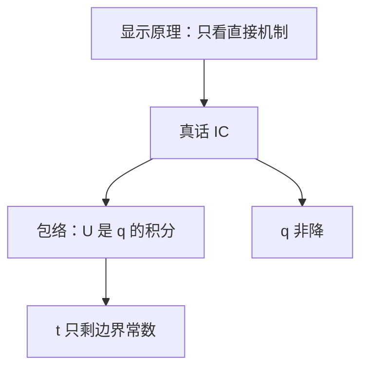

# 可实施性与包络

激励相容把代理人的均衡支付钉成配置规则的积分：可实施的是单调的配置，支付只剩一个边界常数。

<footer>—— Myerson, Optimal Auction Design, Mathematics of Operations Research, 1981；Milgrom and Segal, Envelope Theorems for Arbitrary Choice Sets, Econometrica, 2002</footer>

[上一课](/econ/revelation-principle)把任意间接机制收成说真话的直接机制。缺口是：哪些配置规则 $Q(\theta)$ 真的能配上一组支付使真话 IC 成立？显示原理不回答「IC 有多紧」。本课钉积分 / 包络条件，不把 Groves 转移写成下一课，也不把最优拍卖写成虚拟价值。

## 问题

拟线性、一维类型 $\theta\in[\underline\theta,\bar\theta]$，配置 $q(\theta)$（数量、赢得概率），支付 $t(\theta)$。直接机制真话 IC：$\theta\in\arg\max_{\hat\theta}\ \theta q(\hat\theta)-t(\hat\theta)$（估值与 $q$ 乘积的教具）。令 $U(\theta)=\theta q(\theta)-t(\theta)$。包络：只要选择集上的目标对 $\theta$ 绝对连续（Milgrom–Segal 的条件），

$$
U(\theta)=U(\underline\theta)+\int_{\underline\theta}^{\theta}q(s)\,ds.
$$

从而 $t(\theta)=\theta q(\theta)-U(\theta)$ 被 $q$ 与 $U(\underline\theta)$ 钉死。可实施性的另一半： $q$ 必须非降——否则积分条件与全局 IC 冲突。一维单交叉下，单调 + 包络 $\Leftrightarrow$ 全局 IC。

这正是收入等价在直接机制上的来源：同一 $q$、同一 $U(\underline\theta)$，期望支付相同。显示原理说搜索可限在直接机制；包络说直接机制里支付没有独立自由度。

### 包络不是一阶条件的别名

代理人 FOC 是局部 IC。包络把它积分，并给出值函数对参数的导数等于目标对参数的偏导（在最优点）。选择集可以不凸、可以对参数不光滑，Milgrom–Segal 仍给积分式。拍卖、税收、规制里用的都是这一条，不必每次重推。

多维类型时单调变成循环单调（Rochet），包络变成路径积分，可实施性苛刻得多。本课只钉一维。Myerson 把拍卖的 $Q_i$ 写成对他人类型的期望赢得概率，同一积分。

$U(\underline\theta)$ 通常由 IR 钉住：最低类型拿到保留效用。
卖家要抽租，只能动 $q$（含保留价、排斥低类型），不能靠「换一种付款方式」在同一 $q$ 下多收。
风险厌恶或非拟线性时，包络改写，收入等价失败。

## 方法

对象：一维类型、拟线性、直接机制。先写包络，再证 $q$ 非降必要，单交叉下充分。把[收入等价](/econ/revenue-equivalence)认作本课在拍卖上的特例：那里 $q$ 是赢得概率。公共品数量、Mussa–Rosen 质量，同一对条件。

## 机制

类型 $\theta$ 提高，在同一报告下多享受一单位 $q$ 的边际价值就是 $q$ 本身。IC 要求这一点被租金的导数吃掉，否则他会微微谎报。积分后，租金差等于沿途的配置。支付会计必须服从这条差，否则某对类型会互换报告。单调防止「低类型买到比高类型更多」——那会让中间类型宁愿跳到两端。

筛选课的「无扭曲在上」是本课包络的优化推论：顶上再扭曲 $q$ 省不下积分里已经积完的租金。收入等价课已经用过积分；本课把它从拍卖放回一般 $q$，供 VCG 与 Myerson 接着用。

## 边界

类型多维、分配多维，循环单调可以极紧，有些有效配置不可实施。占优策略 IC 比贝叶斯 IC 更强：包络要对每个对手类型的实现都成立，不只对期望 $Q$。无承诺、再谈判会让间接机制再次有价值，显示原理的前提先破，包络帮不上。

后课默认：谈实施先问 $q$ 是否单调、支付是否服从包络；在拟线性一维下，这两条就是贝叶斯 IC。下一课用这条自由度为有效配置配 Groves 转移。

### 边界常数是唯一剩下的支付工具

同一 $q$ 下能改的只有 $U(\underline\theta)$：抽干最低类型，或留给他们租金以满足事中 IR。预算平衡、事后 IR 会再锁这个常数，可能与有效 $q$ 冲突——Myerson–Satterthwaite 的根子在此。本课不写那条不可能，只把自由度点清。

Milgrom–Segal 的贡献是：不必假设内部最优或凸选择集。机制设计里报告集是类型空间本身，这条一般包络刚好够用。

## 小结

- 一维拟线性下，IC $\Leftrightarrow$ $q$ 非降 + 支付由包络钉死。
- 支付只剩 $U(\underline\theta)$ 一个常数；收入等价是其推论。
- 显示原理缩小搜索；包络再把支付从搜索里删掉。
- 下一课为有效 $q$ 给出占优策略的 Groves / 枢轴转移。
- 出处：Myerson, *Math. Oper. Res.* 1981；Milgrom and Segal, *Econometrica* 2002。
