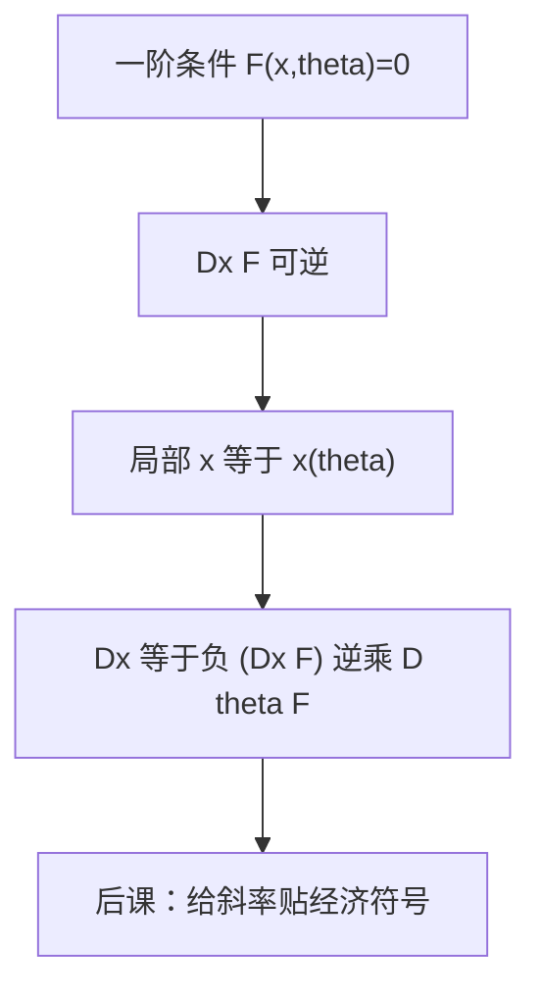

# 隐函数定理

一阶条件是 $n$ 个方程；$x$ 对参数可解，当且仅当那组方程对 $x$ 的 Jacobian 可逆。

<footer>—— 据 Rudin, Principles of Mathematical Analysis, 第 9 章；Mas-Colell, Whinston and Green 数学附录整理</footer>

上一课[包络定理](/econ/envelope-theorem)把 $V'(\theta)$ 写成直接偏导，故意丢掉 $Dx^*$。比较静态若问「价格涨，买多还是买少」，丢掉的那一项必须回来。缺口是：由 $F(x,\theta)=0$（通常是 FONC 或 KKT 的平稳方程）局部解出 $x(\theta)$，并给出 $Dx$。本课只提供这条微积分许可，不把经济学符号推完——那是下一课比较静态。

## 问题

$F:\mathbb{R}^n\times\mathbb{R}^k\to\mathbb{R}^n$ 为 $C^1$，$F(x_0,\theta_0)=0$，且 $D_x F(x_0,\theta_0)$ 可逆。则存在 $(x_0,\theta_0)$ 的邻域，使 $x=x(\theta)$ 为 $C^1$，且
$D_\theta x=-(D_x F)^{-1}D_\theta F$。
经济学里 $F=\nabla_x\mathcal{L}$ 或无约束的 $\nabla f$。$D_x F$ 就是 Hessian（或加了约束后的加边 Hessian）。可逆 = 非退化驻点 = 局部唯一的 $x(\theta)$。

加边 Hessian 非奇异，是支出最小化、效用最大化内部解比较静态的标准假设。它失败时：完全替代的整段需求、有效约束集合跳变、多重最优。那些情形没有单值可微的 $x(\theta)$，包络仍可能用次梯度说话，但本课的公式不适用。

### 隐函数不是「把 $x$ 解出来」

定理不保证闭式。$u$ 的 FONC 很少能把 $x$ 写成初等函数；定理只说局部存在一张 $C^1$ 的图，并且告诉你斜率。比较静态要的是斜率的符号，不是公式。把隐函数理解成「先解出 $x=g(\theta)$ 再代入」会在 CES 以外的问题里走死。

方程个数必须等于内生变量个数。多出来的乘子要么被约束消掉，要么进入扩大的 $F$。KKT 在角点附近有效集不变时，对有效变量用隐函数。

## 方法

把参数分成你关心的 $\theta$ 与其余。计算 $D_x F$ 与 $D_\theta F$，解线性方程 $D_x F\cdot x_\theta=-D_\theta F$。符号由 $(D_x F)^{-1}$ 的负定性或加边矩阵的符号模式给出——下一课把这些模式翻译成替代、收入效应。本课停在线性代数：可逆就有局部函数。

高维时不要对每个分量分别「当一元隐函数」除非交叉偏导为零。同时动的 $x_i$ 必须一起求。这也是为什么两商品可以画图消元、多商品必须上矩阵。

## 机制

$F=0$ 定义一张曲面。若曲面在 $x$ 方向的切空间投影满秩，就能把曲面写成 $x$ 对 $\theta$ 的图。满秩失败是折叠：同一 $\theta$ 对应多个 $x$，或突然消失——多重均衡、弯折的最优对应。Brouwer/Kakutani 仍可保证存在，但不给可微分支；那是后课不动点的语言，与本课互补：隐函数管局部光滑枝，不动点管全局存在。

$C^1$ 的 $F$ 给出 $C^1$ 的 $x(\theta)$；$C^2$ 给出 $C^2$。后课斯勒茨基要用 $x$ 对 $(p,w)$ 可微，默认加边 Hessian 在最优点可逆。二阶充分条件（切空间负定）往往蕴含这块可逆，但要把约束的加边写对。

离散选择没有内部 Jacobian。包络仍在（Milgrom–Segal），隐函数不在。不要对 0-1 决策套本课公式。

## 边界

不在本课证明隐函数（Rudin 用压缩或平均微分）。不把反函数定理单独铺成一课：反函数是 $k=n$ 且 $F(x,\theta)=x-\theta$ 一类的特例。也不进入流形上的横截性讲义。下一课把 $Dx$ 的符号读成替代与收入。

后课默认：非退化内部解存在局部 $C^1$ 的 $x(\theta)$，导数由 $-(D_x F)^{-1}D_\theta F$ 给出。

## 小结

- $F(x,\theta)=0$ 且 $D_x F$ 可逆 $\Rightarrow$ 局部 $x(\theta)$ 为 $C^1$。
- 斜率公式是线性方程，不必有闭式解。
- 加边 Hessian 奇异时需求可以集值或跳跃，本课公式停用。
- 隐函数管光滑枝；存在性另由不动点管。
- 下一课：[比较静态](/econ/comparative-statics)。
- 出处：Rudin, *Principles of Mathematical Analysis*；MWG 数学附录。
