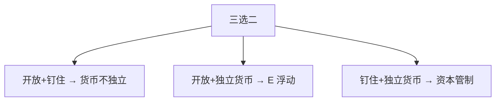

# 不可能三角

独立的货币政策、固定汇率、资本自由流动，三者不能同时成立；选两个，第三个必须放弃。

<footer>—— 据 Mundell 开放宏观的政策分派；Fleming 固定与浮动下的稳定政策</footer>

[上一课](/econ/monetary-union)（货币同盟）。已经在完全资本流动下看到：钉住 $E$ 则 $M$ 内生，$i$ 钉住 $i^*$。本课把这句话收成制度选择，不再重画 IS–LM。三角是政策空间的边界，不是又一条核算恒等。宏观主干的开放课序到此结束；下一课起问金融中介为什么仍然存在——无论三角选哪一边，不可交易的初级债权还在。

## 问题

三个目标各有理由：独立货币（选自己的 $\pi^*$ 与泰勒规则）、固定汇率（减少 $q$ 的短波动、或作为名义锚）、资本开放（跨期贸易、配置）。Mundell 的装置表明它们不相容。缺口是把不相容写成清楚的三选二，并接到已经学过的中性、PPP、铸币税：你不能既把 $P$ 的趋势交给外国锚，又用本国 $H$ 去征独立的通胀税，还让资本按 $i$ 自由套利。

中间制度（有管理浮动、有限管制）是三角内部的折中，不是第四个顶点。卢卡斯批判：宣布「三个都要」而实际会放弃其中一个，预期会对准将被放弃的那个。

三角约束的是**同时**的制度。可以随时间改组合：先资本管制再开放，或放弃钉住。那是制度变迁，不是某一年违反了会计。

## 方法

三个顶点：

- 开放资本 + 固定 $E$ → 放弃独立货币（货币局、美元化、硬钉住）。
- 开放资本 + 独立货币 → 放弃固定 $E$（浮动，PPP 在长期吸收 $\pi-\pi^*$）。
- 固定 $E$ + 独立货币 → 放弃自由资本（管制，BP 不再把 $i$ 钉死）。

泰勒规则在浮动角上对本国 $\pi$ 操作；在硬钉住角上，本国规则必须复制外国 $i^*$，否则储备耗尽。时间不一致：宣布钉住却在压力下想用独立 $i$ 来顾国内缺口，是三角上的再优化，结果是挤兑储备或突然浮动。

### 与核算、中性的对齐

$CA=S-I$ 在三角每一角都成立。独立货币的长期含义仍是本国 $\pi$ 由本国名义锚定；钉住则进口外国 $\pi$。铸币税在钉住角上受限于为维持 $E$ 而必须提供的外汇——不能任意抽通胀税。下限在开放角上可通过 $E$ 部分减压，但外国也在下限时渠道变窄。

## 机制

无抛补套利把 $i$ 接到 $i^*+\mathbb{E}\Delta e$。若政策同时保证 $\Delta e=0$、资本无摩擦、又要把 $i$ 调离 $i^*$，套利资金无限，储备或汇率必破。管制提高套利成本，等于让 $i$ 暂时独立，代价是跨期贸易与规避。浮动让 $\mathbb{E}\Delta e$ 去吸收 $i$ 差，PPP 与数量论在长期把 $E$ 拉到与 $P/P^*$ 一致。

银行与中介并不因为选了某一角而消失：存款仍是支付手段，初级贷款仍难直接持有。下一课从 Gurley–Shaw 接过转换功能。汇率制度只改变中介面对的宏观名义锚与资本流。

无抛补套利把 $i$ 接到 $i^*+\mathbb{E}\Delta e$。若政策同时保证 $\Delta e=0$、资本无摩擦、又要把 $i$ 调离 $i^*$，套利资金无限，储备或汇率必破。管制提高套利成本，等于让 $i$ 暂时独立。浮动让 $\mathbb{E}\Delta e$ 吸收 $i$ 差，PPP 与数量论在长期把 $E$ 拉到与 $P/P^*$ 一致。

中间制度（管理浮动、软钉、有限管制）是边上的点，不是第四个可同时满足的顶点。Rey 的全球金融周期称浮动也买不到完全独立——边界修正，不是否定会计式套利。

## 边界

三角不是福利排序。浮动的 $q$ 波动、管制的寻租、钉住的输入通胀，都要另评。货币联盟是把「独立货币」上交，相当于大范围的钉住。本栏不把三角写成外汇交易员的头寸；接到[限价簿](/quant/lob-structure)之前，这里只停在宏观制度。CIP 三边套利属于报价层，见 `/quant/irp`；制度三角约束的是政策目标集合。

后课默认：开放宏观的政策空间按三选二来读。下一课进入货币银行：中介为何要把初级债权改写成存款。

## 小结

- 独立货币、固定汇率、资本自由流动不能同时成立。
- 每一角对应蒙代尔–弗莱明里已经见过的内生变量。
- 长期中性与 PPP 决定名义锚在本国还是外国。
- 宣布三角全占是不可信承诺。
- 市场层 CIP 与制度层三角不要混成一句。
- 出处：Mundell 的开放政策分派；Fleming 固定与浮动下的稳定政策。
