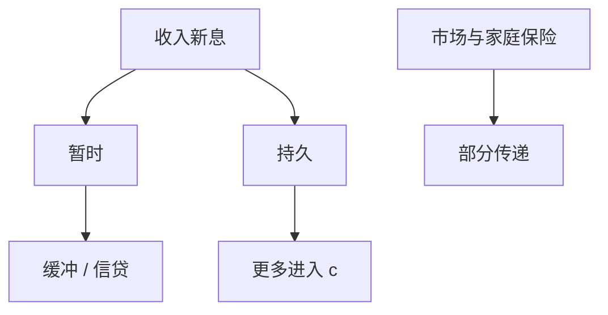

# 劳动收入风险与保险

消费对收入冲击的传递系数，测量市场与家庭提供了多少保险；完全市场是零传递，自保是缓冲存量。

<footer>—— Blundell, Pistaferri and Preston, Consumption Inequality and Partial Insurance, AER 2008；Kaplan and Violante 对不完全保险模型的对照</footer>

[上一课](/econ/intergenerational-mobility)把 $z$ 接到跨代投资。一代之内，$z$ 仍在动。本课缺口是**保险**：哪些冲击被抹平，哪些进消费。不重写代际弹性，不把失业保险的道德风险提前写完。

## 问题

完全市场：特异 $z$ 不进个人 $c$。自保 Aiyagari：暂时冲击被缓冲，持久冲击进消费。Blundell–Pistaferri–Preston：用收入与消费的面板，估对持久/暂时冲击的传递。发现部分保险：既不是零也不是一。缺口是给 HANK 的收入过程一个可测的保险程度，而不是假设「不可保」等于「完全不保」。

Blundell, Pistaferri and Preston, *AER* 98(5), 2008, 1887–1921。Attanasio–Davis；Krueger–Perri 消费不平等。Heathcote, Storesletten and Violante 的定量保险。

## 方法

把收入分成持久与暂时（或单位根加 MA）。消费增长对两类新息回归，控制家庭结构。模型侧：在 Aiyagari/HANK 里加进（或关掉）状态依存证券、破产、家庭内保险，使传递系数对上。宏观加总：特异风险的保险不影响总量 $C$ 的一阶，但影响福利与 MPC 分布。

与股权溢价：总量消费平滑不能推断微观保险充分。本栏不把谜重做一遍，只禁止用 $C$ 的平滑否定本课。

## 机制

机制是资产、家庭、破产法与税收的混合。持久冲击难以自保，因为要移动永久收入水平；暂时冲击像缓冲课已经写过的。累进税与转移提供政府保险，扭曲留给下一课 UI。房价与住房权益提取在某些国家是主要保险工具——与后课家庭债务接口。

识别：收入测量误差会把暂时冲击估大、保险估高。行政数据改善但不消灭模型设定误差。

Guvenen, Ozkan and Song 的行政收入过程显示偏斜与灾难式下降，校准若只用 AR(1) 会低估对保险的需求。

## 边界

本课不设计最优失业保险公式（下一课道德风险）。不估计健康保险。不把人力资本不可逆投资与一年一度的 $z$ 混成一个冲击。企业风险向工资的传递（Guiso 等）点名即可。

后课默认：部分保险由传递系数测量；持久冲击进 $c$ 更多。下一课：专门把失业这种可观测冲击接到 UI 与搜寻激励。

## 小结

- 传递系数测量部分保险；完全市场与纯自保是两端。
- 暂时冲击靠缓冲，持久冲击难保。
- 总量 $C$ 平滑不等于微观充分保险。
- 出处：Blundell, Pistaferri and Preston, *AER* 2008。
