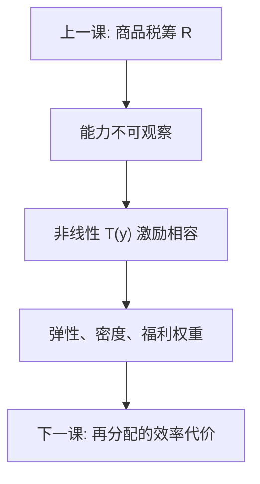

# 所得税与激励

能力不可观察时，非线性所得税在再分配与劳动供给之间权衡；最优边际税率由弹性、能力密度与社会福利权重共同决定，不是「高税率自动更公平」。

<footer>—— Mirrlees, Review of Economic Studies 1971；Saez, Using Elasticities to Derive Optimal Income Tax Rates, RES 2001；对照 Atkinson and Stiglitz；Diamond</footer>

[上一课](/econ/ramsey-optimal-commodity-tax)在代表性消费者下分配商品税楔子。本课缺口是人与人之间的能力差异：要再分配，又不能按能力一次总付，只能按收入（可观察的选择）征税，于是劳动供给被楔子扭曲。Atkinson–Stiglitz 已提示：有了非线性所得税，商品税可能多余。本课把所得税本身写成激励相容的机制。后课把效率代价从公式收到漏桶。

## 问题

能力 $n$ 私有信息，收入 $y=nl$，税 $T(y)$。高能力可以模仿低能力的 $y$ 来少缴税。激励相容迫使边际税率不能随便钉在 100%：顶层若还想让人揭示，边际税有上限（经典 Mirrlees 顶层为零是特殊密度下的结果，应用里被 Saez 用厚尾密度改写）。缺口不是再讲劳动供给曲线，而是：**再分配的导数必须经过行为弹性**，观测到的收入变化含替代、收入与逃税，政策弹性与微观弹性不必相同。

 intensive（已工作的人调时数）与 extensive（是否参与）对最优税率形状不同：底部参与弹性高时，低收入段边际税应低，甚至补贴，以免把人挡在市场外。

### 高税率不是自动更再分配

平均税率决定从谁收到谁；边际税率决定扭曲。混淆两者，会把「提高最高档法定税率」当成再分配已经完成，却漏掉申报、避税与收入定义。Saez 把最优边际税写成弹性、密度、福利权重的充分统计公式，让争论落到可估对象，而不是落到口号。

Mirrlees 1971 用道德风险/逆向选择语言：政府看到 $y$ 看不到 $n$。最优是一连串激励约束下的规划。Saez 2001 把它翻译成弹性语言，便于实证。

## 方法

充分统计：在所考虑的改革方向上，$\mathrm{d}W$ 由机械的收入转移、行为造成的税基收缩、以及福利权重组成。报告收入弹性（含避税）比只报工时弹性更接近税基。商品税：若弱可分，非线性所得税已处理能力，Ramsey 商品税的分配角色下降——这是上一课边界的兑现。非线性与线性：线性税只有一个楔子，管理便宜；非线性对准密度形状，顶部与底部可以不同。

不要把法定税率表当成有效边际税率：扣除、优惠、社保缴款都会改楔子。申报收入弹性把避税通道算进行为，工时弹性会低估税基反应，从而高估最优边际税。跨国把弹性当同一数字更危险：执法与扣除菜单不同，充分统计不可直接搬运。

## 机制

机制是显示原理：要让高 $n$ 不模仿低 $n$，必须留给信息租金，租金表现为较低的边际税或较高的税后消费。弹性越大，同样再分配的税基收缩越狠，最优边际税越低。密度在某段越厚，机械转移越大，越值得在那段加楔子。底部 extensive 弹性把「参与」写成另一条一阶条件，EITC 一类补贴是对准这条，不是对准 Ramsey 商品税。

与公共品连接：$R$ 与 $G$ 仍在，但筹资工具从商品篮换到劳动收入。边际公共资金现在含劳动楔子，不只含 Ramsey $t_i$。夫妻联合申报、资本与劳动的边界，都会改变 $y$ 的定义，从而改变激励相容的对象——本课不写家庭劳动供给全书，只要求：税基定义先于弹性数字。

Diamond 对顶部税率与 Pareto 分布的讨论，以及 Saez 的经验校准，是同一公式的不同密度假设。本课不选定某一个「最优顶税率数字」。

## 边界

本课不估一套国家税率表，不写申报软件。资本税、动态 Mirrlees 不在此展开。逃税作为弹性的一部分点到，不写稽查博弈。下一课把「弹性造成的漏」收成再分配与效率的权衡语言，接到 Okun 与 Atkinson。后课默认：谈所得税先分清平均与边际、intensive 与 extensive，并用弹性而不是法定档次读激励。

## 小结

- 能力不可观察，所得税必须激励相容，边际税扭曲劳动。
- 最优边际税由弹性、密度、福利权重决定。
- 高法定税率不等于再分配完成；有效楔子与税基弹性才算。
- 底部参与弹性指向低收入段低边际税或补贴。
- 出处：Mirrlees, *RES* 1971；Saez, *RES* 2001；Atkinson and Stiglitz；Diamond。
