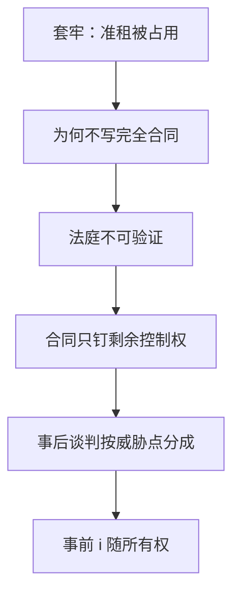

# 不完全合同

状态不能被法庭廉价验证时，合同只能规定剩余控制权；事后重新谈判分享剩余，事前投资激励随所有权走。

<footer>—— Hart and Moore, Incomplete Contracts and Renegotiation, Econometrica, 1988；Property Rights and the Nature of the Firm, Journal of Political Economy, 1990</footer>

[上一课](/econ/hold-up-gh)给出套牢：专用性制造准租，分离时投资不足，所有权是反应。缺口是：为什么不写一份「按 $R(i)$ 补偿投资者」的完全合同，把准租事先分掉？Hart–Moore 的答案是不完全：关键状态或投资对法庭不可验证，写了也执行不了；能执行的是谁拥有资产、因而谁对未规定之事有决定权。本课钉这条基础，不重算半半分成的一阶条件。显示原理下一步假定结果可以写入机制；本课正是那条假设失败的地方。

## 问题

完全合同：对每一可验证状态指定交易与转移，套牢可被买断。不完全：投资 $i$、自然状态 $\omega$、甚至交易的质量，第三方看不到或验证成本高于所得。双方事后看见剩余，会重新谈判。合同能钉住的是：**默认点**——谈崩时谁有权使用资产、谁能阻止谁。

Hart–Moore：所有权 $=$ 剩余控制权。拥有关键资产的一方在谈判破裂时外部选择更高，纳什分成里多拿，因而更愿意事前投资。两边都投资时，所有权只能强化一边；最优把资产给投资弹性更大、专用性更强的一方。企业边界是这个规划的解，不是生产函数的技术附录。

### 不可验证不是隐藏行动

道德风险是委托人看不见努力，但合同可以写在可验证的 $y$ 上。[委托–代理](/econ/principal-agent)的 IC 规划假定 $w(y)$ 能执行。不完全合同是：$y$ 或 $\omega$ 对法庭也不可用，连 $w(y)$ 都写不成，只能写所有权与少数可验证条款（交货、违约）。隐藏信息的显示原理同样假定计划者能承诺执行 $g(\hat\theta)$；重新谈判若不能禁止，直接机制的承诺会坏。

Hart–Moore 1988 先写重新谈判下的投资；1990 与 Grossman–Hart 把所有权接到企业理论。Maskin–Tirole 后来问：若双方都看见状态，为何不设计消息博弈让法庭执行？不完全合同文献的立场是：描述性消息本身也不可验证，或重新谈判会掀掉消息博弈。

## 方法

对象：两人、专用性投资、事后对称信息、法庭只执行所有权与简单交易。先规定破裂点（谁拥有资产），再纳什谈判分合作剩余，倒推 $i$。比较两种所有权的事前剩余，取较大者。对照完全合同第一最佳：只有当投资可验证或破裂点能模拟第一最佳分成时才达到。

完全合同若可行，所有权无差异：分成已写死。不完全时所有权有内容，正因为默认点进入谈判。企业边界是比较两种默认点的事前剩余，不是比较生产函数。

可验证的部分仍应写入（价格公式、抵押）。不完全不是「什么都不写」，是写不尽的那些决策必须事先指定权威。违约、交货日期、抵押品往往可验证，应写进合同；质量、适应性投资、哪一种改型更值钱，常常写不成，才轮到所有权。

## 机制

激励不来自 $w(y)$ 的似然比，而来自分成规则。所有权移动破裂点，等于移动谈判权，等于移动 $i$ 的边际回报。这与职业关注相反：那边激励来自市场后验；这边市场已被专用性关掉，激励来自「谈崩我还能带走什么」。与多任务也不相同：多任务仍有合同，只是信号不对称；不完全是合同空间本身被验证技术截断。

重新谈判在事后是有效的（对称信息），无效率仍在事前投资——与上一课同一时序，本课补上「为什么合同补不了」。若禁止重新谈判，有时能实施更多，但禁令本身往往不可信：双方事后有钱可分。

### 显示原理在本课的边界

能承诺执行的机制，显示原理把间接规则收成直接报告。不完全合同说：可执行对象太穷，只剩控制权；再「显示」也没有 $g$ 可承诺。后课仍要显示原理——用在拍卖、筛选、VCG 那些结果写得进合同的环境。两套工具叠用时先问：这一变量法庭看不看得见。

融资里的控制权转移（违约把权交给债权人）是同一逻辑的状态依存所有权，后课公司治理会用；本课只钉验证与剩余控制，不切资本结构。

## 边界

关系契约、声誉可以在法庭外执行「不可验证」的承诺，部分替代所有权。多方、公共品、政府作为第三方验证者，会改可行合同集。也不要把不完全合同写成宏观名义刚性或限价簿规则。

关系契约把「不可验证」的部分交给未来交易的租金来执行，法庭只当背景。那是重复博弈，不是所有权公式的取消。本课一次性关系里，没有下一次可扣的租金，控制权仍是主工具。显示原理课默认设计者能承诺 $g$；读完本课应先问 $g$ 的自变量法庭看不看得见。

后课默认：投资与状态不可验证时，机制缩成剩余控制权加重新谈判；套牢不能靠完全合同一句消掉。显示原理在可承诺、可验证的结果上重新展开。

## 小结

- 套牢问占用；不完全合同问为何不能写尽占用规则。
- 不可验证 ⇒ 合同钉所有权，事后谈判按威胁点分成。
- 事前投资随剩余控制权走；企业边界是所有权规划。
- 显示原理假定 $g$ 可承诺；本课是该假设失败的环境。
- 出处：Hart and Moore, *Econometrica*, 1988；*JPE*, 1990。
