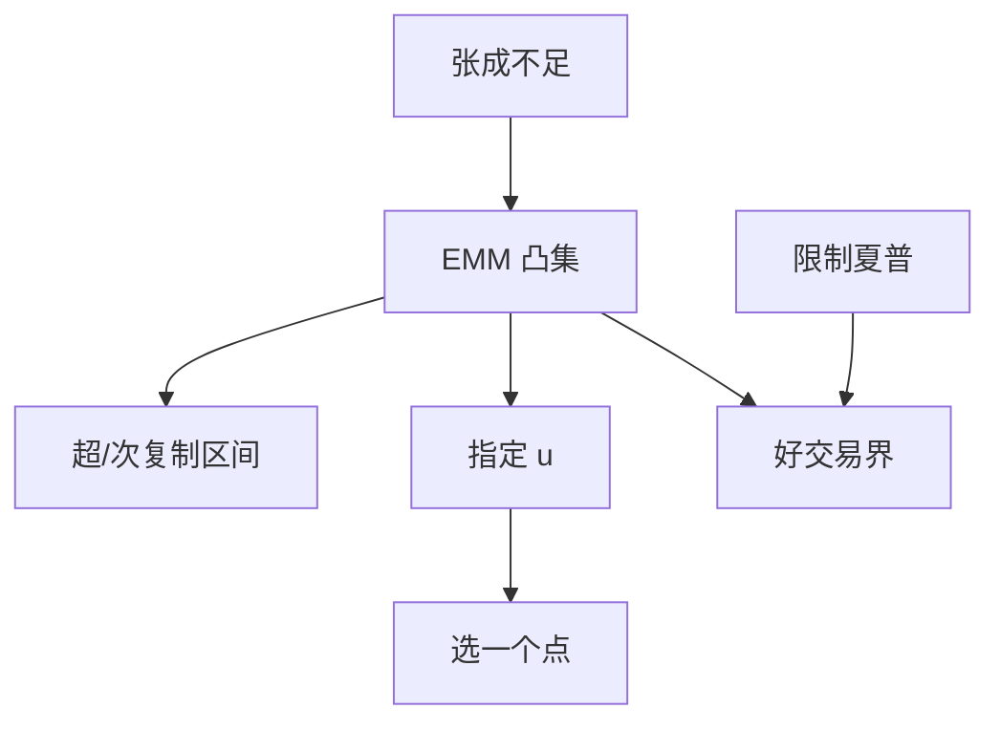

# 不完全市场的定价界

不能复制时没有唯一无套利价格；超复制给出上界，次复制给出下界，过宽的界可以用「好交易」再收紧。

<footer>—— 据 El Karoui and Quenez；Cvitanic and Karatzas；Cochrane and Saá-Requejo, Good-Deal Asset Price Bounds, JPE 2000</footer>

[上一课](/econ/bs-as-equilibrium)在完全端给出唯一期权价。本课缺口是张成不足：额外的布朗、跳跃幅度、随机波动不可交易。FTAP 给出一凸集 $\mathbb{Q}$，未定权益 $x$ 的无套利价格落在 $\{\mathrm{E}^{\mathbb{Q}}[x/B]\}$ 的区间里。不重做 BS 公式，不把区间写成买卖价差——价差可以来自不利选择，对象不同。

## 问题

动态完备课已经说过：EMM 不唯一则价格区间。连续时间把区间写成超复制成本：$\inf\{W_0:$ 存在 $\theta$ 使终端财富 $\ge x\}$，以及次复制的对称上、下。跳扩散期权、随机波动下的欧式，典型地落在非退化区间。区间可能宽到没有用——任何合理 $m$ 都能钻进去。Cochrane–Saá-Requejo（2000）用 Hansen–Jagannathan 式的夏普约束（禁止「好交易」）收紧集合，得到更窄的好交易界。缺口是：不完全不是「不能定价」，是「无套利只给区间；再加均衡或夏普约束才变窄」。

与 [GEI](/econ/incomplete-markets-gei) 一致：缺列则无唯一 $q$。本课是连续时间未定权益版。

Cochrane and Saá-Requejo, *JPE* 108(1), 2000。好交易：夏普超过阈值的策略被当作不可接受，等价于限制 $m$ 的波动。比纯 NA 强，比指定 $u$ 弱。

## 方法

无套利界：$\underline p=\sup\{\mathrm{E}^{\mathbb{Q}}[x/B]:\mathbb{Q}\in\mathcal{M}\}$ 的对偶写法用次复制；上界用超复制。均衡选取：指定 $u$ 或代表性主体，从集合里挑一个点（Lucas、CIR）。好交易：限制 $\sigma(m)/\mathrm{E}[m]$ 的上界，截掉极端 $\mathbb{Q}$。三条从弱到强。信息课序的部分揭示不是这里的不完全：揭示不足改 $\mathcal{F}$，张成不足改菜单。可以同时发生。

不要把超复制成本当成 ask、次复制当成 bid。做市报价是 Glosten–Milgrom 的条件期望；这里是可行策略的会计。数字可以碰巧相近，定义不同。

## 机制

机制是未对冲的残差。复制对冲掉菜单张成里的风险，剩下与 $x$ 相关但不在菜单里的方向，不同 $\mathbb{Q}$ 给它们不同权重，期望就散开。夏普约束说：把残差权重拧得太极端，等于承认市场上有过高夏普——若你不信有那么好的交易，就不要用那个 $\mathbb{Q}$。均衡说：残差的权重由谁被迫持有它决定——中介约束课序给出谁。

Constantinides 下一课把「不能连续复制」换成交易成本：即使菜单在零成本下完全，正成本下精确复制无穷贵，实际又是区间或惰性带。不完全与摩擦是两种非唯一。

可交易的 $x$ 仍有唯一价格。界只对不可复制的要求权。上市期权若可交易，它自己的价格钉住一个超平面，缩小剩余集合——新证券可以完备市场。

## 边界

本课不计算某一敲出期权的数值界。下一课交易成本下的组合：对象换成再平衡政策，不是未定权益区间。两者都破坏 BS 的「连续无成本 $\Delta$」。

后课默认：不完全 ⇒ 无套利价格区间；均衡或好交易约束把区间收窄。区间不是微观结构价差。完全端的 BS 是区间退化成点。

## 小结

- 超复制 / 次复制给出 NA 上下界；集合可以很宽。
- 指定 $m$ 得一点；限制夏普得好交易界。
- 张成不足 ≠ 信息不对称，也 ≠ 买卖价差。
- 出处：超复制对偶文献；Cochrane and Saá-Requejo, *JPE* 2000。
