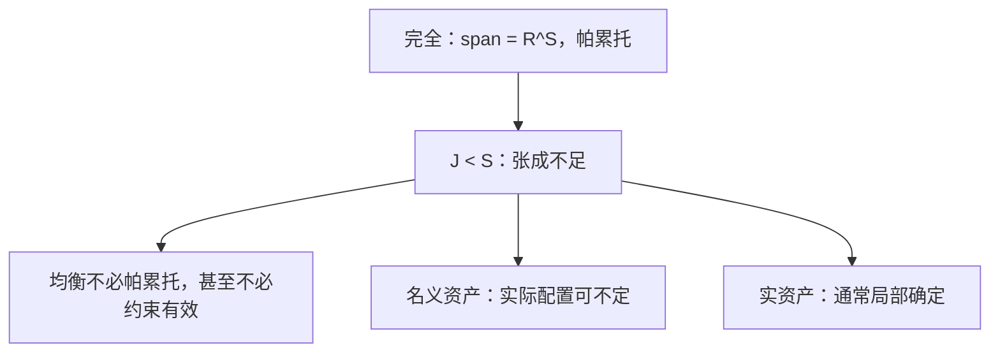

# 不完全市场 GEI

资产张成不足时，竞争配置不必帕累托有效；名义资产还让均衡的实变量可以不确定。

<footer>—— 据 Magill and Quinzii, Theory of Incomplete Markets, 1996；Geanakoplos, An Introduction to General Equilibrium with Incomplete Asset Markets, JME, 1990 整理</footer>

定位：[上一课](/econ/core-equivalence)。复制使核缩到瓦尔拉斯配置，故事默认商品空间列全、Arrow 证券张成全部状态。[状态依存](/econ/state-contingent)已钉完全市场那一端。本课不重写 Debreu–Scarf 的分离。缺口是张成不足：只有 $J<S$ 种资产，现货与证券两层价格，均衡不必有效，名义单位可以留下实不确定性。

## 问题

两期，$S$ 个未到状态。0 期交易资产，收益矩阵 $A$ 为 $S\times J$，1 期现货市场再开。GEI 均衡是资产价格 $q$、现货 $p=(p_s)$、持仓与现货消费，使证券与现货同时出清，每人在预算下最优。完全当 $\mathrm{span}(A)=\mathbb{R}^S$（可允许 $A$ 随 $p$ 变的实资产）。不完全当可及的或有转移是 $A$ 的列空间的真子空间。缺口不是再定义一次瓦尔拉斯，而是：**缺列的时候，第一福利定理哪一步破，价格水平还定不定。**

核等价把「人多」变成竞争；它不填补缺掉的状态证券。联盟即使用自己的禀赋，也只能用现有资产重新分担风险，不能凭空创造缺的 Arrow 证券。故不完全市场的核与均衡都相对于**受约束**的可行集，不是相对于完全市场的帕累托集。

### 约束有效不是有效

Geanakoplos–Polemarchakis：即便只允许用现有资产再交易，GEI 均衡一般仍不是约束帕累托有效——现货价格把资产的实际收益内生化，单个人不内部化自己持仓对他人跨状态预算的影响。完全市场没有这层金钱外部性，因为任何转移都能直接买到。不要把「缺市场」读成「均衡在约束集里还有效」。

名义资产用货币单位承诺支付；现货价格一变，实际收益 $A$ 的列跟着变。Cass 指出：名义资产下均衡配置可以有高维不确定性。实资产（商品单位支付）通常局部确定。

## 方法

定义预算：0 期 $p_0\cdot(x_0-\omega_0)+q\cdot\phi=0$；状态 $s$ 有 $p_s\cdot(x_s-\omega_s)=p_s\cdot A_s\phi$（实资产则右端不依赖 $p_s$ 的水平）。均衡要求 $\sum\phi=0$、各现货出清。存在性比 Arrow–Debreu 脆：卖空无界、收益矩阵掉秩，需要截断或 numéraire 资产约定。本课不把存在当成定理目标，只钉张成与福利。

完全化：若能对每个 $s$ 添 Arrow 证券，回到[状态依存](/econ/state-contingent)的第一优。公司证券、期权能否张成，取决于现货价格是否把收益变得线性独立——内生张成是边界，主干先当 $A$ 外生。

无套利给张成空间里的收益一个线性定价泛函；张成之外只有价格区间，不能把任意或有束标成唯一的 $q$。

不要把资产张成写成限价簿的档位深度。GEI 仍是瓦尔拉斯式出清，没有队列；缺的是列，不是流动性协议。

## 机制

第一定理失败的机制是：帕累托改进可能要求一种「只在某 $s$ 转移」的方向，而 $\mathrm{span}(A)$ 里没有这个方向。约束无效的机制是金钱外部性：$i$ 改 $\phi$ 会改某些 $p_s$，从而改 $A$ 对 $k$ 的实际购买力，$i$ 不计入。名义不定的机制是：0 期把名义单位乘 $\lambda$，1 期现货价格可以同比缩放，实际消费与相对价格的方程组少了锚——与[计价物](/econ/walras-law-numeraire)课「必须选正价格商品当锚」是同一类会计，但这里缺的锚在未到状态之间。

与核的关系：复制仍可瘦「给定资产结构下的核」，不会把经济变成完全市场。人多不等于证券多。

两层价格的机制还改变计价：0 期 $q$ 给资产标价，1 期 $p_s$ 给现货标价。完全市场可以把两者压成一组 Arrow 价格；不完全时没有唯一的状态价格去贴现所有或有束，随机折现因子若存在也不唯一。资产定价课的 $p=E[mx]$ 在完全市场上是均衡的改写；在 GEI 里 $m$ 只能给张成空间里的收益定价，张成之外的要求权没有无套利价格，只有区间。

Magill–Quinzii 把存在、不定与福利收成一套。Geanakoplos 1990 的 *JME* 导论更短。Geanakoplos–Polemarchakis 1986 的约束无效是福利缺口的原文。

## 边界

太阳黑子把外生无关的信号写进信念，不完全市场更容易让太阳黑子成为均衡——下一课。违约、抵押、内生保证金改 $A$ 的有效列。宏观的不完全市场（Bewley）用异质主体加一种债券，是本课的无穷人口特化，主干不把计算写进来。也不要把缺列写成限价簿缺档：这里缺的是或有要求权，不是买卖队列。

实资产局部确定，并不恢复帕累托；只是少了一层名义不定。

后课默认：GEI 在张成不足时不保证帕累托（甚至不保证约束有效）；名义资产可有实不确定性。完全市场的核等价与两定理不自动继承。

## 小结

- 资产列张不成 $\mathbb{R}^S$ 时，竞争配置相对于完全市场不必有效。
- 现货价格内生于持仓，GEI 一般也不是约束帕累托有效。
- 名义资产可有实不定；实资产通常局部确定。
- 下一课：外生无关信号能否进入均衡信念。
- 出处：Magill and Quinzii, *Theory of Incomplete Markets*；Geanakoplos, *JME*, 1990；Geanakoplos and Polemarchakis, 1986。
