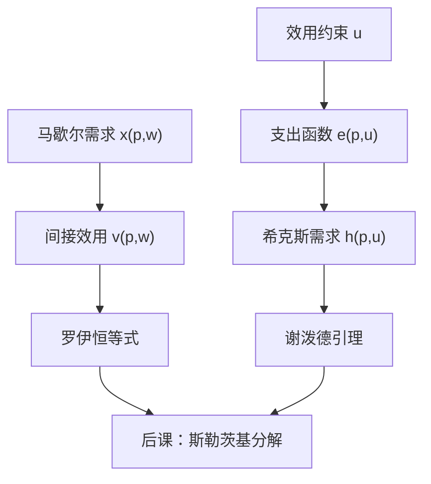

# 间接效用与支出函数

支出函数是达到给定效用的最小开销；间接效用是给定价格与财富时能达到的最大效用。二者互为逆。

<footer>—— 据 Varian, Microeconomic Analysis；Mas-Colell, Whinston and Green, Microeconomic Theory 第 3 章整理</footer>

上一课[预算集与马歇尔需求](/econ/marshallian-demand)给出了 $x(p,w)$ 以及齐次性、瓦尔拉斯定律。本课不重讲预算几何，也不再推导一阶条件。缺口是：后课要把价格效应拆成「沿无差异面滑动」和「换到另一条无差异面」，必须先有一条以效用为约束的对偶问题，以及一个把 $(p,w)$ 映成已达效用的值函数。马歇尔需求本身不携带这两套函数。

## 问题

$x(p,w)$ 回答「在这笔预算上选什么」。政策与福利常问另一句：价格变了，要多少钱才能回到原来的满足？或者：名义财富变了，满足变多少？这两个问题不能靠把 $x$ 再写一遍来回答，因为 $x$ 的坐标是商品，不是效用，也不是钱。缺口是引进两个值函数。

间接效用 $v(p,w)=u\bigl(x(p,w)\bigr)$，即最优值。支出函数

$$
e(p,u)=\min_x\bigl\{p\cdot x:u(x)\ge u\bigr\},
$$

即达到效用 $u$ 的最便宜账单。希克斯需求 $h(p,u)$ 是这个最小问题的解。本课的任务是钉死 $v$ 与 $e$ 互逆、以及它们对价格的导数如何回到需求——罗伊恒等式与谢泼德引理。斯勒茨基分解下一课才写。

### 对偶不是另一套偏好

支出最小化用的仍是同一 $u$，同一 $\succsim$。改的是约束：从「钱给定、效用最大」换成「效用给定、钱最小」。局部非餍足下，最优处 $u\bigl(h(p,u)\bigr)=u$，且 $e\bigl(p,v(p,w)\bigr)=w$。对偶缺口一旦补上，马歇尔与希克斯只是同一偏好的两种参数化。

$v$ 随 $u$ 的单调变换而变，$e$ 的「效用刻度」也随之改。希克斯需求本身仍是序数对象：它只依赖于无差异集，不依赖于刻度。

## 方法

$v$ 对 $p$ 拟凸、对 $w$ 递增，且 $(p,w)$ 零次齐次——因为 $x$ 零次齐次，$u(x)$ 只依赖比值。$e$ 对 $p$ 凹、一次齐次、对 $u$ 递增。凹性来自：两个价格的平均去买，不会比分别买更贵。这些形状后课用来证明斯勒茨基矩阵负半定。

包络定理给出导数，不必把最优束对价格再全微分。谢泼德引理：$\nabla_p e(p,u)=h(p,u)$。罗伊恒等式：

$$
x_i(p,w)=-\frac{\partial v/\partial p_i}{\partial v/\partial w}.
$$

直观是：涨价的效用损失，除以财富的边际效用，等于必须减掉的消费。本课把这两条当对偶的可操作接口，不把包络证明重写一遍。

恒等式 $x(p,w)=h\bigl(p,v(p,w)\bigr)$ 与 $h(p,u)=x\bigl(p,e(p,u)\bigr)$ 把两条需求焊在一起。下一课对 $p$ 求导，交叉项就是收入效应。

## 机制

值函数比原始需求更光滑、更好认。$e$ 对 $p$ 凹，立刻推出希克斯需求向下倾斜：自价格替代效应非正。马歇尔需求没有这层保护，因为收入效应可以翻号。这就是为什么补偿变化、等价变化用 $e$ 来写，而不用 $x$ 的积分乱加。

福利比较在本课只开一个口：价格从 $p^0$ 变到 $p^1$，补偿变化是 $e(p^1,u^0)-e(p^0,u^0)$。这是钱，可以加总到一个人的两次预算上，仍然不是人际效用。后课税收归宿会再借这个口，本课不展开公共财政。

拟线性效用使 $e$ 在计价物与效用之间仿射，收入效应集中在计价物上。这是后课局部均衡常用的刀，不是一般形状。

## 边界

$v$ 与 $e$ 要求最优存在。价格为零或偏好在边界上不满足局部非餍足时，最小值可以是 $0$ 或达不到。角点上谢泼德引理改成超梯度：支出函数仍凹，导数是对应。可微公式只在内点正则处使用。

也不要把间接效用当成「可观测的幸福指数」。观测到的是 $(p,w,x)$；$v$ 是模型里的值。显示偏好课会问：这些观测是否与某一 $u$ 一致。本课仍走「偏好 → 对偶函数」方向。

补偿变化与等价变化用 $e$ 定义，路径无关靠的是下一课才写清的 $S$ 对称。本课只把值函数准备好，不把福利积分提前做完。价格指数后课会再借 $e$，对象是宏观核算，不是这里的消费者对偶。

后课默认：可以自由使用 $v$、$e$、$h$，以及罗伊、谢泼德两条导数。

## 小结

- 间接效用是马歇尔问题的值；支出函数是效用约束下的最小账单。
- 二者互逆；$x$ 与 $h$ 只是同一偏好的两种参数化。
- 谢泼德引理与罗伊恒等式用包络把需求从值函数读出。
- 希克斯自价格效应非正；马歇尔效应的符号留给斯勒茨基。
- 出处：Varian, *Microeconomic Analysis*；Mas-Colell, Whinston and Green 第 3 章。
