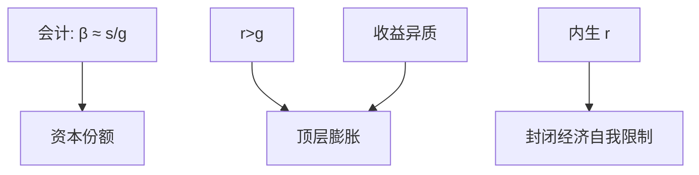

# 不平等与 r > g

若资本回报持久地高于经济增长，已有财富相对劳动收入膨胀；但这是会计加机制的候选，不是一条无价格的自然律。

<footer>—— Piketty, Capital in the Twenty-First Century, 2014；Krusell and Smith 对 $r-g$ 的一般均衡评论；Piketty and Zucman, Capital is Back, QJE 2014</footer>

[上一课](/econ/fiscal-hank)的刺激是短期再分配。长期顶层份额的运动常被写成 $r\gt g$。本课缺口是把这句话接到**已经写过的**内生 $r$（Aiyagari、尾、公债）上，而不是当口号。不重写一次总付乘数。

## 问题

Piketty：财富/收入比 $\beta=s/g$（稳态），资本份额 $\alpha=r\beta$。$r\gt g$ 时遗产与资本收入相对工资膨胀，顶层份额升。会计成立。一般均衡：储蓄率、价格、$r$ 都会对 $\beta$ 的上升起反应；Krusell–Smith 提醒不能把 $r$ 当外生。缺口是：在不完全市场模型里，$r-g$ 由什么决定，它何时足以解释尾与份额，何时必须靠收益异质（上一课尾）。

Piketty, 2014。Piketty and Zucman, *QJE* 2014。Jones 对 $r-g$ 与帕累托的增长理论对照。Acemoglu–Robinson 对制度的批评。

## 方法

在 Aiyagari–KS 里改变 $\beta$、$g$、资本税、利润份额，看 $r$ 与财富份额。开放经济小国：$r$ 更外生，$r\gt g$ 的力量更大。封闭经济：$K$ 上升压 $r$，自我限制。住房与土地：不可再生要素使 $\beta$ 可升而 $r$ 不必等于资本边际产出。测量：$r$ 是哪一个——权益、住房、全部财富的加权，口径决定不等式。

增长下降（$g$ 降）在会计上抬 $\beta$，与「储蓄率故事」不同。本课两者都保留，不选边当唯一。

## 机制

机制是相对增长。劳动收入随 $g$ 增；已投资本按 $r$ 滚。再分配、累进税、战争摧毁、住房价格，是历史里打断 $r\gt g$ 的力量。HANK 的短期 MPC 加权与长期 $r\gt g$ 不是同一时间尺度：支票改的是季度 $C$，资本积累改的是十年份额。把二者塞进同一 IRF 会乱。

金融摩擦单元会让 $r$ 含风险与中介利差，名义 $r$ 与资本净回报再分叉——本课先用实物 $r$。

$r\gt g$ 作为庞氏或债务可持续条件，在后课 $r-g$ 与主权债里以公共部门再出现。私人财富与公债不是同一个 $r$。

## 边界

本课不写最优财富税税率表。不预测未来三十年基尼。不把文学性的「二十一世纪」当计量结果。公司金融的治理与股票回购不是这里的 $r$。

后课默认：$r\gt g$ 是放大已有财富的候选机制，必须与内生 $r$ 和收益异质一起读。下一课：截面不仅是财富，还有代际的人力资本流动。

## 小结

- $r\gt g$ 的会计清楚；一般均衡里 $r$ 会动。
- 封闭经济有自我限制；开放与土地弱化限制。
- 尾仍常需收益异质，不只平均 $r-g$。
- 出处：Piketty 2014；Piketty and Zucman, *QJE* 2014；Krusell–Smith 评论。
