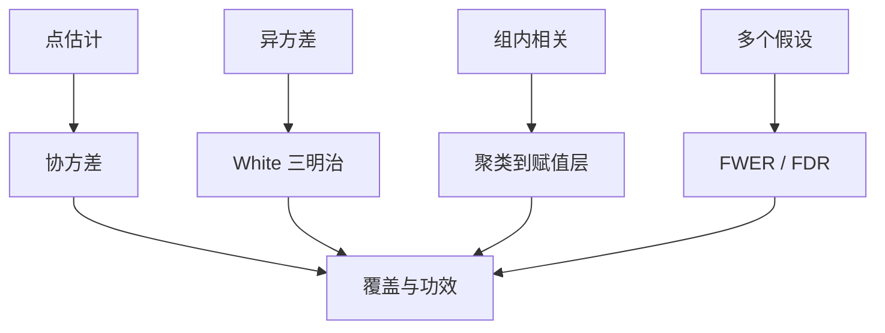

# 稳健、聚类与多重检验

点估计对准了参数，名义标准误还可以全错：异方差、组内相关、以及一桌子系数里最显著的那个，都会把 $p$ 值变成装饰。

<footer>—— White, A Heteroskedasticity-Consistent Covariance Matrix Estimator, Econometrica 1980；Bertrand, Duflo and Mullainathan, QJE 2004；Romano and Wolf 逐步多重检验</footer>

[上一课](/econ/multiple-testing-econ)把家族错误率钉在多假设上。本课缺口是把稳健协方差、聚类、以及多个假设收成一套报告纪律。机器学习与因果下一课换估计装置；本课先保证「显著」两个字有内容。识别与回归课序在此收束精度。

## 问题

Gauss–Markov 的球形误差在截面异方差、时间序列相关、州–年面板里几乎从不真。White：异方差下 OLS 仍一致，协方差用残差平方加权的「三明治」。聚类：同一州的年份之间 $u_{it}$ 相关，有效样本接近州的个数而不是州–年格点数。Bertrand–Duflo–Mullainathan 演示 DiD 忽略这一点会严重过度拒绝。缺口是：聚类层级要对准赋值发生的层级；乱聚到过细，名义 $p$ 又会过小。

多重检验：二十个结果、五个子样本，期望有一个「$p\lt 0.05$」。Bonferroni 过保守；Benjamini–Hochberg FDR、Romano–Wolf 逐步法在功效与控制之间折中。预注册与单一主结果是设计手段，不是统计公式。

Cameron–Gelbach–Miller：聚类数少时用野 bootstrap。Abadie–Athey–Imbens–Wooldridge：聚类应对准设计（哪些单位被随机或被政策），不是「所有看起来相关的」。

## 方法

默认报告异方差稳健；面板、州政策报告聚类稳健。双向聚类（公司与时间）在金融量化栏更常见，本课只标：第二维要有足够簇。HAC（Newey–West）是时间维的三明治，滞后截断要声明。不要「换聚类直到显著」。

量化栏的[聚类标准误](/quant/clustered-se)写金融应用；本课写同一套推断逻辑，不重写那些表，也不进限价簿。

## 机制

机制是把估计量的抽样变异写对。三明治的面包是梯度、肉是残差的二阶矩；聚类把肉在簇内加总，等于允许簇内任意相关、簇间独立。簇间仍相关（空间、共同市场）则仍低估。多重检验把「至少一个假阳性」当成家族错误率，惩罚搜刮。

与识别：推断再对，排除失败的 IV 仍然错。本课不管偏误，管方差。弱工具的名义 $t$ 失败是上一课的覆盖问题，不是聚类能修的。

Moulton：回归元在组层、误差在组层，即便「看起来 $N$ 很大」，信息量是组数。教育政策用学校，劳动用州，都先数簇。

## 边界

本课不把所有论文改成 Romano–Wolf。不处理空间 HAC 的完整菜单。机器学习课会对交叉拟合的标准误另写；本课的三明治不自动覆盖数据驱动的带宽、惩罚参数。课序下一课 ML 因果仍要本课的聚类意识：样本划分不能当独立若簇还在。

后课默认：报告与赋值层级匹配的聚类；多结果要有家族控制或预先主结果。White 不是聚类的替代。精度正确不能补识别失败。

## 小结

- White：异方差下一致协方差；不管组内相关。
- 聚类到政策 / 随机化发生的层；簇少则野 bootstrap。
- 多重检验：FWER 或 FDR；搜刮子样本会制造显著。
- 量化栏金融聚类是应用，定义相同。
- 出处：White, *Econometrica* 1980；Bertrand, Duflo and Mullainathan, *QJE* 2004；Cameron, Gelbach and Miller；Romano and Wolf。
