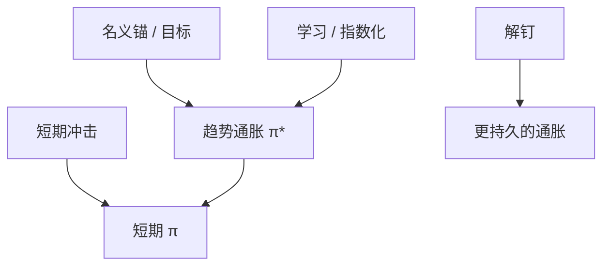

# 通胀预期锚定

长期预期若钉在目标上，短期冲击少进入工资与价格；一旦解钉，学习与指数化把通胀变成更持久的状态。

<footer>—— Bernanke 对锚定的政策表述；Gürkaynak, Sack and Swanson 对远期通胀补偿；Coibion, Gorodnichenko and Kamdar 综述</footer>

[上一课](/econ/expectations-management)给出沟通工具。本课缺口是**长期通胀预期**这个具体状态：锚定意味着什么、用什么测、解钉如何进入 NK。不重写 Odyssean 定义。

## 问题

SW 类 NK 常把通胀目标写成常数，长期预期机械锚定。数据：十年通胀补偿与调查长期预期在目标制下较稳，但仍随原油、财政、体制新闻动（Gürkaynak 等）。解钉：学习把趋势通胀当时变系数；指数化与过去通胀进工资，使菲利普斯更陡或更持久。缺口是把「锚定」写成可破的信念，而不是永远的常数 $\bar\pi$。

Gürkaynak, Sack and Swanson 对远期通胀。Coibion, Gorodnichenko and Kamdar, *JEL* 2018。Orphanides and Williams 的学习与锚定。Hazell, Herreno, Nakamura and Steinsson 的区域菲利普斯。

## 方法

测量：调查长期预期、通胀掉期与 TIPS 远期（含风险溢价与流动性，要拆）。模型：趋势通胀 $\pi_t^*$ 为随机游走或学习过程；锚定 = $\pi_t^*$ 方差小且对短期冲击载荷小。政策：平均通胀目标、对称损失、财政货币合作（后课主导）影响 $\pi^*$。HANK：家庭 CPI 预期解钉会立刻经高 MPC 与工资要求进入需求，比专家锚定更要紧。

与疏忽：低通胀年代容量不分配给 CPI，看起来像锚定，其实是不注意；一旦通胀升高，更新跳升，像突然解钉。

## 机制

机制是长期信念进入当期定价（前瞻菲利普斯含 $\mathbb{E}\pi_{t+1}$，迭代后含长期）。锚定把冲击的折现核压住；解钉等于把单位根或近单位根放进通胀。财政：若人相信债务最终靠铸币税，锚定失败——Lee 财政理论接口留给主导课。沟通：重复目标只能在 Odyssean 可信或 Delphic 不破坏信任时钉住。

1970 年代是解钉的经典样本；1990 年代后目标制是锚定样本。样本分裂使 SW 全样本估计的持续性是混合物。

## 边界

本课不预测下一次解钉。不把能源权重的 CPI 会计当预期理论。工资–价格螺旋的全部制度史放不下。下一课把有限理性收成 NK 的显式偏离 RE，作为本单元收束。

后课默认：锚定 = 趋势通胀信念的稳定；测量要分调查与市场、分家庭与专家。下一课：有限理性 NK 的系统写法。

## 小结

- 锚定是长期通胀信念对短期冲击的低载荷。
- 学习、指数化、疏忽的注意力跳升都可以表现为解钉。
- 家庭预期对 HANK 传导更关键。
- 出处：Gürkaynak–Sack–Swanson；Coibion, Gorodnichenko and Kamdar, *JEL* 2018。
